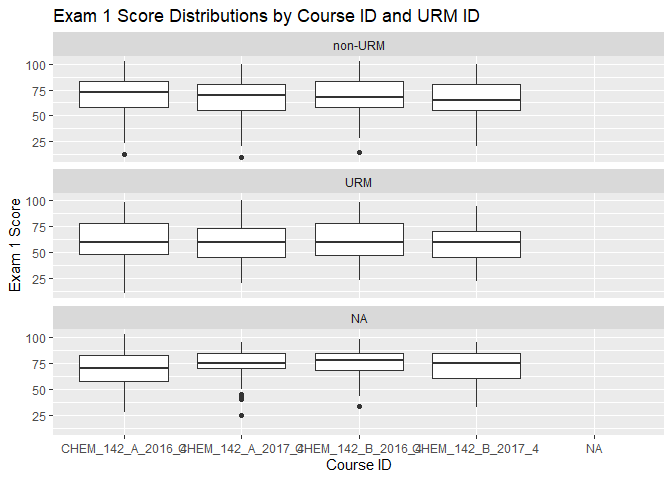

### Set working directories


```r
proj_dir  <-  here()
original_data_dir <- here("original-data", "/")
importable_data_dir <- here("processing-and-analysis", "01-importable-data", "/")
analysis_data_dir <- here("processing-and-analysis", "03-analysis-data", "/")
```

### Copy data set from `original-data` to `01-importable-data`


```r
copy_from <- paste0(original_data_dir, "master_2s_small_deidentified.rds")
copy_to <- paste0(importable_data_dir, "master_2s_small_deidentified.rds")

# CFC: If the file already exists in the target directory, the file will not be 
# overwritten and this command will return `FALSE`.
file.copy(copy_from, copy_to)
```

```
## [1] FALSE
```


### Import dataset


```r
# master <- read_csv(paste0(original_data_dir, "master_2s_small_deidentified.csv"))
master <- readRDS(paste0(original_data_dir, "master_2s_small_deidentified.rds"))
```

## Relationship 1: Scores for Exam 1, 2, and Final by:
* `course_fullid`
* `course_fullid` and `ver`
* `course_fullid` and demographic `eop_id`, `sex_id`, `fgn_id`, `urm_id` (all separate)

### Remove duplicate rows of student data: 

The master df contains per-exam-question data in a "long" format (as well as the 2017
quiz data in a "wide" format). This means that there are 72 duplicates of each student's 
exam score (there are 72 exam question records for each student). To create meaningful
visualizations of the exam scores, we need to remove these excess records.


```r
# Anti-select those columns that are related to the question-level records.
master_extras_removed <- subset(master, 
                                select = -c(item_num, stud_ans, exam_key, corr, 
                                            bloom_rating, complexity_rating_mean,
                                            complexity_rating_median, item_code, stem))

# An alternative method to the above 
master_extras_removed_2 <- master %>% 
   select(!c(item_num, stud_ans, exam_key, corr, 
          bloom_rating, complexity_rating_mean,
          complexity_rating_median, item_code, stem))

# the dfs are identical
all_equal(master_extras_removed, master_extras_removed_2)
```

```
## [1] TRUE
```

```r
# Create a df from the remaining unique records
master_unique <- unique(master_extras_removed, incomparables = FALSE)
```

How many student records are in each course?


```r
# master_unique %>% 
#   group_by(course_fullid) %>% 
#   skim(exam1)
# 
# # This is not useful as written
# summary(master_unique)

master_unique <- master_unique %>% mutate(course_fullid = factor(course_fullid))

master_unique %>% 
  group_by(course_fullid) %>% 
  tally()
```

```
## # A tibble: 5 x 2
##   course_fullid         n
##   <fct>             <int>
## 1 CHEM_142_A_2016_4  1839
## 2 CHEM_142_A_2017_4  2380
## 3 CHEM_142_B_2016_4  2043
## 4 CHEM_142_B_2017_4  2417
## 5 <NA>                 23
```

These numbers seem way too high for these courses. What's going on?


```r
master_unique %>% 
  group_by(course_fullid) %>% 
  select(two_stage_id) %>% 
  unique() %>% 
  tally()
```

```
## Adding missing grouping variables: `course_fullid`
```

```
## # A tibble: 5 x 2
##   course_fullid         n
##   <fct>             <int>
## 1 CHEM_142_A_2016_4   465
## 2 CHEM_142_A_2017_4   603
## 3 CHEM_142_B_2016_4   521
## 4 CHEM_142_B_2017_4   608
## 5 <NA>                 23
```

This looks much more reasonable. Let's take a look at the data set.


```r
master_unique %>% arrange(two_stage_id)
```

```
## # A tibble: 8,702 x 64
##    two_stage_id qtr   course course_fullid ta_sect exam1predict exam2predict
##    <chr>        <chr> <chr>  <fct>         <chr>          <dbl>        <dbl>
##  1 chem142_2s_1 A16   142AB  CHEM_142_B_2~ BM                89           55
##  2 chem142_2s_1 A16   142AB  CHEM_142_B_2~ BM                89           55
##  3 chem142_2s_1 A16   142AB  CHEM_142_B_2~ BM                89           55
##  4 chem142_2s_1 A16   142AB  CHEM_142_B_2~ BM                89           55
##  5 chem142_2s_~ A16   142AB  CHEM_142_B_2~ BM                90           70
##  6 chem142_2s_~ A16   142AB  CHEM_142_B_2~ BM                90           70
##  7 chem142_2s_~ A16   142AB  CHEM_142_B_2~ BM                90           70
##  8 chem142_2s_~ A16   142AB  CHEM_142_B_2~ BM                90           70
##  9 chem142_2s_~ A16   142AB  CHEM_142_B_2~ BT               100          103
## 10 chem142_2s_~ A16   142AB  CHEM_142_B_2~ BT               100          103
## # ... with 8,692 more rows, and 57 more variables: finalexampredict <dbl>,
## #   exam1 <dbl>, exam2 <dbl>, finalexam <dbl>, instructorgrade <dbl>,
## #   exam <chr>, ver <chr>, num_items <dbl>, length_min <dbl>,
## #   min_per_ques <dbl>, mastered_topics_initial_kc <dbl>,
## #   time_initial_kc <chr>, satmath <dbl>, satverbal <dbl>, high_sch_gpa <dbl>,
## #   cci_total_1 <dbl>, cci_total_2 <dbl>, project1 <chr>, experiment1 <chr>,
## #   eop_id <chr>, sex_id <chr>, fgn_id <chr>, urm_id <chr>, ethnicity <chr>,
## #   q1_total <dbl>, q1_ver <chr>, q1_ind <dbl>, q1_grp <dbl>, q2_version <chr>,
## #   q2_ind <dbl>, q2_grp <dbl>, q2_total <dbl>, q3_version <chr>, q3_ind <dbl>,
## #   q3_grp <dbl>, q3_total <dbl>, q4_version <chr>, q4_ind <dbl>, q4_grp <dbl>,
## #   q4_total <dbl>, q5_version <chr>, q5_ind <dbl>, q5_grp <dbl>,
## #   q5_total <dbl>, q6_version <chr>, q6_ind <dbl>, q6_grp <dbl>,
## #   q6_total <dbl>, q7_version <chr>, q7_ind <dbl>, q7_grp <dbl>,
## #   q7_total <dbl>, q7_total_scaled <dbl>, q8_version <chr>, q8_ind <dbl>,
## #   q8_grp <dbl>, q8_total <dbl>
```

There are four duplicate rows for each `two_stage_id`. This is because the df still contains
the `exam`, `ver`, `num_items`, `length_min`, and `min_per_ques` columns, which are specific
to the Bloom's/complexity analysis (all of the other Bloom's related columns were removed
above). 

So, the presence of the `exam` column explains three of the repeated `two_stage_id` 
values. The fourth is due to some mysterious NAs in the `num_items`, `length_min`, etc.,
columns for `exam == FinalExam`. There appears to be two final exam rows per student, 
one with data in these columns and one with NAs. This is surely some artifact of the 
Frankenstein approach I've taken to preparing this dataset. **YET MORE REASON TO RECREATE
MYSELF FROM SCRATCH!!!** 

#### Create a new version of the unique records df


```r
master_extras_removed_3 <- master %>% 
   select(!c(item_num, stud_ans, exam_key, corr, bloom_rating, 
             complexity_rating_mean, complexity_rating_median, 
             item_code, stem, exam, ver, num_items, length_min, min_per_ques))

# Create a df from the remaining unique records
master_unique_3 <- unique(master_extras_removed_3, incomparables = FALSE)
```

#### Check number of student records again


```r
master_unique_3 %>% 
  group_by(course_fullid) %>% 
  tally()
```

```
## # A tibble: 5 x 2
##   course_fullid         n
##   <chr>             <int>
## 1 CHEM_142_A_2016_4   484
## 2 CHEM_142_A_2017_4   618
## 3 CHEM_142_B_2016_4   536
## 4 CHEM_142_B_2017_4   619
## 5 <NA>                 23
```

```r
master_unique_3 %>% 
  group_by(course_fullid) %>% 
  select(two_stage_id) %>% 
  unique() %>% 
  tally()
```

```
## Adding missing grouping variables: `course_fullid`
```

```
## # A tibble: 5 x 2
##   course_fullid         n
##   <chr>             <int>
## 1 CHEM_142_A_2016_4   465
## 2 CHEM_142_A_2017_4   603
## 3 CHEM_142_B_2016_4   521
## 4 CHEM_142_B_2017_4   608
## 5 <NA>                 23
```

```r
master_unique_3 %>% 
  select(two_stage_id) %>% 
 # unique() %>% 
  tally()
```

```
## # A tibble: 1 x 1
##       n
##   <int>
## 1  2280
```

Ok...situation is better, there are still some duplicates.


```r
master_unique_3 %>% group_by(course_fullid) %>% select(two_stage_id) %>% duplicated()
```

```
## Adding missing grouping variables: `course_fullid`
```

```
##    [1] FALSE FALSE FALSE FALSE FALSE FALSE FALSE FALSE FALSE FALSE FALSE FALSE
##   [13] FALSE FALSE FALSE FALSE FALSE FALSE FALSE FALSE FALSE FALSE FALSE FALSE
##   [25] FALSE FALSE FALSE FALSE FALSE FALSE FALSE FALSE FALSE FALSE FALSE FALSE
##   [37] FALSE FALSE FALSE FALSE FALSE FALSE FALSE FALSE FALSE FALSE FALSE FALSE
##   [49] FALSE FALSE FALSE FALSE FALSE FALSE FALSE FALSE FALSE FALSE FALSE FALSE
##   [61] FALSE FALSE FALSE FALSE FALSE FALSE FALSE FALSE FALSE FALSE FALSE FALSE
##   [73] FALSE FALSE FALSE FALSE FALSE FALSE FALSE FALSE FALSE FALSE FALSE FALSE
##   [85] FALSE FALSE FALSE FALSE FALSE FALSE FALSE FALSE FALSE FALSE FALSE FALSE
##   [97] FALSE FALSE FALSE FALSE FALSE FALSE FALSE FALSE FALSE FALSE FALSE FALSE
##  [109] FALSE FALSE FALSE FALSE FALSE FALSE FALSE FALSE FALSE FALSE FALSE FALSE
##  [121] FALSE FALSE FALSE FALSE FALSE FALSE FALSE FALSE FALSE FALSE FALSE FALSE
##  [133] FALSE FALSE FALSE FALSE FALSE FALSE FALSE FALSE FALSE FALSE FALSE FALSE
##  [145] FALSE FALSE FALSE FALSE FALSE FALSE FALSE FALSE FALSE FALSE FALSE FALSE
##  [157] FALSE FALSE FALSE FALSE FALSE FALSE FALSE FALSE FALSE FALSE FALSE FALSE
##  [169] FALSE FALSE FALSE FALSE FALSE FALSE FALSE FALSE FALSE FALSE FALSE FALSE
##  [181] FALSE FALSE FALSE FALSE FALSE FALSE FALSE FALSE FALSE FALSE FALSE FALSE
##  [193] FALSE FALSE FALSE FALSE FALSE FALSE FALSE FALSE FALSE FALSE FALSE FALSE
##  [205] FALSE FALSE FALSE FALSE FALSE FALSE FALSE FALSE FALSE FALSE FALSE FALSE
##  [217] FALSE FALSE FALSE FALSE FALSE FALSE FALSE FALSE FALSE FALSE FALSE FALSE
##  [229] FALSE FALSE FALSE FALSE FALSE FALSE FALSE FALSE FALSE FALSE FALSE FALSE
##  [241] FALSE FALSE FALSE FALSE FALSE FALSE FALSE FALSE FALSE FALSE FALSE FALSE
##  [253] FALSE FALSE FALSE FALSE FALSE FALSE FALSE FALSE FALSE FALSE FALSE FALSE
##  [265] FALSE FALSE FALSE FALSE FALSE FALSE FALSE FALSE FALSE FALSE FALSE FALSE
##  [277] FALSE FALSE FALSE FALSE FALSE FALSE FALSE FALSE FALSE FALSE FALSE FALSE
##  [289] FALSE FALSE FALSE FALSE FALSE FALSE FALSE FALSE FALSE FALSE FALSE FALSE
##  [301] FALSE FALSE FALSE FALSE FALSE FALSE FALSE FALSE FALSE FALSE FALSE FALSE
##  [313] FALSE FALSE FALSE FALSE FALSE FALSE FALSE FALSE FALSE FALSE FALSE FALSE
##  [325] FALSE FALSE FALSE FALSE FALSE FALSE FALSE FALSE FALSE FALSE FALSE FALSE
##  [337] FALSE FALSE FALSE FALSE FALSE FALSE FALSE FALSE FALSE FALSE FALSE FALSE
##  [349] FALSE FALSE FALSE FALSE FALSE FALSE FALSE FALSE FALSE FALSE FALSE FALSE
##  [361] FALSE FALSE FALSE FALSE FALSE FALSE FALSE FALSE FALSE FALSE FALSE FALSE
##  [373] FALSE FALSE FALSE FALSE FALSE FALSE FALSE FALSE FALSE FALSE FALSE FALSE
##  [385] FALSE FALSE FALSE FALSE FALSE FALSE FALSE FALSE FALSE FALSE FALSE FALSE
##  [397] FALSE FALSE FALSE FALSE FALSE FALSE FALSE FALSE FALSE FALSE FALSE FALSE
##  [409] FALSE FALSE FALSE FALSE FALSE FALSE FALSE FALSE FALSE FALSE FALSE FALSE
##  [421] FALSE FALSE FALSE FALSE FALSE FALSE FALSE FALSE FALSE FALSE FALSE FALSE
##  [433] FALSE FALSE FALSE FALSE FALSE FALSE FALSE FALSE FALSE FALSE FALSE FALSE
##  [445] FALSE FALSE FALSE FALSE FALSE FALSE FALSE FALSE FALSE FALSE FALSE FALSE
##  [457] FALSE FALSE FALSE FALSE FALSE FALSE FALSE FALSE FALSE  TRUE  TRUE  TRUE
##  [469]  TRUE  TRUE  TRUE  TRUE  TRUE  TRUE  TRUE  TRUE  TRUE  TRUE  TRUE  TRUE
##  [481]  TRUE  TRUE  TRUE  TRUE FALSE FALSE FALSE FALSE FALSE FALSE FALSE FALSE
##  [493] FALSE FALSE FALSE FALSE FALSE FALSE FALSE FALSE FALSE FALSE FALSE FALSE
##  [505] FALSE FALSE FALSE FALSE FALSE FALSE FALSE FALSE FALSE FALSE FALSE FALSE
##  [517] FALSE FALSE FALSE FALSE FALSE FALSE FALSE FALSE FALSE FALSE FALSE FALSE
##  [529] FALSE FALSE FALSE FALSE FALSE FALSE FALSE FALSE FALSE FALSE FALSE FALSE
##  [541] FALSE FALSE FALSE FALSE FALSE FALSE FALSE FALSE FALSE FALSE FALSE FALSE
##  [553] FALSE FALSE FALSE FALSE FALSE FALSE FALSE FALSE FALSE FALSE FALSE FALSE
##  [565] FALSE FALSE FALSE FALSE FALSE FALSE FALSE FALSE FALSE FALSE FALSE FALSE
##  [577] FALSE FALSE FALSE FALSE FALSE FALSE FALSE FALSE FALSE FALSE FALSE FALSE
##  [589] FALSE FALSE FALSE FALSE FALSE FALSE FALSE FALSE FALSE FALSE FALSE FALSE
##  [601] FALSE FALSE FALSE FALSE FALSE FALSE FALSE FALSE FALSE FALSE FALSE FALSE
##  [613] FALSE FALSE FALSE FALSE FALSE FALSE FALSE FALSE FALSE FALSE FALSE FALSE
##  [625] FALSE FALSE FALSE FALSE FALSE FALSE FALSE FALSE FALSE FALSE FALSE FALSE
##  [637] FALSE FALSE FALSE FALSE FALSE FALSE FALSE FALSE FALSE FALSE FALSE FALSE
##  [649] FALSE FALSE FALSE FALSE FALSE FALSE FALSE FALSE FALSE FALSE FALSE FALSE
##  [661] FALSE FALSE FALSE FALSE FALSE FALSE FALSE FALSE FALSE FALSE FALSE FALSE
##  [673] FALSE FALSE FALSE FALSE FALSE FALSE FALSE FALSE FALSE FALSE FALSE FALSE
##  [685] FALSE FALSE FALSE FALSE FALSE FALSE FALSE FALSE FALSE FALSE FALSE FALSE
##  [697] FALSE FALSE FALSE FALSE FALSE FALSE FALSE FALSE FALSE FALSE FALSE FALSE
##  [709] FALSE FALSE FALSE FALSE FALSE FALSE FALSE FALSE FALSE FALSE FALSE FALSE
##  [721] FALSE FALSE FALSE FALSE FALSE FALSE FALSE FALSE FALSE FALSE FALSE FALSE
##  [733] FALSE FALSE FALSE FALSE FALSE FALSE FALSE FALSE FALSE FALSE FALSE FALSE
##  [745] FALSE FALSE FALSE FALSE FALSE FALSE FALSE FALSE FALSE FALSE FALSE FALSE
##  [757] FALSE FALSE FALSE FALSE FALSE FALSE FALSE FALSE FALSE FALSE FALSE FALSE
##  [769] FALSE FALSE FALSE FALSE FALSE FALSE FALSE FALSE FALSE FALSE FALSE FALSE
##  [781] FALSE FALSE FALSE FALSE FALSE FALSE FALSE FALSE FALSE FALSE FALSE FALSE
##  [793] FALSE FALSE FALSE FALSE FALSE FALSE FALSE FALSE FALSE FALSE FALSE FALSE
##  [805] FALSE FALSE FALSE FALSE FALSE FALSE FALSE FALSE FALSE FALSE FALSE FALSE
##  [817] FALSE FALSE FALSE FALSE FALSE FALSE FALSE FALSE FALSE FALSE FALSE FALSE
##  [829] FALSE FALSE FALSE FALSE FALSE FALSE FALSE FALSE FALSE FALSE FALSE FALSE
##  [841] FALSE FALSE FALSE FALSE FALSE FALSE FALSE FALSE FALSE FALSE FALSE FALSE
##  [853] FALSE FALSE FALSE FALSE FALSE FALSE FALSE FALSE FALSE FALSE FALSE FALSE
##  [865] FALSE FALSE FALSE FALSE FALSE FALSE FALSE FALSE FALSE FALSE FALSE FALSE
##  [877] FALSE FALSE FALSE FALSE FALSE FALSE FALSE FALSE FALSE FALSE FALSE FALSE
##  [889] FALSE FALSE FALSE FALSE FALSE FALSE FALSE FALSE FALSE FALSE FALSE FALSE
##  [901] FALSE FALSE FALSE FALSE FALSE FALSE FALSE FALSE FALSE FALSE FALSE FALSE
##  [913] FALSE FALSE FALSE FALSE FALSE FALSE FALSE FALSE FALSE FALSE FALSE FALSE
##  [925] FALSE FALSE FALSE FALSE FALSE FALSE FALSE FALSE FALSE FALSE FALSE FALSE
##  [937] FALSE FALSE FALSE FALSE FALSE FALSE FALSE FALSE FALSE FALSE FALSE FALSE
##  [949] FALSE FALSE FALSE FALSE FALSE FALSE FALSE FALSE FALSE FALSE FALSE FALSE
##  [961] FALSE FALSE FALSE FALSE FALSE FALSE FALSE FALSE FALSE FALSE FALSE FALSE
##  [973] FALSE FALSE FALSE FALSE FALSE FALSE FALSE FALSE FALSE FALSE FALSE FALSE
##  [985] FALSE FALSE FALSE FALSE FALSE FALSE FALSE FALSE FALSE FALSE FALSE FALSE
##  [997] FALSE FALSE FALSE FALSE FALSE FALSE FALSE FALSE FALSE  TRUE  TRUE  TRUE
## [1009]  TRUE  TRUE  TRUE  TRUE  TRUE  TRUE  TRUE  TRUE  TRUE  TRUE  TRUE  TRUE
## [1021] FALSE FALSE FALSE FALSE FALSE FALSE FALSE FALSE FALSE FALSE FALSE FALSE
## [1033] FALSE FALSE FALSE FALSE FALSE FALSE FALSE FALSE FALSE FALSE FALSE FALSE
## [1045] FALSE FALSE FALSE FALSE FALSE FALSE FALSE FALSE FALSE FALSE FALSE FALSE
## [1057] FALSE FALSE FALSE FALSE FALSE FALSE FALSE FALSE FALSE FALSE FALSE FALSE
## [1069] FALSE FALSE FALSE FALSE FALSE FALSE FALSE FALSE FALSE FALSE FALSE FALSE
## [1081] FALSE FALSE FALSE FALSE FALSE FALSE FALSE FALSE FALSE FALSE FALSE FALSE
## [1093] FALSE FALSE FALSE FALSE FALSE FALSE FALSE FALSE FALSE FALSE FALSE FALSE
## [1105] FALSE FALSE FALSE FALSE FALSE FALSE FALSE FALSE FALSE FALSE FALSE FALSE
## [1117] FALSE FALSE FALSE FALSE FALSE FALSE FALSE FALSE FALSE FALSE FALSE FALSE
## [1129] FALSE FALSE FALSE FALSE FALSE FALSE FALSE FALSE FALSE FALSE FALSE FALSE
## [1141] FALSE FALSE FALSE FALSE FALSE FALSE FALSE FALSE FALSE FALSE FALSE FALSE
## [1153] FALSE FALSE FALSE FALSE FALSE FALSE FALSE FALSE FALSE FALSE FALSE FALSE
## [1165] FALSE FALSE FALSE FALSE FALSE FALSE FALSE FALSE FALSE FALSE FALSE FALSE
## [1177] FALSE FALSE FALSE FALSE FALSE FALSE FALSE FALSE FALSE FALSE FALSE FALSE
## [1189] FALSE FALSE FALSE FALSE FALSE FALSE FALSE FALSE FALSE FALSE FALSE FALSE
## [1201] FALSE FALSE FALSE FALSE FALSE FALSE FALSE FALSE FALSE FALSE FALSE FALSE
## [1213] FALSE FALSE FALSE FALSE FALSE FALSE FALSE FALSE FALSE FALSE FALSE FALSE
## [1225] FALSE FALSE FALSE FALSE FALSE FALSE FALSE FALSE FALSE FALSE FALSE FALSE
## [1237] FALSE FALSE FALSE FALSE FALSE FALSE FALSE FALSE FALSE FALSE FALSE FALSE
## [1249] FALSE FALSE FALSE FALSE FALSE FALSE FALSE FALSE FALSE FALSE FALSE FALSE
## [1261] FALSE FALSE FALSE FALSE FALSE FALSE FALSE FALSE FALSE FALSE FALSE FALSE
## [1273] FALSE FALSE FALSE FALSE FALSE FALSE FALSE FALSE FALSE FALSE FALSE FALSE
## [1285] FALSE FALSE FALSE FALSE FALSE FALSE FALSE FALSE FALSE FALSE FALSE FALSE
## [1297] FALSE FALSE FALSE FALSE FALSE FALSE FALSE FALSE FALSE FALSE FALSE FALSE
## [1309] FALSE FALSE FALSE FALSE FALSE FALSE FALSE FALSE FALSE FALSE FALSE FALSE
## [1321] FALSE FALSE FALSE FALSE FALSE FALSE FALSE FALSE FALSE FALSE FALSE FALSE
## [1333] FALSE FALSE FALSE FALSE FALSE FALSE FALSE FALSE FALSE FALSE FALSE FALSE
## [1345] FALSE FALSE FALSE FALSE FALSE FALSE FALSE FALSE FALSE FALSE FALSE FALSE
## [1357] FALSE FALSE FALSE FALSE FALSE FALSE FALSE FALSE FALSE FALSE FALSE FALSE
## [1369] FALSE FALSE FALSE FALSE FALSE FALSE FALSE FALSE FALSE FALSE FALSE FALSE
## [1381] FALSE FALSE FALSE FALSE FALSE FALSE FALSE FALSE FALSE FALSE FALSE FALSE
## [1393] FALSE FALSE FALSE FALSE FALSE FALSE FALSE FALSE FALSE FALSE FALSE FALSE
## [1405] FALSE FALSE FALSE FALSE FALSE FALSE FALSE FALSE FALSE FALSE FALSE FALSE
## [1417] FALSE FALSE FALSE FALSE FALSE FALSE FALSE FALSE FALSE FALSE FALSE FALSE
## [1429] FALSE FALSE FALSE FALSE FALSE FALSE FALSE FALSE FALSE FALSE FALSE FALSE
## [1441] FALSE FALSE FALSE FALSE FALSE FALSE FALSE FALSE FALSE FALSE FALSE FALSE
## [1453] FALSE FALSE FALSE FALSE FALSE FALSE FALSE FALSE FALSE FALSE FALSE FALSE
## [1465] FALSE FALSE FALSE FALSE FALSE FALSE FALSE FALSE FALSE FALSE FALSE FALSE
## [1477] FALSE FALSE FALSE FALSE FALSE FALSE FALSE FALSE FALSE FALSE FALSE FALSE
## [1489] FALSE FALSE FALSE FALSE FALSE FALSE FALSE FALSE FALSE FALSE FALSE FALSE
## [1501] FALSE FALSE FALSE FALSE FALSE FALSE FALSE FALSE FALSE FALSE FALSE FALSE
## [1513] FALSE FALSE FALSE FALSE FALSE FALSE FALSE FALSE FALSE FALSE FALSE FALSE
## [1525] FALSE FALSE FALSE FALSE FALSE FALSE FALSE FALSE FALSE FALSE FALSE FALSE
## [1537] FALSE FALSE FALSE FALSE FALSE FALSE FALSE FALSE FALSE FALSE FALSE FALSE
## [1549] FALSE FALSE FALSE FALSE FALSE FALSE FALSE FALSE FALSE FALSE FALSE FALSE
## [1561] FALSE FALSE FALSE FALSE FALSE FALSE FALSE FALSE FALSE FALSE FALSE FALSE
## [1573] FALSE FALSE FALSE FALSE FALSE FALSE FALSE FALSE FALSE FALSE FALSE FALSE
## [1585] FALSE FALSE FALSE FALSE FALSE FALSE FALSE FALSE FALSE FALSE FALSE FALSE
## [1597] FALSE FALSE FALSE FALSE FALSE FALSE FALSE FALSE FALSE FALSE FALSE FALSE
## [1609] FALSE FALSE FALSE FALSE FALSE FALSE FALSE FALSE FALSE FALSE FALSE FALSE
## [1621] FALSE FALSE FALSE FALSE FALSE FALSE FALSE FALSE FALSE FALSE FALSE FALSE
## [1633] FALSE FALSE  TRUE  TRUE  TRUE  TRUE  TRUE  TRUE  TRUE FALSE  TRUE  TRUE
## [1645] FALSE  TRUE  TRUE  TRUE  TRUE  TRUE  TRUE FALSE FALSE FALSE FALSE FALSE
## [1657] FALSE FALSE FALSE FALSE FALSE FALSE FALSE FALSE FALSE FALSE FALSE FALSE
## [1669] FALSE FALSE FALSE FALSE FALSE FALSE FALSE FALSE FALSE FALSE FALSE FALSE
## [1681] FALSE FALSE FALSE FALSE FALSE FALSE FALSE FALSE FALSE FALSE FALSE FALSE
## [1693] FALSE FALSE FALSE FALSE FALSE FALSE FALSE FALSE FALSE FALSE FALSE FALSE
## [1705] FALSE FALSE FALSE FALSE FALSE FALSE FALSE FALSE FALSE FALSE FALSE FALSE
## [1717] FALSE FALSE FALSE FALSE FALSE FALSE FALSE FALSE FALSE FALSE FALSE FALSE
## [1729] FALSE FALSE FALSE FALSE FALSE FALSE FALSE FALSE FALSE FALSE FALSE FALSE
## [1741] FALSE FALSE FALSE FALSE FALSE FALSE FALSE FALSE FALSE FALSE FALSE FALSE
## [1753] FALSE FALSE FALSE FALSE FALSE FALSE FALSE FALSE FALSE FALSE FALSE FALSE
## [1765] FALSE FALSE FALSE FALSE FALSE FALSE FALSE FALSE FALSE FALSE FALSE FALSE
## [1777] FALSE FALSE FALSE FALSE FALSE FALSE FALSE FALSE FALSE FALSE FALSE FALSE
## [1789] FALSE FALSE FALSE FALSE FALSE FALSE FALSE FALSE FALSE FALSE FALSE FALSE
## [1801] FALSE FALSE FALSE FALSE FALSE FALSE FALSE FALSE FALSE FALSE FALSE FALSE
## [1813] FALSE FALSE FALSE FALSE FALSE FALSE FALSE FALSE FALSE FALSE FALSE FALSE
## [1825] FALSE FALSE FALSE FALSE FALSE FALSE FALSE FALSE FALSE FALSE FALSE FALSE
## [1837] FALSE FALSE FALSE FALSE FALSE FALSE FALSE FALSE FALSE FALSE FALSE FALSE
## [1849] FALSE FALSE FALSE FALSE FALSE FALSE FALSE FALSE FALSE FALSE FALSE FALSE
## [1861] FALSE FALSE FALSE FALSE FALSE FALSE FALSE FALSE FALSE FALSE FALSE FALSE
## [1873] FALSE FALSE FALSE FALSE FALSE FALSE FALSE FALSE FALSE FALSE FALSE FALSE
## [1885] FALSE FALSE FALSE FALSE FALSE FALSE FALSE FALSE FALSE FALSE FALSE FALSE
## [1897] FALSE FALSE FALSE FALSE FALSE FALSE FALSE FALSE FALSE FALSE FALSE FALSE
## [1909] FALSE FALSE FALSE FALSE FALSE FALSE FALSE FALSE FALSE FALSE FALSE FALSE
## [1921] FALSE FALSE FALSE FALSE FALSE FALSE FALSE FALSE FALSE FALSE FALSE FALSE
## [1933] FALSE FALSE FALSE FALSE FALSE FALSE FALSE FALSE FALSE FALSE FALSE FALSE
## [1945] FALSE FALSE FALSE FALSE FALSE FALSE FALSE FALSE FALSE FALSE FALSE FALSE
## [1957] FALSE FALSE FALSE FALSE FALSE FALSE FALSE FALSE FALSE FALSE FALSE FALSE
## [1969] FALSE FALSE FALSE FALSE FALSE FALSE FALSE FALSE FALSE FALSE FALSE FALSE
## [1981] FALSE FALSE FALSE FALSE FALSE FALSE FALSE FALSE FALSE FALSE FALSE FALSE
## [1993] FALSE FALSE FALSE FALSE FALSE FALSE FALSE FALSE FALSE FALSE FALSE FALSE
## [2005] FALSE FALSE FALSE FALSE FALSE FALSE FALSE FALSE FALSE FALSE FALSE FALSE
## [2017] FALSE FALSE FALSE FALSE FALSE FALSE FALSE FALSE FALSE FALSE FALSE FALSE
## [2029] FALSE FALSE FALSE FALSE FALSE FALSE FALSE FALSE FALSE FALSE FALSE FALSE
## [2041] FALSE FALSE FALSE FALSE FALSE FALSE FALSE FALSE FALSE FALSE FALSE FALSE
## [2053] FALSE FALSE FALSE FALSE FALSE FALSE FALSE FALSE FALSE FALSE FALSE FALSE
## [2065] FALSE FALSE FALSE FALSE FALSE FALSE FALSE FALSE FALSE FALSE FALSE FALSE
## [2077] FALSE FALSE FALSE FALSE FALSE FALSE FALSE FALSE FALSE FALSE FALSE FALSE
## [2089] FALSE FALSE FALSE FALSE FALSE FALSE FALSE FALSE FALSE FALSE FALSE FALSE
## [2101] FALSE FALSE FALSE FALSE FALSE FALSE FALSE FALSE FALSE FALSE FALSE FALSE
## [2113] FALSE FALSE FALSE FALSE FALSE FALSE FALSE FALSE FALSE FALSE FALSE FALSE
## [2125] FALSE FALSE FALSE FALSE FALSE FALSE FALSE FALSE FALSE FALSE FALSE FALSE
## [2137] FALSE FALSE FALSE FALSE FALSE FALSE FALSE FALSE FALSE FALSE FALSE FALSE
## [2149] FALSE FALSE FALSE FALSE FALSE FALSE FALSE FALSE FALSE FALSE FALSE FALSE
## [2161] FALSE FALSE FALSE FALSE FALSE FALSE FALSE FALSE FALSE FALSE FALSE FALSE
## [2173] FALSE FALSE FALSE FALSE FALSE FALSE FALSE FALSE FALSE FALSE FALSE FALSE
## [2185] FALSE FALSE FALSE FALSE FALSE FALSE FALSE FALSE FALSE FALSE FALSE FALSE
## [2197] FALSE FALSE FALSE FALSE FALSE FALSE FALSE FALSE FALSE FALSE FALSE FALSE
## [2209] FALSE FALSE FALSE FALSE FALSE FALSE FALSE FALSE FALSE FALSE FALSE FALSE
## [2221] FALSE FALSE FALSE FALSE FALSE FALSE FALSE FALSE FALSE FALSE FALSE FALSE
## [2233] FALSE FALSE FALSE FALSE FALSE FALSE FALSE FALSE FALSE FALSE FALSE FALSE
## [2245] FALSE FALSE FALSE FALSE FALSE FALSE FALSE FALSE FALSE FALSE FALSE FALSE
## [2257] FALSE FALSE FALSE FALSE FALSE FALSE FALSE FALSE FALSE FALSE FALSE  TRUE
## [2269]  TRUE FALSE  TRUE FALSE  TRUE  TRUE  TRUE  TRUE  TRUE  TRUE  TRUE  TRUE
```

```r
master_unique_3$two_stage_id[duplicated(master_unique_3$two_stage_id)]
```

```
##  [1] "chem142_2s_952"  "chem142_2s_1881" "chem142_2s_2028" "chem142_2s_409" 
##  [5] "chem142_2s_1701" "chem142_2s_832"  "chem142_2s_2027" "chem142_2s_1988"
##  [9] "chem142_2s_517"  "chem142_2s_143"  "chem142_2s_1237" "chem142_2s_1413"
## [13] "chem142_2s_1231" "chem142_2s_350"  "chem142_2s_1105" "chem142_2s_513" 
## [17] "chem142_2s_911"  "chem142_2s_11"   "chem142_2s_641"  "chem142_2s_956" 
## [21] "chem142_2s_2182" "chem142_2s_1672" "chem142_2s_1541" "chem142_2s_819" 
## [25] "chem142_2s_2072" "chem142_2s_1974" "chem142_2s_2150" "chem142_2s_51"  
## [29] "chem142_2s_262"  "chem142_2s_1219" "chem142_2s_499"  "chem142_2s_1890"
## [33] "chem142_2s_660"  "chem142_2s_2215" "chem142_2s_892"  "chem142_2s_558" 
## [37] "chem142_2s_54"   "chem142_2s_529"  "chem142_2s_2049" "chem142_2s_705" 
## [41] "chem142_2s_303"  "chem142_2s_1730" "chem142_2s_997"  "chem142_2s_2066"
## [45] "chem142_2s_139"  "chem142_2s_776"  "chem142_2s_1688" "chem142_2s_662" 
## [49] "chem142_2s_1923" "chem142_2s_837"  "chem142_2s_1663" "chem142_2s_1003"
## [53] "chem142_2s_2070" "chem142_2s_927"  "chem142_2s_1729" "chem142_2s_767" 
## [57] "chem142_2s_1817" "chem142_2s_907"  "chem142_2s_1777" "chem142_2s_1452"
## [61] "chem142_2s_244"  "chem142_2s_639"  "chem142_2s_1060" "chem142_2s_1097"
```

```r
master_unique_3$two_stage_id[duplicated(master_unique_3$two_stage_id)] %>% sort()
```

```
##  [1] "chem142_2s_1003" "chem142_2s_1060" "chem142_2s_1097" "chem142_2s_11"  
##  [5] "chem142_2s_1105" "chem142_2s_1219" "chem142_2s_1231" "chem142_2s_1237"
##  [9] "chem142_2s_139"  "chem142_2s_1413" "chem142_2s_143"  "chem142_2s_1452"
## [13] "chem142_2s_1541" "chem142_2s_1663" "chem142_2s_1672" "chem142_2s_1688"
## [17] "chem142_2s_1701" "chem142_2s_1729" "chem142_2s_1730" "chem142_2s_1777"
## [21] "chem142_2s_1817" "chem142_2s_1881" "chem142_2s_1890" "chem142_2s_1923"
## [25] "chem142_2s_1974" "chem142_2s_1988" "chem142_2s_2027" "chem142_2s_2028"
## [29] "chem142_2s_2049" "chem142_2s_2066" "chem142_2s_2070" "chem142_2s_2072"
## [33] "chem142_2s_2150" "chem142_2s_2182" "chem142_2s_2215" "chem142_2s_244" 
## [37] "chem142_2s_262"  "chem142_2s_303"  "chem142_2s_350"  "chem142_2s_409" 
## [41] "chem142_2s_499"  "chem142_2s_51"   "chem142_2s_513"  "chem142_2s_517" 
## [45] "chem142_2s_529"  "chem142_2s_54"   "chem142_2s_558"  "chem142_2s_639" 
## [49] "chem142_2s_641"  "chem142_2s_660"  "chem142_2s_662"  "chem142_2s_705" 
## [53] "chem142_2s_767"  "chem142_2s_776"  "chem142_2s_819"  "chem142_2s_832" 
## [57] "chem142_2s_837"  "chem142_2s_892"  "chem142_2s_907"  "chem142_2s_911" 
## [61] "chem142_2s_927"  "chem142_2s_952"  "chem142_2s_956"  "chem142_2s_997"
```

#### Considering the first two duplicates given above as examples:

Student chem142_2s_1003 took the course in both A16 and A17, whereas chem142_2s_1060
has a duplicate record within the A17 data set, due to a missing `ta_sect` value. 


```r
master_unique_3 %>% filter(two_stage_id == "chem142_2s_1003")
```

```
## # A tibble: 2 x 59
##   two_stage_id qtr   course course_fullid ta_sect exam1predict exam2predict
##   <chr>        <chr> <chr>  <chr>         <chr>          <dbl>        <dbl>
## 1 chem142_2s_~ A16   142AB  CHEM_142_B_2~ BB                70           50
## 2 chem142_2s_~ A17   142AB  CHEM_142_B_2~ BV                80           50
## # ... with 52 more variables: finalexampredict <dbl>, exam1 <dbl>, exam2 <dbl>,
## #   finalexam <dbl>, instructorgrade <dbl>, mastered_topics_initial_kc <dbl>,
## #   time_initial_kc <chr>, satmath <dbl>, satverbal <dbl>, high_sch_gpa <dbl>,
## #   cci_total_1 <dbl>, cci_total_2 <dbl>, project1 <chr>, experiment1 <chr>,
## #   eop_id <chr>, sex_id <chr>, fgn_id <chr>, urm_id <chr>, ethnicity <chr>,
## #   q1_total <dbl>, q1_ver <chr>, q1_ind <dbl>, q1_grp <dbl>, q2_version <chr>,
## #   q2_ind <dbl>, q2_grp <dbl>, q2_total <dbl>, q3_version <chr>, q3_ind <dbl>,
## #   q3_grp <dbl>, q3_total <dbl>, q4_version <chr>, q4_ind <dbl>, q4_grp <dbl>,
## #   q4_total <dbl>, q5_version <chr>, q5_ind <dbl>, q5_grp <dbl>,
## #   q5_total <dbl>, q6_version <chr>, q6_ind <dbl>, q6_grp <dbl>,
## #   q6_total <dbl>, q7_version <chr>, q7_ind <dbl>, q7_grp <dbl>,
## #   q7_total <dbl>, q7_total_scaled <dbl>, q8_version <chr>, q8_ind <dbl>,
## #   q8_grp <dbl>, q8_total <dbl>
```

```r
master_unique_3 %>% filter(two_stage_id == "chem142_2s_1060")
```

```
## # A tibble: 2 x 59
##   two_stage_id qtr   course course_fullid ta_sect exam1predict exam2predict
##   <chr>        <chr> <chr>  <chr>         <chr>          <dbl>        <dbl>
## 1 chem142_2s_~ A17   142AB  CHEM_142_B_2~ BG                75           70
## 2 chem142_2s_~ A17   142AB  CHEM_142_B_2~ <NA>              75           70
## # ... with 52 more variables: finalexampredict <dbl>, exam1 <dbl>, exam2 <dbl>,
## #   finalexam <dbl>, instructorgrade <dbl>, mastered_topics_initial_kc <dbl>,
## #   time_initial_kc <chr>, satmath <dbl>, satverbal <dbl>, high_sch_gpa <dbl>,
## #   cci_total_1 <dbl>, cci_total_2 <dbl>, project1 <chr>, experiment1 <chr>,
## #   eop_id <chr>, sex_id <chr>, fgn_id <chr>, urm_id <chr>, ethnicity <chr>,
## #   q1_total <dbl>, q1_ver <chr>, q1_ind <dbl>, q1_grp <dbl>, q2_version <chr>,
## #   q2_ind <dbl>, q2_grp <dbl>, q2_total <dbl>, q3_version <chr>, q3_ind <dbl>,
## #   q3_grp <dbl>, q3_total <dbl>, q4_version <chr>, q4_ind <dbl>, q4_grp <dbl>,
## #   q4_total <dbl>, q5_version <chr>, q5_ind <dbl>, q5_grp <dbl>,
## #   q5_total <dbl>, q6_version <chr>, q6_ind <dbl>, q6_grp <dbl>,
## #   q6_total <dbl>, q7_version <chr>, q7_ind <dbl>, q7_grp <dbl>,
## #   q7_total <dbl>, q7_total_scaled <dbl>, q8_version <chr>, q8_ind <dbl>,
## #   q8_grp <dbl>, q8_total <dbl>
```

There must be some automated way to pull out all of the duplicates. Maybe I could play 
around with mapping?


### Faceted histograms of scores for exam 1, 2, and final by `course_fullid`:


```r
ggplot(master_unique, aes(x = exam1)) +
  geom_histogram(binwidth = 5, color = "white") +
  labs(x = "Exam 1 Score", y = "Number of Students", 
       title = "Exam 1 Score Distributions by Course ID") +
  facet_wrap(~ course_fullid, nrow = 2)
```

```
## Warning: Removed 66 rows containing non-finite values (stat_bin).
```

<!-- -->

```r
ggplot(master_unique, aes(x = exam2)) +
  geom_histogram(binwidth = 5, color = "white") +
  labs(x = "Exam 2 Score", y = "Number of Students", 
       title = "Exam 2 Score Distributions by Course ID") +
  facet_wrap(~ course_fullid, nrow = 2)
```

```
## Warning: Removed 74 rows containing non-finite values (stat_bin).
```

<!-- -->

```r
ggplot(master_unique, aes(x = finalexam)) +
  geom_histogram(binwidth = 5, color = "white") +
  labs(x = "Final Exam Score", y = "Number of Students", 
       title = "Final Exam Score Distributions by Course ID") +
  facet_wrap(~ course_fullid, nrow = 2)
```

```
## Warning: Removed 107 rows containing non-finite values (stat_bin).
```

<!-- -->

### Boxplots of Scores for Exam 1, 2, and final by `course_fullid`:


```r
ggplot(master_unique, aes(x = course_fullid, y = exam1)) +
  geom_boxplot() +
  labs(x = "Course ID", y = "Exam 1 Score", 
       title = "Exam 1 Score Distributions by Course ID")
```

```
## Warning: Removed 66 rows containing non-finite values (stat_boxplot).
```

<!-- -->

```r
ggplot(master_unique, aes(x = course_fullid, y = exam2)) +
  geom_boxplot() +
  labs(x = "Course ID", y = "Exam 2 Score", 
       title = "Exam 2 Score Distributions by Course ID")
```

```
## Warning: Removed 74 rows containing non-finite values (stat_boxplot).
```

<!-- -->

```r
ggplot(master_unique, aes(x = course_fullid, y = finalexam)) +
  geom_boxplot() +
  labs(x = "Course ID", y = "Final Exam Score", 
       title = "Final Exam Score Distributions by Course ID")
```

```
## Warning: Removed 107 rows containing non-finite values (stat_boxplot).
```

<!-- -->


### Faceted Histograms of Scores for Exam 1, 2, and final by `course_fullid` and `ver`:


```r
ggplot(master_unique, aes(x = exam1)) +
  geom_histogram(binwidth = 5, color = "white") +
  labs(x = "Exam 1 Score", y = "Number of Students", 
       title = "Exam 1 Score Distributions by Course ID and Test Version") +
  facet_wrap(~ course_fullid + ver, nrow = 3)
```

```
## Warning: Removed 66 rows containing non-finite values (stat_bin).
```

<!-- -->

```r
ggplot(master_unique, aes(x = exam2)) +
  geom_histogram(binwidth = 5, color = "white") +
  labs(x = "Exam 2 Score", y = "Number of Students", 
       title = "Exam 2 Score Distributions by Course ID and Test Version") +
  facet_wrap(~ course_fullid + ver, nrow = 3)
```

```
## Warning: Removed 74 rows containing non-finite values (stat_bin).
```

<!-- -->

```r
ggplot(master_unique, aes(x = finalexam)) +
  geom_histogram(binwidth = 5, color = "white") +
  labs(x = "Final Exam Score", y = "Number of Students", 
       title = "Final Exam Score Distributions by Course ID and Test Version") +
  facet_wrap(~ course_fullid + ver, nrow = 3)
```

```
## Warning: Removed 107 rows containing non-finite values (stat_bin).
```

<!-- -->

### Faceted Boxplots of Scores for Exam 1, 2, and final by `course_fullid` and `ver`:


```r
ggplot(master_unique, aes(x = course_fullid, y = exam1)) +
  geom_boxplot() +
  labs(x = "Course ID", y = "Exam 1 Score", 
       title = "Exam 1 Score Distributions by Course ID") +
  facet_wrap(~ ver, nrow = 3)
```

```
## Warning: Removed 66 rows containing non-finite values (stat_boxplot).
```

<!-- -->

```r
ggplot(master_unique, aes(x = course_fullid, y = exam2)) +
  geom_boxplot() +
  labs(x = "Course ID", y = "Exam 2 Score", 
       title = "Exam 2 Score Distributions by Course ID") +
  facet_wrap(~ ver, nrow = 3)
```

```
## Warning: Removed 74 rows containing non-finite values (stat_boxplot).
```

<!-- -->

```r
ggplot(master_unique, aes(x = course_fullid, y = finalexam)) +
  geom_boxplot() +
  labs(x = "Course ID", y = "Final Exam Score", 
       title = "Final Exam Score Distributions by Course ID") +
  facet_wrap(~ ver, nrow = 3)
```

```
## Warning: Removed 107 rows containing non-finite values (stat_boxplot).
```

<!-- -->


### Faceted Histograms of Scores for Exam 1, 2, and Final by `course_fullid` and demographic `eop_id`, `sex_id`, `fgn_id`, `urm_id`:


```r
ggplot(master_unique, aes(x = exam1)) +
  geom_histogram(binwidth = 5, color = "white") +
  labs(x = "Exam 1 Score", y = "Number of Students", 
       title = "Exam 1 Score Distributions by Course ID and EOP ID") +
  facet_wrap(~ course_fullid + eop_id, nrow = 3)
```

```
## Warning: Removed 66 rows containing non-finite values (stat_bin).
```

<!-- -->

```r
ggplot(master_unique, aes(x = exam2)) +
  geom_histogram(binwidth = 5, color = "white") +
  labs(x = "Exam 2 Score", y = "Number of Students", 
       title = "Exam 2 Score Distributions by Course ID and EOP ID") +
  facet_wrap(~ course_fullid + eop_id, nrow = 3)
```

```
## Warning: Removed 74 rows containing non-finite values (stat_bin).
```

<!-- -->

```r
ggplot(master_unique, aes(x = finalexam)) +
  geom_histogram(binwidth = 5, color = "white") +
  labs(x = "Final Exam Score", y = "Number of Students", 
       title = "Final Exam Score Distributions by Course ID and EOP ID") +
  facet_wrap(~ course_fullid + eop_id, nrow = 3)
```

```
## Warning: Removed 107 rows containing non-finite values (stat_bin).
```

<!-- -->

```r
ggplot(master_unique, aes(x = exam1)) +
  geom_histogram(binwidth = 5, color = "white") +
  labs(x = "Exam 1 Score", y = "Number of Students", 
       title = "Exam 1 Score Distributions by Course ID and Sex") +
  facet_wrap(~ course_fullid + sex_id, nrow = 3)
```

```
## Warning: Removed 66 rows containing non-finite values (stat_bin).
```

<!-- -->

```r
ggplot(master_unique, aes(x = exam2)) +
  geom_histogram(binwidth = 5, color = "white") +
  labs(x = "Exam 2 Score", y = "Number of Students", 
       title = "Exam 2 Score Distributions by Course ID and Sex") +
  facet_wrap(~ course_fullid + sex_id, nrow = 3)
```

```
## Warning: Removed 74 rows containing non-finite values (stat_bin).
```

<!-- -->

```r
ggplot(master_unique, aes(x = finalexam)) +
  geom_histogram(binwidth = 5, color = "white") +
  labs(x = "Final Exam Score", y = "Number of Students", 
       title = "Final Exam Score Distributions by Course ID and Sex") +
  facet_wrap(~ course_fullid + sex_id, nrow = 3)
```

```
## Warning: Removed 107 rows containing non-finite values (stat_bin).
```

<!-- -->

```r
ggplot(master_unique, aes(x = exam1)) +
  geom_histogram(binwidth = 5, color = "white") +
  labs(x = "Exam 1 Score", y = "Number of Students", 
       title = "Exam 1 Score Distributions by Course ID and FGN ID") +
  facet_wrap(~ course_fullid + fgn_id, nrow = 3)
```

```
## Warning: Removed 66 rows containing non-finite values (stat_bin).
```

<!-- -->

```r
ggplot(master_unique, aes(x = exam2)) +
  geom_histogram(binwidth = 5, color = "white") +
  labs(x = "Exam 2 Score", y = "Number of Students", 
       title = "Exam 2 Score Distributions by Course ID and FGN ID") +
  facet_wrap(~ course_fullid + fgn_id, nrow = 3)
```

```
## Warning: Removed 74 rows containing non-finite values (stat_bin).
```

<!-- -->

```r
ggplot(master_unique, aes(x = finalexam)) +
  geom_histogram(binwidth = 5, color = "white") +
  labs(x = "Final Exam Score", y = "Number of Students", 
       title = "Final Exam Score Distributions by Course ID and FGN ID") +
  facet_wrap(~ course_fullid + fgn_id, nrow = 3)
```

```
## Warning: Removed 107 rows containing non-finite values (stat_bin).
```

<!-- -->

```r
ggplot(master_unique, aes(x = exam1)) +
  geom_histogram(binwidth = 5, color = "white") +
  labs(x = "Exam 1 Score", y = "Number of Students", 
       title = "Exam 1 Score Distributions by Course ID and URM ID") +
  facet_wrap(~ course_fullid + urm_id, nrow = 3)
```

```
## Warning: Removed 66 rows containing non-finite values (stat_bin).
```

<!-- -->

```r
ggplot(master_unique, aes(x = exam2)) +
  geom_histogram(binwidth = 5, color = "white") +
  labs(x = "Exam 2 Score", y = "Number of Students", 
       title = "Exam 2 Score Distributions by Course ID and URM ID") +
  facet_wrap(~ course_fullid + urm_id, nrow = 3)
```

```
## Warning: Removed 74 rows containing non-finite values (stat_bin).
```

<!-- -->

```r
ggplot(master_unique, aes(x = finalexam)) +
  geom_histogram(binwidth = 5, color = "white") +
  labs(x = "Final Exam Score", y = "Number of Students", 
       title = "Final Exam Score Distributions by Course ID and URM ID") +
  facet_wrap(~ course_fullid + urm_id, nrow = 3)
```

```
## Warning: Removed 107 rows containing non-finite values (stat_bin).
```

<!-- -->

### Faceted Histograms of Scores for Exam 1, 2, and Final by `course_fullid` and demographic `eop_id`, `sex_id`, `fgn_id`, `urm_id`:


```r
ggplot(master_unique, aes(x = course_fullid, y = exam1)) +
  geom_boxplot() +
  labs(x = "Course ID", y = "Exam 1 Score", 
       title = "Exam 1 Score Distributions by Course ID and EOP ID") +
  facet_wrap(~ eop_id, nrow = 3)
```

```
## Warning: Removed 66 rows containing non-finite values (stat_boxplot).
```

<!-- -->

```r
ggplot(master_unique, aes(x = course_fullid, y = exam2)) +
  geom_boxplot() +
  labs(x = "Course ID", y = "Exam 2 Score", 
       title = "Exam 2 Score Distributions by Course ID and EOP ID") +
  facet_wrap(~ eop_id, nrow = 3)
```

```
## Warning: Removed 74 rows containing non-finite values (stat_boxplot).
```

<!-- -->

```r
ggplot(master_unique, aes(x = course_fullid, y = finalexam)) +
  geom_boxplot() +
  labs(x = "Course ID", y = "Final Exam Score", 
       title = "Final Exam Score Distributions by Course ID and EOP ID") +
  facet_wrap(~ eop_id, nrow = 3)
```

```
## Warning: Removed 107 rows containing non-finite values (stat_boxplot).
```

<!-- -->

```r
ggplot(master_unique, aes(x = course_fullid, y = exam1)) +
  geom_boxplot() +
  labs(x = "Course ID", y = "Exam 1 Score", 
       title = "Exam 1 Score Distributions by Course ID and Sex") +
  facet_wrap(~ sex_id, nrow = 3)
```

```
## Warning: Removed 66 rows containing non-finite values (stat_boxplot).
```

<!-- -->

```r
ggplot(master_unique, aes(x = course_fullid, y = exam2)) +
  geom_boxplot() +
  labs(x = "Course ID", y = "Exam 2 Score", 
       title = "Exam 2 Score Distributions by Course ID and Sex") +
  facet_wrap(~ sex_id, nrow = 3)
```

```
## Warning: Removed 74 rows containing non-finite values (stat_boxplot).
```

<!-- -->

```r
ggplot(master_unique, aes(x = course_fullid, y = finalexam)) +
  geom_boxplot() +
  labs(x = "Course ID", y = "Final Exam Score", 
       title = "Final Exam Score Distributions by Course ID and Sex") +
  facet_wrap(~ sex_id, nrow = 3)
```

```
## Warning: Removed 107 rows containing non-finite values (stat_boxplot).
```

<!-- -->

```r
ggplot(master_unique, aes(x = course_fullid, y = exam1)) +
  geom_boxplot() +
  labs(x = "Course ID", y = "Exam 1 Score", 
       title = "Exam 1 Score Distributions by Course ID and FGN ID") +
  facet_wrap(~ fgn_id, nrow = 3)
```

```
## Warning: Removed 66 rows containing non-finite values (stat_boxplot).
```

<!-- -->

```r
ggplot(master_unique, aes(x = course_fullid, y = exam2)) +
  geom_boxplot() +
  labs(x = "Course ID", y = "Exam 2 Score", 
       title = "Exam 2 Score Distributions by Course ID and FGN ID") +
  facet_wrap(~ fgn_id, nrow = 3)
```

```
## Warning: Removed 74 rows containing non-finite values (stat_boxplot).
```

<!-- -->

```r
ggplot(master_unique, aes(x = course_fullid, y = finalexam)) +
  geom_boxplot() +
  labs(x = "Course ID", y = "Final Exam Score", 
       title = "Final Exam Score Distributions by Course ID and FGN ID") +
  facet_wrap(~ fgn_id, nrow = 3)
```

```
## Warning: Removed 107 rows containing non-finite values (stat_boxplot).
```

<!-- -->

```r
ggplot(master_unique, aes(x = course_fullid, y = exam1)) +
  geom_boxplot() +
  labs(x = "Course ID", y = "Exam 1 Score", 
       title = "Exam 1 Score Distributions by Course ID and URM ID") +
  facet_wrap(~ urm_id, nrow = 3)
```

```
## Warning: Removed 66 rows containing non-finite values (stat_boxplot).
```

<!-- -->

```r
ggplot(master_unique, aes(x = course_fullid, y = exam2)) +
  geom_boxplot() +
  labs(x = "Course ID", y = "Exam 2 Score", 
       title = "Exam 2 Score Distributions by Course ID and URM ID") +
  facet_wrap(~ urm_id, nrow = 3)
```

```
## Warning: Removed 74 rows containing non-finite values (stat_boxplot).
```

<!-- -->

```r
ggplot(master_unique, aes(x = course_fullid, y = finalexam)) +
  geom_boxplot() +
  labs(x = "Course ID", y = "Final Exam Score", 
       title = "Final Exam Score Distributions by Course ID and URM ID") +
  facet_wrap(~ urm_id, nrow = 3)
```

```
## Warning: Removed 107 rows containing non-finite values (stat_boxplot).
```

<!-- -->

## Relationship 2: Scores for each of the A17 individual quiz scores (`q1_ind`) by:
* `ver`
* `eop_id`, `sex_id`, `fgn_id`, `urm_id`

### Condense dataset to only include Autumn 2017 data:


```r
fall_2017 <- master %>% 
  filter(course_fullid == "CHEM_142_A_2017_4" | course_fullid == "CHEM_142_B_2017_4")
fall_2017 <- na.omit(fall_2017)
```

### Faceted histograms of `q1_ind` by `ver`:


```r
ggplot(fall_2017, aes(x = q1_ind)) +
  geom_histogram(binwidth = 5, color = "white") +
  labs(x = "Individual Quiz Score", y = "Number of Students", 
       title = "Individual Quiz Score Distributions by Version") +
  facet_wrap(~ ver, nrow = 2)
```

<!-- -->

### Boxplots of `q1_ind` by `ver`:


```r
ggplot(fall_2017, aes(x = ver, y = q1_ind)) +
  geom_boxplot() +
  labs(x = "Version", y = "Individual Quiz Scores", 
       title = "Boxplots of Individual Quiz Scores by Version")
```

<!-- -->

### Faceted Histograms of `q1_ind` by `eop_id`, `sex_id`, `fgn_id`, and `urm_id`: 


```r
ggplot(fall_2017, aes(x = q1_ind)) +
  geom_histogram(binwidth = 5, color = "white") +
  labs(x = "Individual Quiz Score", y = "number of students", 
       title = "Distributions of Individual Quiz Scores by EOP ID") +
  facet_wrap(~ eop_id, nrow = 1)
```

<!-- -->

```r
ggplot(fall_2017, aes(x = q1_ind)) +
  geom_histogram(binwidth = 5, color = "white") +
  labs(x = "Individual Quiz Score", y = "number of students", 
       title = "Distributions of Individual Quiz Scores by Sex") +
  facet_wrap(~ sex_id, nrow = 1)
```

<!-- -->

```r
ggplot(fall_2017, aes(x = q1_ind)) +
  geom_histogram(binwidth = 5, color = "white") +
  labs(x = "Individual Quiz Score", y = "number of students", 
       title = "Distributions of Individual Quiz Scores by FGN ID") +
  facet_wrap(~ fgn_id, nrow = 1)
```

<!-- -->

```r
ggplot(fall_2017, aes(x = q1_ind)) +
  geom_histogram(binwidth = 5, color = "white") +
  labs(x = "Individual Quiz Score", y = "number of students", 
       title = "Distributions of Individual Quiz Scores by URM ID") +
  facet_wrap(~ urm_id, nrow = 1)
```

<!-- -->

### Boxplots of `q1_ind` by `eop_id`, `sex_id`, `fgn_id`, and `urm_id`: 


```r
ggplot(fall_2017, aes(x = eop_id, y = q1_ind)) +
  geom_boxplot() +
  labs(x = "EOP ID", y = "Individual Quiz Scores", 
       title = "Distributions of Individual Quiz Scores by EOP ID")
```

<!-- -->

```r
ggplot(fall_2017, aes(x = sex_id, y = q1_ind)) +
  geom_boxplot() +
  labs(x = "Sex", y = "Individual Quiz Scores", 
       title = "Distributions of Individual Quiz Scores by Sex")
```

<!-- -->

```r
ggplot(fall_2017, aes(x = fgn_id, y = q1_ind)) +
  geom_boxplot() +
  labs(x = "FGN ID", y = "Individual Quiz Scores", 
       title = "Distributions of Individual Quiz Scores by FGN ID")
```

<!-- -->

```r
ggplot(fall_2017, aes(x = urm_id, y = q1_ind)) +
  geom_boxplot() +
  labs(x = "URM ID", y = "Individual Quiz Scores", 
       title = "Distributions of Individual Quiz Scores by URM ID")
```

<!-- -->

## Relationship 3: Scores for each of the A17 group quiz scores (`q1_grp`) by:
* `ver`
* `eop_id`, `sex_id`, `fgn_id`, `urm_id`

### Faceted histograms of `q1_grp` by `ver`:


```r
ggplot(fall_2017, aes(x = q1_grp)) +
  geom_histogram(binwidth = 5, color = "white") +
  labs(x = "Group Quiz Score", y = "Number of Students", 
       title = "Group Quiz Score Distributions by Version") +
  facet_wrap(~ ver, nrow = 2)
```

<!-- -->

### Boxplots of `q1_grp` by `ver`:


```r
ggplot(fall_2017, aes(x = ver, y = q1_grp)) +
  geom_boxplot() +
  labs(x = "Version", y = "Group Quiz Scores", 
       title = "Boxplots of Group Quiz Scores by Version")
```

<!-- -->

### Faceted Histograms of `q1_grp` by `eop_id`, `sex_id`, `fgn_id`, and `urm_id`: 


```r
ggplot(fall_2017, aes(x = q1_grp)) +
  geom_histogram(binwidth = 5, color = "white") +
  labs(x = "Group Quiz Score", y = "number of students",
       title = "Distributions of Group Quiz Scores by EOP ID") +
  facet_wrap(~ eop_id, nrow = 1)
```

<!-- -->

```r
ggplot(fall_2017, aes(x = q1_grp)) +
  geom_histogram(binwidth = 5, color = "white") +
  labs(x = "Group Quiz Score", y = "number of students", 
       title = "Distributions of Group Quiz Scores by Sex") +
  facet_wrap(~ sex_id, nrow = 1)
```

<!-- -->

```r
ggplot(fall_2017, aes(x = q1_grp)) +
  geom_histogram(binwidth = 5, color = "white") +
  labs(x = "Group Quiz Score", y = "number of students", 
       title = "Distributions of Group Quiz Scores by FGN ID") +
  facet_wrap(~ fgn_id, nrow = 1)
```

<!-- -->

```r
ggplot(fall_2017, aes(x = q1_grp)) +
  geom_histogram(binwidth = 5, color = "white") +
  labs(x = "Group Quiz Score", y = "number of students", 
       title = "Distributions of Group Quiz Scores by URM ID") +
  facet_wrap(~ urm_id, nrow = 1)
```

<!-- -->

### Boxplots of `q1_grp` by `eop_id`, `sex_id`, `fgn_id`, and `urm_id`: 


```r
ggplot(fall_2017, aes(x = eop_id, y = q1_grp)) +
  geom_boxplot() +
  labs(x = "EOP ID", y = "Group Quiz Scores", 
       title = "Distributions of Group Quiz Scores by EOP ID")
```

<!-- -->

```r
ggplot(fall_2017, aes(x = sex_id, y = q1_grp)) +
  geom_boxplot() +
  labs(x = "Sex", y = "Group Quiz Scores", 
       title = "Distributions of Group Quiz Scores by Sex")
```

<!-- -->

```r
ggplot(fall_2017, aes(x = fgn_id, y = q1_grp)) +
  geom_boxplot() +
  labs(x = "FGN ID", y = "Group Quiz Scores", 
       title = "Distributions of Group Quiz Scores by FGN ID")
```

<!-- -->

```r
ggplot(fall_2017, aes(x = urm_id, y = q1_grp)) +
  geom_boxplot() +
  labs(x = "URM ID", y = "Group Quiz Scores", 
       title = "Distributions of Group Quiz Scores by URM ID")
```

<!-- -->

## Relationship 4: Scores for each of the A17 total quiz scores (`q1_total`) by:
* `ver`
* `eop_id`, `sex_id`, `fgn_id`, `urm_id`

### Faceted histograms of `q1_total` by `ver`:


```r
ggplot(fall_2017, aes(x = q1_total)) +
  geom_histogram(binwidth = 5, color = "white") +
  labs(x = "Total Quiz Score", y = "Number of Students", 
       title = "Total Quiz Score Distributions by Version") +
  facet_wrap(~ ver, nrow = 2)
```

<!-- -->

### Boxplots of `q1_total` by `ver`:


```r
ggplot(fall_2017, aes(x = ver, y = q1_total)) +
  geom_boxplot() +
  labs(x = "Version", y = "Total Quiz Scores", 
       title = "Boxplots of Total Quiz Scores by Version")
```

<!-- -->

### Faceted Histograms of `q1_total` by `eop_id`, `sex_id`, `fgn_id`, and `urm_id`: 


```r
ggplot(fall_2017, aes(x = q1_total)) +
  geom_histogram(binwidth = 5, color = "white") +
  labs(x = "Total Quiz Score", y = "number of students", 
       title = "Distributions of Total Quiz Scores by EOP ID") +
  facet_wrap(~ eop_id, nrow = 1)
```

<!-- -->

```r
ggplot(fall_2017, aes(x = q1_total)) +
  geom_histogram(binwidth = 5, color = "white") +
  labs(x = "Total Quiz Score", y = "number of students", 
       title = "Distributions of Total Quiz Scores by Sex") +
  facet_wrap(~ sex_id, nrow = 1)
```

<!-- -->

```r
ggplot(fall_2017, aes(x = q1_total)) +
  geom_histogram(binwidth = 5, color = "white") +
  labs(x = "Total Quiz Score", y = "number of students", 
       title = "Distributions of Total Quiz Scores by FGN ID") +
  facet_wrap(~ fgn_id, nrow = 1)
```

<!-- -->

```r
ggplot(fall_2017, aes(x = q1_total)) +
  geom_histogram(binwidth = 5, color = "white") +
  labs(x = "Total Quiz Score", y = "number of students", 
       title = "Distributions of Total Quiz Scores by URM ID") +
  facet_wrap(~ urm_id, nrow = 1)
```

<!-- -->

### Boxplots of `q1_total` by `eop_id`, `sex_id`, `fgn_id`, and `urm_id`: 


```r
ggplot(fall_2017, aes(x = eop_id, y = q1_total)) +
  geom_boxplot() +
  labs(x = "EOP ID", y = "Total Quiz Scores", 
       title = "Distributions of Total Quiz Scores by EOP ID")
```

<!-- -->

```r
ggplot(fall_2017, aes(x = sex_id, y = q1_total)) +
  geom_boxplot() +
  labs(x = "Sex", y = "Total Quiz Scores", 
       title = "Distributions of Total Quiz Scores by Sex")
```

<!-- -->

```r
ggplot(fall_2017, aes(x = fgn_id, y = q1_total)) +
  geom_boxplot() +
  labs(x = "FGN ID", y = "Total Quiz Scores", 
       title = "Distributions of Total Quiz Scores by FGN ID")
```

<!-- -->

```r
ggplot(fall_2017, aes(x = urm_id, y = q1_total)) +
  geom_boxplot() +
  labs(x = "URM ID", y = "Total Quiz Scores", 
       title = "Distributions of Total Quiz Scores by URM ID")
```

<!-- -->

## Summary Statistics:

### Exam Scores by `course_fullid`:

```r
fall_2016_A <- filter(master_unique, course_fullid == "CHEM_142_A_2016_4")
fall_2016_B <- filter(master_unique, course_fullid == "CHEM_142_B_2016_4")
fall_2017_A <- filter(master_unique, course_fullid == "CHEM_142_A_2017_4")
fall_2017_B <- filter(master_unique, course_fullid == "CHEM_142_B_2017_4")

summary_exam1_fall_2016_A <- fall_2016_A %>% 
  summarize(mean = mean(exam1), std_dev = sd(exam1), min = min(exam1), 
            max = max(exam1))
summary_exam1_fall_2016_A
```

```
## # A tibble: 1 x 4
##    mean std_dev   min   max
##   <dbl>   <dbl> <dbl> <dbl>
## 1    NA      NA    NA    NA
```

```r
summary_exam2_fall_2016_A <- fall_2016_A %>% 
  summarize(mean = mean(exam2), std_dev = sd(exam2), min = min(exam2), 
            max = max(exam2))
summary_exam2_fall_2016_A
```

```
## # A tibble: 1 x 4
##    mean std_dev   min   max
##   <dbl>   <dbl> <dbl> <dbl>
## 1    NA      NA    NA    NA
```

```r
summary_final_fall_2016_A <- fall_2016_A %>% 
  summarize(mean = mean(finalexam), std_dev = sd(finalexam), 
            min = min(finalexam), max = max(finalexam))
summary_final_fall_2016_A
```

```
## # A tibble: 1 x 4
##    mean std_dev   min   max
##   <dbl>   <dbl> <dbl> <dbl>
## 1    NA      NA    NA    NA
```

```r
summary_exam1_fall_2016_B <- fall_2016_B %>% 
  summarize(mean = mean(exam1), std_dev = sd(exam1), 
            min = min(exam1), max = max(exam1))
summary_exam1_fall_2016_B
```

```
## # A tibble: 1 x 4
##    mean std_dev   min   max
##   <dbl>   <dbl> <dbl> <dbl>
## 1    NA      NA    NA    NA
```

```r
summary_exam2_fall_2016_B <- fall_2016_B %>% 
  summarize(mean = mean(exam2), std_dev = sd(exam2), 
            min = min(exam2), max = max(exam2))
summary_exam2_fall_2016_B
```

```
## # A tibble: 1 x 4
##    mean std_dev   min   max
##   <dbl>   <dbl> <dbl> <dbl>
## 1    NA      NA    NA    NA
```

```r
summary_final_fall_2016_B <- fall_2016_B %>% 
  summarize(mean = mean(finalexam), std_dev = sd(finalexam), 
            min = min(finalexam), max = max(finalexam))
summary_final_fall_2016_B
```

```
## # A tibble: 1 x 4
##    mean std_dev   min   max
##   <dbl>   <dbl> <dbl> <dbl>
## 1    NA      NA    NA    NA
```

```r
summary_exam1_fall_2017_A <- fall_2017_A %>% 
  summarize(mean = mean(exam1), std_dev = sd(exam1), 
            min = min(exam1), max = max(exam1))
summary_exam1_fall_2017_A
```

```
## # A tibble: 1 x 4
##    mean std_dev   min   max
##   <dbl>   <dbl> <dbl> <dbl>
## 1    NA      NA    NA    NA
```

```r
summary_exam2_fall_2017_A <- fall_2017_A %>% 
  summarize(mean = mean(exam2), std_dev = sd(exam2), 
            min = min(exam2), max = max(exam2))
summary_exam2_fall_2017_A
```

```
## # A tibble: 1 x 4
##    mean std_dev   min   max
##   <dbl>   <dbl> <dbl> <dbl>
## 1    NA      NA    NA    NA
```

```r
summary_final_fall_2017_A <- fall_2017_A %>% 
  summarize(mean = mean(finalexam), std_dev = sd(finalexam), 
            min = min(finalexam), max = max(finalexam))
summary_final_fall_2017_A
```

```
## # A tibble: 1 x 4
##    mean std_dev   min   max
##   <dbl>   <dbl> <dbl> <dbl>
## 1    NA      NA    NA    NA
```

```r
summary_exam1_fall_2017_B <- fall_2017_B %>% 
  summarize(mean = mean(exam1), std_dev = sd(exam1), 
            min = min(exam1), max = max(exam1))
summary_exam1_fall_2017_B
```

```
## # A tibble: 1 x 4
##    mean std_dev   min   max
##   <dbl>   <dbl> <dbl> <dbl>
## 1    NA      NA    NA    NA
```

```r
summary_exam2_fall_2017_B <- fall_2017_B %>% 
  summarize(mean = mean(exam2), std_dev = sd(exam2), 
            min = min(exam2), max = max(exam2))
summary_exam2_fall_2017_B
```

```
## # A tibble: 1 x 4
##    mean std_dev   min   max
##   <dbl>   <dbl> <dbl> <dbl>
## 1    NA      NA    NA    NA
```

```r
summary_final_fall_2017_B <- fall_2017_B %>% 
  summarize(mean = mean(finalexam), std_dev = sd(finalexam), 
            min = min(finalexam), max = max(finalexam))
summary_final_fall_2017_B
```

```
## # A tibble: 1 x 4
##    mean std_dev   min   max
##   <dbl>   <dbl> <dbl> <dbl>
## 1    NA      NA    NA    NA
```

### Exam Scores by `course_fullid` and `eop_id`:

```r
summary_exam1_fall_2016_A_eop <- fall_2016_A %>%
  filter(eop_id == "EOP") %>% 
  summarize(mean = mean(exam1), st_dev = sd(exam1), 
            min = min(exam1), max = max(exam1))
summary_exam1_fall_2016_A_eop
```

```
## # A tibble: 1 x 4
##    mean st_dev   min   max
##   <dbl>  <dbl> <dbl> <dbl>
## 1  60.6   19.3    10    98
```

```r
summary_exam1_fall_2016_A_non_eop <- fall_2016_A %>%
  filter(eop_id == "non-EOP") %>% 
  summarize(mean = mean(exam1), st_dev = sd(exam1), 
            min = min(exam1), max = max(exam1))
summary_exam1_fall_2016_A_non_eop
```

```
## # A tibble: 1 x 4
##    mean st_dev   min   max
##   <dbl>  <dbl> <dbl> <dbl>
## 1  70.6   16.6    13   103
```

### Exam Scores by `course_fullid` and `sex_id`:

```r
summary_exam1_fall_2016_A_male <- fall_2016_A %>%
  filter(sex_id == "Male") %>% 
  summarize(mean = mean(exam1), st_dev = sd(exam1), 
            min = min(exam1), max = max(exam1))
summary_exam1_fall_2016_A_male
```

```
## # A tibble: 1 x 4
##    mean st_dev   min   max
##   <dbl>  <dbl> <dbl> <dbl>
## 1  71.3   17.0    10   103
```

```r
summary_exam1_fall_2016_A_female <- fall_2016_A %>%
  filter(eop_id == "Female") %>% 
  summarize(mean = mean(exam1), st_dev = sd(exam1), 
            min = min(exam1), max = max(exam1))
```

```
## Warning in min(exam1): no non-missing arguments to min; returning Inf
```

```
## Warning in max(exam1): no non-missing arguments to max; returning -Inf
```

```r
summary_exam1_fall_2016_A_female
```

```
## # A tibble: 1 x 4
##    mean st_dev   min   max
##   <dbl>  <dbl> <dbl> <dbl>
## 1   NaN     NA   Inf  -Inf
```

### Exam Scores by `course_fullid` and `fgn_id`:

```r
summary_exam1_fall_2016_A_fgn <- fall_2016_A %>%
  filter(fgn_id == "FGN") %>% 
  summarize(mean = mean(exam1), st_dev = sd(exam1), 
            min = min(exam1), max = max(exam1))
summary_exam1_fall_2016_A_fgn
```

```
## # A tibble: 1 x 4
##    mean st_dev   min   max
##   <dbl>  <dbl> <dbl> <dbl>
## 1  62.7   18.8    10    98
```

```r
summary_exam1_fall_2016_A_non_fgn = fall_2016_A %>%
  filter(fgn_id == "non-FGN") %>% 
  summarize(mean = mean(exam1), st_dev = sd(exam1), 
            min = min(exam1), max = max(exam1))
summary_exam1_fall_2016_A_non_fgn
```

```
## # A tibble: 1 x 4
##    mean st_dev   min   max
##   <dbl>  <dbl> <dbl> <dbl>
## 1  71.6   16.2    28   103
```

### Exam scores by `course_fullid` and `urm_id`:

```r
summary_exam1_fall_2016_A_urm = fall_2016_A %>%
  filter(urm_id == "URM") %>% 
  summarize(mean = mean(exam1), st_dev = sd(exam1), 
            min = min(exam1), max = max(exam1))
summary_exam1_fall_2016_A_urm
```

```
## # A tibble: 1 x 4
##    mean st_dev   min   max
##   <dbl>  <dbl> <dbl> <dbl>
## 1  61.3   21.2    10    98
```

```r
summary_exam1_fall_2016_A_non_urm <- fall_2016_A %>%
  filter(urm_id == "non-URM") %>% 
  summarize(mean = mean(exam1), st_dev = sd(exam1), 
            min = min(exam1), max = max(exam1))
summary_exam1_fall_2016_A_non_urm
```

```
## # A tibble: 1 x 4
##    mean st_dev   min   max
##   <dbl>  <dbl> <dbl> <dbl>
## 1  69.7   16.9    13   103
```

## Notes:
* Need to figure out how to remove the NAs
* Still need to include summary stats for the quiz data
* The dataset is still being uploaded through my local device (I forgot how to upload properly through the file stream)
