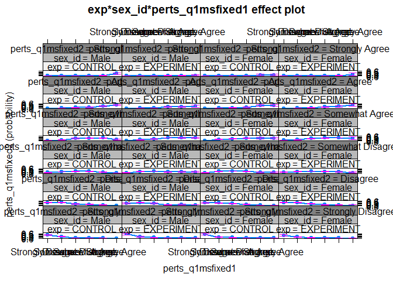
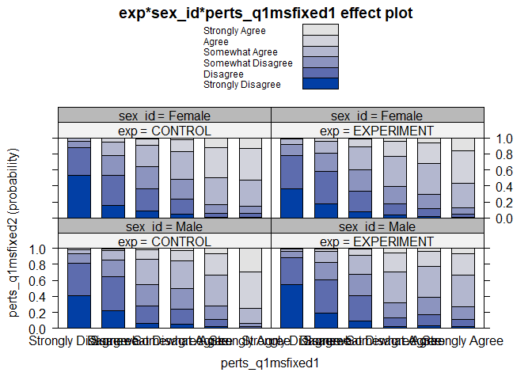
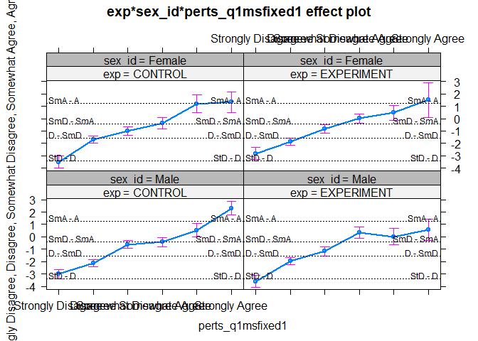
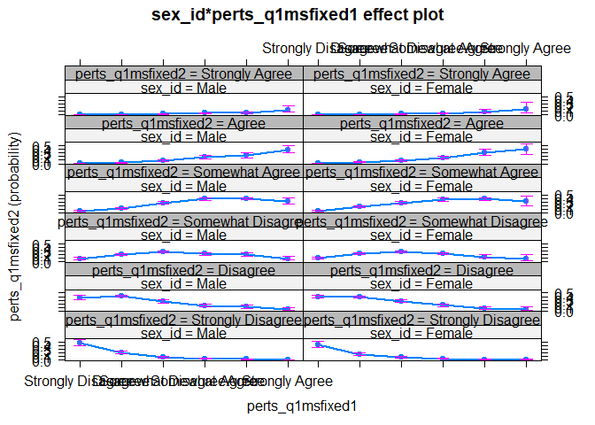
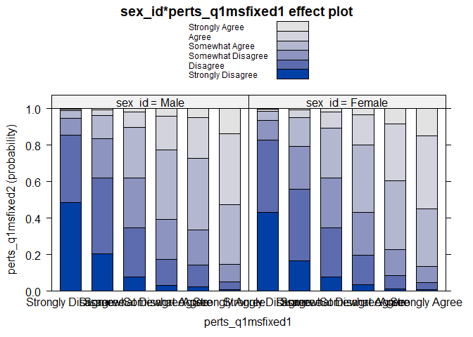
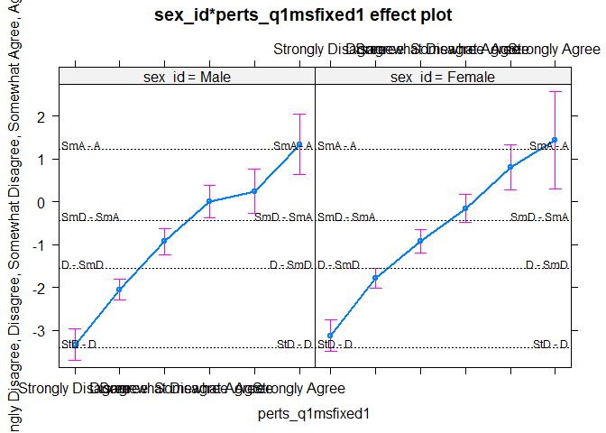
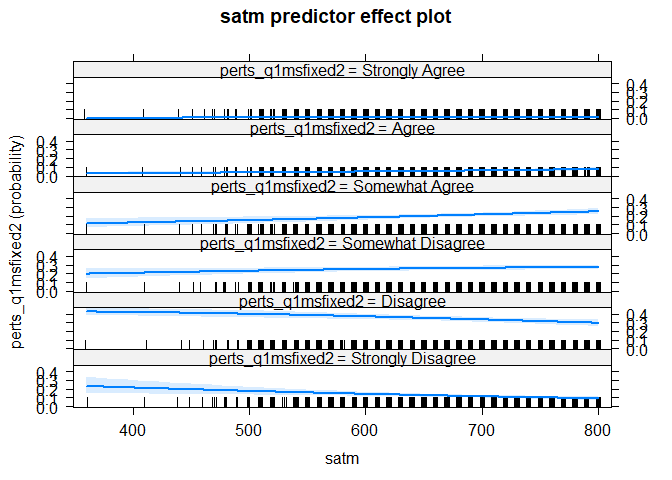

## Set up

### Designate working directories and copy file


```r
original_data_dir   <- here("original-data")
importable_data_dir <- here("processing-and-analysis", "01-importable-data")
analysis_data_dir   <- here("processing-and-analysis", "03-analysis-data")
metadata_dir <- here("original-data", "metadata")
copy_from <- here(original_data_dir, "two_stage_master_wide_deid.rds")
copy_to <- here(importable_data_dir, "two_stage_master_wide_deid.rds")
file.copy(copy_from, copy_to)
```

```
## [1] FALSE
```

### Import dataset


```r
master_original_1 <- readRDS(here(importable_data_dir, "two_stage_master_wide_deid.rds"))
```

### Change value of NAs in `exp` column to `EXPERIMENT`


```r
master <- master_original_1 %>% 
  mutate(exp = replace_na(exp, "EXPERIMENT"))
```

## POLR on Survey Data Part I: Relatively more complex interactions

#### Ensure that survey data is ordered


```r
master$perts_q1msfixed1 <- ordered(master$perts_q1msfixed1, 
                                   levels=c("Strongly Disagree", "Disagree", 
                                            "Somewhat Disagree","Somewhat Agree", 
                                            "Agree", "Strongly Agree"))
master$perts_q1msfixed2 <- ordered(master$perts_q1msfixed2, 
                                   levels=c("Strongly Disagree", "Disagree", 
                                            "Somewhat Disagree", "Somewhat Agree", 
                                            "Agree", "Strongly Agree"))
```

### `perts_q1msfixed1` versus `perts_q1msfixed2` (`sex_id`)


```r
model_1 <- polr(perts_q1msfixed2 ~ exp*sex_id*perts_q1msfixed1 +
                  exp*sex_id + exp*perts_q1msfixed1 + sex_id*perts_q1msfixed1 +
                  exp + sex_id + perts_q1msfixed1 +
                  satm + satv + hs_gpa + aleksikc_score, data = master)

summary(model_1)
```

```
## 
## Re-fitting to get Hessian
```

```
## Call:
## polr(formula = perts_q1msfixed2 ~ exp * sex_id * perts_q1msfixed1 + 
##     exp * sex_id + exp * perts_q1msfixed1 + sex_id * perts_q1msfixed1 + 
##     exp + sex_id + perts_q1msfixed1 + satm + satv + hs_gpa + 
##     aleksikc_score, data = master)
## 
## Coefficients:
##                                                   Value Std. Error t value
## expEXPERIMENT                                 -0.407140  0.1409928 -2.8877
## sex_idFemale                                  -0.104299  0.1408236 -0.7406
## perts_q1msfixed1.L                             4.164843  0.2194950 18.9747
## perts_q1msfixed1.Q                             0.252109  0.1928028  1.3076
## perts_q1msfixed1.C                             0.517695  0.1814118  2.8537
## perts_q1msfixed1^4                             0.390282  0.1765054  2.2112
## perts_q1msfixed1^5                            -0.382503  0.1549721 -2.4682
## satm                                           0.002528  0.0008081  3.1277
## satv                                          -0.001739  0.0008258 -2.1061
## hs_gpa                                        -0.237781  0.1282476 -1.8541
## aleksikc_score                                -0.006756  0.0030490 -2.2159
## expEXPERIMENT:sex_idFemale                     0.480375  0.1722105  2.7895
## expEXPERIMENT:perts_q1msfixed1.L              -0.799794  0.2170400 -3.6850
## expEXPERIMENT:perts_q1msfixed1.Q              -1.339393  0.1822319 -7.3499
## expEXPERIMENT:perts_q1msfixed1.C              -0.453599  0.1999020 -2.2691
## expEXPERIMENT:perts_q1msfixed1^4              -0.169089  0.2031551 -0.8323
## expEXPERIMENT:perts_q1msfixed1^5               0.972764  0.1748760  5.5626
## sex_idFemale:perts_q1msfixed1.L               -0.166368  0.2014304 -0.8259
## sex_idFemale:perts_q1msfixed1.Q               -0.796266  0.1770588 -4.4972
## sex_idFemale:perts_q1msfixed1.C               -0.406120  0.1822933 -2.2278
## sex_idFemale:perts_q1msfixed1^4               -1.052399  0.1994022 -5.2778
## sex_idFemale:perts_q1msfixed1^5                0.182924  0.1713718  1.0674
## expEXPERIMENT:sex_idFemale:perts_q1msfixed1.L  0.327977  0.1567375  2.0925
## expEXPERIMENT:sex_idFemale:perts_q1msfixed1.Q  1.694220  0.1497943 11.3103
## expEXPERIMENT:sex_idFemale:perts_q1msfixed1.C  0.480234  0.1402558  3.4240
## expEXPERIMENT:sex_idFemale:perts_q1msfixed1^4  1.061704  0.1560331  6.8044
## expEXPERIMENT:sex_idFemale:perts_q1msfixed1^5 -0.697007  0.1388426 -5.0201
## 
## Intercepts:
##                                  Value     Std. Error t value  
## Strongly Disagree|Disagree         -3.3945    0.0302  -112.2354
## Disagree|Somewhat Disagree         -1.5492    0.0803   -19.2868
## Somewhat Disagree|Somewhat Agree   -0.4305    0.0935    -4.6048
## Somewhat Agree|Agree                1.2277    0.1214    10.1154
## Agree|Strongly Agree                3.1874    0.2096    15.2051
## 
## Residual Deviance: 4717.048 
## AIC: 4781.048 
## (555 observations deleted due to missingness)
```

```r
levels(master$perts_q1msfixed1)
```

```
## [1] "Strongly Disagree" "Disagree"          "Somewhat Disagree"
## [4] "Somewhat Agree"    "Agree"             "Strongly Agree"
```

The "L", "C", "Q", "4", and "5" suffixes on the `perts_q1msfixed` predictor variable are due to this predictor being an ordered factor. "L" stands for "linear", "C" stands for "cubic", and so on. R fits the data with a series of orthogonal polynomials (for some reason). I don't really know how to interpret the output, or why to ordering of the factor requires this sort of fitting.

If the predictor variables are *un-ordered* factors, then the summary output does not contain these suffixes. I observed this in my exploration of the `effects` package vingette (find it [here](https://uwnetid-my.sharepoint.com/personal/cfcraig_uw_edu/_layouts/15/onedrive.aspx?id=%2Fpersonal%2Fcfcraig%5Fuw%5Fedu%2Fresearch%2F0%20ANALYSES%2Fexplore%2Deffect%2Dpackage&listurl=%2Fpersonal%2Fcfcraig%5Fuw%5Fedu%2Fresearch%2F0%20ANALYSES&remoteItem=%7B%22mp%22%3A%7B%22webAbsoluteUrl%22%3A%22https%3A%2F%2Fuwnetid%2Dmy%2Esharepoint%2Ecom%2Fpersonal%2Fcfcraig%5Fuw%5Fedu%22%2C%22listFullUrl%22%3A%22https%3A%2F%2Fuwnetid%2Dmy%2Esharepoint%2Ecom%2Fpersonal%2Fcfcraig%5Fuw%5Fedu%2FDocuments%22%2C%22rootFolder%22%3A%22%2Fpersonal%2Fcfcraig%5Fuw%5Fedu%2FDocuments%2F0%20ANALYSES%22%7D%2C%22rsi%22%3A%7B%22listFullUrl%22%3A%22https%3A%2F%2Fuwnetid%2Dmy%2Esharepoint%2Ecom%2Fpersonal%2Fcfcraig%5Fuw%5Fedu%2Fresearch%2F0%20ANALYSES%22%2C%22rootFolder%22%3A%22%2Fpersonal%2Fcfcraig%5Fuw%5Fedu%2Fresearch%2F0%20ANALYSES%2Fexplore%2Deffect%2Dpackage%22%2C%22webAbsoluteUrl%22%3A%22https%3A%2F%2Fuwnetid%2Dmy%2Esharepoint%2Ecom%2Fpersonal%2Fcfcraig%5Fuw%5Fedu%2Fresearch%22%7D%7D&viewid=3a9f768c%2D0ade%2D43f5%2D8b58%2De85651c29766)).

This site helped me sort of understand what's going on with these suffixes: <https://data.library.virginia.edu/understanding-ordered-factors-in-a-linear-model/>

The `perts_q1msfixed` variable has six ordered levels, and the regression output shows five polynomial fits for `perts_q1msfixed`. However, these don't seem to have a 1:1 correspondence to the different levels of `perts_q1msfixed` . Is it more about about how many factor "units" different the outcome is relative to the input? That is, if a student's pre mindset response was "Disagree" and their post response was "Somewhat Disagree", is that a linear change because it differs by one factor unit? If the post response was "Somewhat Agree", is that a quadratic change?

**NOTES**:

-   Some of the mindset questions are coded backwards, so we'll have to address that!!
-   Don't I need to include "student" as a random effect? (Cynthia didn't do so in her survey analyses, from what I can tell.)
-   Did Cynthia ever look at individual survey scores?


```r
# This doesn't work. There is not a native way to include random effects in
# a polr model.
# model_1.1 <- polr(perts_q1msfixed2 ~ exp*sex_id*perts_q1msfixed1 +
#                   exp*sex_id + exp*perts_q1msfixed1 + sex_id*perts_q1msfixed1 +
#                   exp + sex_id + perts_q1msfixed1 +
#                   satm + satv + hs_gpa + aleksikc_score + (1|two_stage_id), 
#                   data = master)
# 
# summary(model_1.1)
```

Let's try the `effects` package:


```r
perts_q1_effects <- allEffects(model_1)
```

```
## 
## Re-fitting to get Hessian
## 
## 
## Re-fitting to get Hessian
## 
## 
## Re-fitting to get Hessian
## 
## 
## Re-fitting to get Hessian
## 
## 
## Re-fitting to get Hessian
```

```r
perts_q1_effects
```

```
##  model: perts_q1msfixed2 ~ exp * sex_id * perts_q1msfixed1 + exp * sex_id + 
##     exp * perts_q1msfixed1 + sex_id * perts_q1msfixed1 + exp + 
##     sex_id + perts_q1msfixed1 + satm + satv + hs_gpa + aleksikc_score
## 
## satm effect (probability) for Strongly Disagree
## satm
##        400        500        600        700        800 
## 0.21239053 0.17316986 0.13990527 0.11216373 0.08935156 
## 
## satm effect (probability) for Disagree
## satm
##       400       500       600       700       800 
## 0.4181960 0.3968625 0.3674023 0.3321882 0.2937820 
## 
## satm effect (probability) for Somewhat Disagree
## satm
##       400       500       600       700       800 
## 0.2087696 0.2322617 0.2518275 0.2656087 0.2721717 
## 
## satm effect (probability) for Somewhat Agree
## satm
##       400       500       600       700       800 
## 0.1254699 0.1528707 0.1838715 0.2178401 0.2536245 
## 
## satm effect (probability) for Agree
## satm
##        400        500        600        700        800 
## 0.03006376 0.03826511 0.04854985 0.06135401 0.07714973 
## 
## satm effect (probability) for Strongly Agree
## satm
##         400         500         600         700         800 
## 0.005110277 0.006570144 0.008443517 0.010845220 0.013920482 
## 
## satv effect (probability) for Strongly Disagree
## satv
##        400        500        600        700        800 
## 0.07833264 0.09184663 0.10742034 0.12527049 0.14560297 
## 
## satv effect (probability) for Disagree
## satv
##       400       500       600       700       800 
## 0.2714691 0.2984695 0.3249819 0.3502167 0.3733372 
## 
## satv effect (probability) for Somewhat Disagree
## satv
##       400       500       600       700       800 
## 0.2723756 0.2717975 0.2674626 0.2595986 0.2486062 
## 
## satv effect (probability) for Somewhat Agree
## satv
##       400       500       600       700       800 
## 0.2741433 0.2492922 0.2246162 0.2006768 0.1779119 
## 
## satv effect (probability) for Agree
## satv
##        400        500        600        700        800 
## 0.08764304 0.07508334 0.06414046 0.05465801 0.04647931 
## 
## satv effect (probability) for Strongly Agree
## satv
##         400         500         600         700         800 
## 0.016036302 0.013510829 0.011378480 0.009579401 0.008062459 
## 
## hs_gpa effect (probability) for Strongly Disagree
## hs_gpa
##          3        3.2        3.5        3.7          4 
## 0.09798511 0.10226943 0.10900695 0.11371243 0.12110213 
## 
## hs_gpa effect (probability) for Disagree
## hs_gpa
##         3       3.2       3.5       3.7         4 
## 0.3094675 0.3167135 0.3274349 0.3344596 0.3447698 
## 
## hs_gpa effect (probability) for Somewhat Disagree
## hs_gpa
##         3       3.2       3.5       3.7         4 
## 0.2704620 0.2692264 0.2668652 0.2649615 0.2616302 
## 
## hs_gpa effect (probability) for Somewhat Agree
## hs_gpa
##         3       3.2       3.5       3.7         4 
## 0.2390954 0.2323489 0.2223140 0.2156960 0.2059011 
## 
## hs_gpa effect (probability) for Agree
## hs_gpa
##          3        3.2        3.5        3.7          4 
## 0.07039933 0.06742894 0.06318405 0.06048988 0.05664420 
## 
## hs_gpa effect (probability) for Strongly Agree
## hs_gpa
##           3         3.2         3.5         3.7           4 
## 0.012590547 0.012012827 0.011195010 0.010680632 0.009952595 
## 
## aleksikc_score effect (probability) for Strongly Disagree
## aleksikc_score
##          2         35         68        100        130 
## 0.09624945 0.11746510 0.14261920 0.17114883 0.20184183 
## 
## aleksikc_score effect (probability) for Disagree
## aleksikc_score
##         2        35        68       100       130 
## 0.3064330 0.3398025 0.3702793 0.3954045 0.4136572 
## 
## aleksikc_score effect (probability) for Somewhat Disagree
## aleksikc_score
##         2        35        68       100       130 
## 0.2708950 0.2633170 0.2503037 0.2334817 0.2150042 
## 
## aleksikc_score effect (probability) for Somewhat Agree
## aleksikc_score
##         2        35        68       100       130 
## 0.2419138 0.2106338 0.1809950 0.1545185 0.1320761 
## 
## aleksikc_score effect (probability) for Agree
## aleksikc_score
##          2         35         68        100        130 
## 0.07166977 0.05848195 0.04754453 0.03878313 0.03197316 
## 
## aleksikc_score effect (probability) for Strongly Agree
## aleksikc_score
##           2          35          68         100         130 
## 0.012839024 0.010299603 0.008258250 0.006663352 0.005447525 
## 
## exp*sex_id*perts_q1msfixed1 effect (probability) for Strongly Disagree
## , , perts_q1msfixed1 = Strongly Disagree
## 
##             sex_id
## exp               Male    Female
##   CONTROL    0.4046956 0.5280683
##   EXPERIMENT 0.5493686 0.3594452
## 
## , , perts_q1msfixed1 = Disagree
## 
##             sex_id
## exp               Male    Female
##   CONTROL    0.2244493 0.1512879
##   EXPERIMENT 0.1928970 0.1790317
## 
## , , perts_q1msfixed1 = Somewhat Disagree
## 
##             sex_id
## exp                Male     Female
##   CONTROL    0.05910907 0.08344262
##   EXPERIMENT 0.09721810 0.07290893
## 
## , , perts_q1msfixed1 = Somewhat Agree
## 
##             sex_id
## exp                Male     Female
##   CONTROL    0.04868712 0.04589984
##   EXPERIMENT 0.02324003 0.03231307
## 
## , , perts_q1msfixed1 = Agree
## 
##             sex_id
## exp                Male      Female
##   CONTROL    0.01931389 0.009939136
##   EXPERIMENT 0.03211519 0.020637122
## 
## , , perts_q1msfixed1 = Strongly Agree
## 
##             sex_id
## exp                Male      Female
##   CONTROL    0.00332965 0.008795175
##   EXPERIMENT 0.01896482 0.007350944
## 
## 
## exp*sex_id*perts_q1msfixed1 effect (probability) for Disagree
## , , perts_q1msfixed1 = Strongly Disagree
## 
##             sex_id
## exp               Male    Female
##   CONTROL    0.4067410 0.3482156
##   EXPERIMENT 0.3359134 0.4208755
## 
## , , perts_q1msfixed1 = Disagree
## 
##             sex_id
## exp               Male    Female
##   CONTROL    0.4224382 0.3788689
##   EXPERIMENT 0.4091531 0.4008744
## 
## , , perts_q1msfixed1 = Somewhat Disagree
## 
##             sex_id
## exp               Male    Female
##   CONTROL    0.2254143 0.2821536
##   EXPERIMENT 0.3081337 0.2594509
## 
## , , perts_q1msfixed1 = Somewhat Agree
## 
##             sex_id
## exp               Male    Female
##   CONTROL    0.1960060 0.1875384
##   EXPERIMENT 0.1076565 0.1421779
## 
## , , perts_q1msfixed1 = Agree
## 
##             sex_id
## exp                Male     Female
##   CONTROL    0.09153311 0.04981085
##   EXPERIMENT 0.14146337 0.09705164
## 
## , , perts_q1msfixed1 = Strongly Agree
## 
##             sex_id
## exp                Male     Female
##   CONTROL    0.01737970 0.04438574
##   EXPERIMENT 0.09006271 0.03742653
## 
## 
## exp*sex_id*perts_q1msfixed1 effect (probability) for Somewhat Disagree
## , , perts_q1msfixed1 = Strongly Disagree
## 
##             sex_id
## exp                Male     Female
##   CONTROL    0.11800109 0.07962528
##   EXPERIMENT 0.07410243 0.13545182
## 
## , , perts_q1msfixed1 = Disagree
## 
##             sex_id
## exp               Male    Female
##   CONTROL    0.2017682 0.2453175
##   EXPERIMENT 0.2203547 0.2287187
## 
## , , perts_q1msfixed1 = Somewhat Disagree
## 
##             sex_id
## exp               Male    Female
##   CONTROL    0.2644634 0.2726026
##   EXPERIMENT 0.2706585 0.2714057
## 
## , , perts_q1msfixed1 = Somewhat Agree
## 
##             sex_id
## exp               Male    Female
##   CONTROL    0.2532048 0.2489973
##   EXPERIMENT 0.1846436 0.2183428
## 
## , , perts_q1msfixed1 = Agree
## 
##             sex_id
## exp               Male    Female
##   CONTROL    0.1653495 0.1030875
##   EXPERIMENT 0.2177423 0.1722276
## 
## , , perts_q1msfixed1 = Strongly Agree
## 
##             sex_id
## exp               Male     Female
##   CONTROL    0.0400853 0.09352209
##   EXPERIMENT 0.1634672 0.08070261
## 
## 
## exp*sex_id*perts_q1msfixed1 effect (probability) for Somewhat Agree
## , , perts_q1msfixed1 = Strongly Disagree
## 
##             sex_id
## exp               Male     Female
##   CONTROL    0.0563072 0.03538141
##   EXPERIMENT 0.0326160 0.06700959
## 
## , , perts_q1msfixed1 = Disagree
## 
##             sex_id
## exp               Male    Female
##   CONTROL    0.1184907 0.1722573
##   EXPERIMENT 0.1380865 0.1482388
## 
## , , perts_q1msfixed1 = Somewhat Disagree
## 
##             sex_id
## exp               Male    Female
##   CONTROL    0.3156997 0.2643393
##   EXPERIMENT 0.2403347 0.2851168
## 
## , , perts_q1msfixed1 = Somewhat Agree
## 
##             sex_id
## exp               Male    Female
##   CONTROL    0.3409642 0.3478860
##   EXPERIMENT 0.3920794 0.3797184
## 
## , , perts_q1msfixed1 = Agree
## 
##             sex_id
## exp               Male    Female
##   CONTROL    0.3908346 0.3423946
##   EXPERIMENT 0.3801141 0.3919592
## 
## , , perts_q1msfixed1 = Strongly Agree
## 
##             sex_id
## exp               Male    Female
##   CONTROL    0.1928368 0.3276938
##   EXPERIMENT 0.3903937 0.3041567
## 
## 
## exp*sex_id*perts_q1msfixed1 effect (probability) for Agree
## , , perts_q1msfixed1 = Strongly Disagree
## 
##             sex_id
## exp                 Male      Female
##   CONTROL    0.012221788 0.007473021
##   EXPERIMENT 0.006864673 0.014755489
## 
## , , perts_q1msfixed1 = Disagree
## 
##             sex_id
## exp                Male     Female
##   CONTROL    0.02809015 0.04455778
##   EXPERIMENT 0.03374666 0.03682478
## 
## , , perts_q1msfixed1 = Somewhat Disagree
## 
##             sex_id
## exp                Male     Female
##   CONTROL    0.11374069 0.08247511
##   EXPERIMENT 0.07095577 0.09380949
## 
## , , perts_q1msfixed1 = Somewhat Agree
## 
##             sex_id
## exp               Male    Female
##   CONTROL    0.1347863 0.1416919
##   EXPERIMENT 0.2373669 0.1876189
## 
## , , perts_q1msfixed1 = Agree
## 
##             sex_id
## exp               Male    Female
##   CONTROL    0.2672583 0.3735203
##   EXPERIMENT 0.1884927 0.2564451
## 
## , , perts_q1msfixed1 = Strongly Agree
## 
##             sex_id
## exp               Male    Female
##   CONTROL    0.4532739 0.3905777
##   EXPERIMENT 0.2702501 0.4127912
## 
## 
## exp*sex_id*perts_q1msfixed1 effect (probability) for Strongly Agree
## , , perts_q1msfixed1 = Strongly Disagree
## 
##             sex_id
## exp                 Male      Female
##   CONTROL    0.002033389 0.001236361
##   EXPERIMENT 0.001134902 0.002462332
## 
## , , perts_q1msfixed1 = Disagree
## 
##             sex_id
## exp                 Male      Female
##   CONTROL    0.004763345 0.007710604
##   EXPERIMENT 0.005762190 0.006311613
## 
## , , perts_q1msfixed1 = Somewhat Disagree
## 
##             sex_id
## exp                Male     Female
##   CONTROL    0.02157284 0.01498675
##   EXPERIMENT 0.01269927 0.01730823
## 
## , , perts_q1msfixed1 = Somewhat Agree
## 
##             sex_id
## exp                Male     Female
##   CONTROL    0.02635149 0.02798651
##   EXPERIMENT 0.05501365 0.03982896
## 
## , , perts_q1msfixed1 = Agree
## 
##             sex_id
## exp                Male     Female
##   CONTROL    0.06571059 0.12124769
##   EXPERIMENT 0.04007240 0.06167931
## 
## , , perts_q1msfixed1 = Strongly Agree
## 
##             sex_id
## exp                Male    Female
##   CONTROL    0.29309466 0.1350255
##   EXPERIMENT 0.06686143 0.1575720
```

polr(formula = perts_q1msfixed2 \~ exp \* sex_id \* perts_q1msfixed1 +

exp \* sex_id + exp \* perts_q1msfixed1 + sex_id \* perts_q1msfixed1 +

exp + sex_id + perts_q1msfixed1 + satm + satv + hs_gpa +

aleksikc_score, data = master)


```r
plot(effect("exp*sex_id*perts_q1msfixed1", model_1, 
     given.values = c(sex_idFemale = 0.5)))
```

```
## 
## Re-fitting to get Hessian
```

<!-- -->

```r
plot(effect("exp*sex_id*perts_q1msfixed1", model_1, 
     given.values = c(sex_idFemale = 0.5)), style = "stacked")
```

```
## 
## Re-fitting to get Hessian
```

<!-- -->

```r
plot(effect("exp*sex_id*perts_q1msfixed1", model_1, 
     given.values = c(sex_idFemale = 0.5), latent = TRUE))
```

```
## 
## Re-fitting to get Hessian
```

<!-- -->


```r
plot(effect("sex_id*perts_q1msfixed1", model_1, 
     given.values = c(sex_idFemale = 0.5)))
```

```
## NOTE: sex_id:perts_q1msfixed1 is not a high-order term in the model
```

```
## 
## Re-fitting to get Hessian
```

<!-- -->

```r
plot(effect("sex_id*perts_q1msfixed1", model_1, 
     given.values = c(sex_idFemale = 0.5)), style = "stacked")
```

```
## NOTE: sex_id:perts_q1msfixed1 is not a high-order term in the model
## 
## Re-fitting to get Hessian
```

<!-- -->

```r
plot(effect("sex_id*perts_q1msfixed1", model_1, 
     given.values = c(sex_idFemale = 0.5), latent = TRUE))
```

```
## NOTE: sex_id:perts_q1msfixed1 is not a high-order term in the model
## 
## Re-fitting to get Hessian
```

<!-- -->


```r
plot(predictorEffect("satm", model_1, 
     given.values = c(sex_idFemale = 0.5)))
```

```
## 
## Re-fitting to get Hessian
```

<!-- -->

# Try some `anova` model selection:


```r
Anova(model_1)
```

```
## Analysis of Deviance Table (Type II tests)
## 
## Response: perts_q1msfixed2
##                             LR Chisq Df Pr(>Chisq)    
## exp                             0.02  1   0.891081    
## sex_id                          2.18  1   0.139663    
## perts_q1msfixed1              465.83  5  < 2.2e-16 ***
## satm                           10.01  1   0.001554 ** 
## satv                            4.50  1   0.033871 *  
## hs_gpa                          0.73  1   0.394411    
## aleksikc_score                  4.89  1   0.027033 *  
## exp:sex_id                      0.32  1   0.572656    
## exp:perts_q1msfixed1            9.43  5   0.093145 .  
## sex_id:perts_q1msfixed1         4.36  5   0.498347    
## exp:sex_id:perts_q1msfixed1    12.20  5   0.032119 *  
## ---
## Signif. codes:  0 '***' 0.001 '**' 0.01 '*' 0.05 '.' 0.1 ' ' 1
```

```r
model_1 <- polr(perts_q1msfixed2 ~ exp*sex_id*perts_q1msfixed1 +
                  exp*sex_id + exp*perts_q1msfixed1 + sex_id*perts_q1msfixed1 +
                  exp + sex_id + perts_q1msfixed1 +
                  satm + satv + hs_gpa + aleksikc_score, data = master)

summary(model_1)
```

```
## 
## Re-fitting to get Hessian
```

```
## Call:
## polr(formula = perts_q1msfixed2 ~ exp * sex_id * perts_q1msfixed1 + 
##     exp * sex_id + exp * perts_q1msfixed1 + sex_id * perts_q1msfixed1 + 
##     exp + sex_id + perts_q1msfixed1 + satm + satv + hs_gpa + 
##     aleksikc_score, data = master)
## 
## Coefficients:
##                                                   Value Std. Error t value
## expEXPERIMENT                                 -0.407140  0.1409928 -2.8877
## sex_idFemale                                  -0.104299  0.1408236 -0.7406
## perts_q1msfixed1.L                             4.164843  0.2194950 18.9747
## perts_q1msfixed1.Q                             0.252109  0.1928028  1.3076
## perts_q1msfixed1.C                             0.517695  0.1814118  2.8537
## perts_q1msfixed1^4                             0.390282  0.1765054  2.2112
## perts_q1msfixed1^5                            -0.382503  0.1549721 -2.4682
## satm                                           0.002528  0.0008081  3.1277
## satv                                          -0.001739  0.0008258 -2.1061
## hs_gpa                                        -0.237781  0.1282476 -1.8541
## aleksikc_score                                -0.006756  0.0030490 -2.2159
## expEXPERIMENT:sex_idFemale                     0.480375  0.1722105  2.7895
## expEXPERIMENT:perts_q1msfixed1.L              -0.799794  0.2170400 -3.6850
## expEXPERIMENT:perts_q1msfixed1.Q              -1.339393  0.1822319 -7.3499
## expEXPERIMENT:perts_q1msfixed1.C              -0.453599  0.1999020 -2.2691
## expEXPERIMENT:perts_q1msfixed1^4              -0.169089  0.2031551 -0.8323
## expEXPERIMENT:perts_q1msfixed1^5               0.972764  0.1748760  5.5626
## sex_idFemale:perts_q1msfixed1.L               -0.166368  0.2014304 -0.8259
## sex_idFemale:perts_q1msfixed1.Q               -0.796266  0.1770588 -4.4972
## sex_idFemale:perts_q1msfixed1.C               -0.406120  0.1822933 -2.2278
## sex_idFemale:perts_q1msfixed1^4               -1.052399  0.1994022 -5.2778
## sex_idFemale:perts_q1msfixed1^5                0.182924  0.1713718  1.0674
## expEXPERIMENT:sex_idFemale:perts_q1msfixed1.L  0.327977  0.1567375  2.0925
## expEXPERIMENT:sex_idFemale:perts_q1msfixed1.Q  1.694220  0.1497943 11.3103
## expEXPERIMENT:sex_idFemale:perts_q1msfixed1.C  0.480234  0.1402558  3.4240
## expEXPERIMENT:sex_idFemale:perts_q1msfixed1^4  1.061704  0.1560331  6.8044
## expEXPERIMENT:sex_idFemale:perts_q1msfixed1^5 -0.697007  0.1388426 -5.0201
## 
## Intercepts:
##                                  Value     Std. Error t value  
## Strongly Disagree|Disagree         -3.3945    0.0302  -112.2354
## Disagree|Somewhat Disagree         -1.5492    0.0803   -19.2868
## Somewhat Disagree|Somewhat Agree   -0.4305    0.0935    -4.6048
## Somewhat Agree|Agree                1.2277    0.1214    10.1154
## Agree|Strongly Agree                3.1874    0.2096    15.2051
## 
## Residual Deviance: 4717.048 
## AIC: 4781.048 
## (555 observations deleted due to missingness)
```

**QUESITON**: How can a 3-way interaction be significant, but the related two-way interactions and main effects *not* be significant?

### `perts_q1msfixed1` versus `perts_q1msfixed2` (`urm_id`)


```r
model_2 <- polr(perts_q1msfixed2 ~ exp*urm_id*perts_q1msfixed1 +
                  exp*urm_id + exp*perts_q1msfixed1 + urm_id*perts_q1msfixed1 +
                  exp + urm_id + perts_q1msfixed1 +
                  satm + satv + hs_gpa + aleksikc_score, data = master)

summary(model_2)
```

```
## 
## Re-fitting to get Hessian
```

```
## Call:
## polr(formula = perts_q1msfixed2 ~ exp * urm_id * perts_q1msfixed1 + 
##     exp * urm_id + exp * perts_q1msfixed1 + urm_id * perts_q1msfixed1 + 
##     exp + urm_id + perts_q1msfixed1 + satm + satv + hs_gpa + 
##     aleksikc_score, data = master)
## 
## Coefficients:
##                                                Value Std. Error   t value
## expEXPERIMENT                               0.003437  0.1075633   0.03195
## urm_idURM                                   0.106804  0.2041143   0.52326
## perts_q1msfixed1.L                          3.269408  0.1229988  26.58081
## perts_q1msfixed1.Q                         -0.965449  0.1613628  -5.98310
## perts_q1msfixed1.C                         -0.358483  0.1415773  -2.53207
## perts_q1msfixed1^4                         -0.459670  0.1260988  -3.64532
## perts_q1msfixed1^5                         -0.230119  0.1519483  -1.51446
## satm                                        0.001451  0.0009065   1.60052
## satv                                       -0.001002  0.0009218  -1.08689
## hs_gpa                                     -0.295246  0.1328493  -2.22241
## aleksikc_score                             -0.007801  0.0032349  -2.41162
## expEXPERIMENT:urm_idURM                    -0.265843  0.2658436  -1.00000
## expEXPERIMENT:perts_q1msfixed1.L            0.375131  0.1413193   2.65449
## expEXPERIMENT:perts_q1msfixed1.Q            0.233303  0.2040226   1.14352
## expEXPERIMENT:perts_q1msfixed1.C            0.542916  0.1797415   3.02054
## expEXPERIMENT:perts_q1msfixed1^4            0.714424  0.1399625   5.10440
## expEXPERIMENT:perts_q1msfixed1^5            0.542343  0.1951127   2.77964
## urm_idURM:perts_q1msfixed1.L                1.777401  0.1679259  10.58443
## urm_idURM:perts_q1msfixed1.Q                0.548747  0.1997340   2.74739
## urm_idURM:perts_q1msfixed1.C                1.293467  0.1925058   6.71911
## urm_idURM:perts_q1msfixed1^4                0.105770  0.1626507   0.65029
## urm_idURM:perts_q1msfixed1^5               -0.336271  0.2520633  -1.33407
## expEXPERIMENT:urm_idURM:perts_q1msfixed1.L -1.732106  0.1099923 -15.74751
## expEXPERIMENT:urm_idURM:perts_q1msfixed1.Q  1.029411  0.1519350   6.77534
## expEXPERIMENT:urm_idURM:perts_q1msfixed1.C -0.603449  0.1331344  -4.53263
## expEXPERIMENT:urm_idURM:perts_q1msfixed1^4  0.464901  0.0998553   4.65575
## expEXPERIMENT:urm_idURM:perts_q1msfixed1^5  0.677649  0.1459584   4.64275
## 
## Intercepts:
##                                  Value     Std. Error t value  
## Strongly Disagree|Disagree         -3.6951    0.0296  -124.8317
## Disagree|Somewhat Disagree         -1.8010    0.0832   -21.6558
## Somewhat Disagree|Somewhat Agree   -0.6767    0.0973    -6.9510
## Somewhat Agree|Agree                1.0030    0.1279     7.8417
## Agree|Strongly Agree                2.9780    0.2251    13.2313
## 
## Residual Deviance: 4241.402 
## AIC: 4305.402 
## (702 observations deleted due to missingness)
```

### `perts_q1msfixed1` versus `perts_q1msfixed2` (`eop_id`)


```r
model_3 <- polr(perts_q1msfixed2 ~ exp*eop_id*perts_q1msfixed1 +
                  exp*eop_id + exp*perts_q1msfixed1 + eop_id*perts_q1msfixed1 +
                  exp + eop_id + perts_q1msfixed1 +
                  satm + satv + hs_gpa + aleksikc_score, data = master)

summary(model_3)
```

```
## 
## Re-fitting to get Hessian
```

```
## Call:
## polr(formula = perts_q1msfixed2 ~ exp * eop_id * perts_q1msfixed1 + 
##     exp * eop_id + exp * perts_q1msfixed1 + eop_id * perts_q1msfixed1 + 
##     exp + eop_id + perts_q1msfixed1 + satm + satv + hs_gpa + 
##     aleksikc_score, data = master)
## 
## Coefficients:
##                                                Value Std. Error  t value
## expEXPERIMENT                               0.118666  0.1117487  1.06190
## eop_idEOP                                   0.220861  0.1670739  1.32194
## perts_q1msfixed1.L                          3.128435  0.2100658 14.89264
## perts_q1msfixed1.Q                         -0.937687  0.2236521 -4.19261
## perts_q1msfixed1.C                         -0.218288  0.1840721 -1.18588
## perts_q1msfixed1^4                         -0.452042  0.1380541 -3.27438
## perts_q1msfixed1^5                         -0.234320  0.1439900 -1.62734
## satm                                        0.002188  0.0007979  2.74207
## satv                                       -0.001779  0.0008249 -2.15610
## hs_gpa                                     -0.138645  0.1330610 -1.04196
## aleksikc_score                             -0.007760  0.0030327 -2.55886
## expEXPERIMENT:eop_idEOP                    -0.338666  0.2050367 -1.65173
## expEXPERIMENT:perts_q1msfixed1.L            0.272364  0.1878760  1.44970
## expEXPERIMENT:perts_q1msfixed1.Q            0.196371  0.2280793  0.86098
## expEXPERIMENT:perts_q1msfixed1.C            0.206119  0.1855450  1.11088
## expEXPERIMENT:perts_q1msfixed1^4            0.498273  0.1375008  3.62378
## expEXPERIMENT:perts_q1msfixed1^5            0.469142  0.1807994  2.59482
## eop_idEOP:perts_q1msfixed1.L                1.308405  0.1453586  9.00122
## eop_idEOP:perts_q1msfixed1.Q                0.985015  0.1731020  5.69037
## eop_idEOP:perts_q1msfixed1.C                0.923656  0.1443786  6.39746
## eop_idEOP:perts_q1msfixed1^4                0.515804  0.1162945  4.43533
## eop_idEOP:perts_q1msfixed1^5               -0.369518  0.1758465 -2.10136
## expEXPERIMENT:eop_idEOP:perts_q1msfixed1.L -0.946143  0.1027078 -9.21199
## expEXPERIMENT:eop_idEOP:perts_q1msfixed1.Q  0.011463  0.1236483  0.09271
## expEXPERIMENT:eop_idEOP:perts_q1msfixed1.C  0.101353  0.1083360  0.93555
## expEXPERIMENT:eop_idEOP:perts_q1msfixed1^4  0.564121  0.0849498  6.64063
## expEXPERIMENT:eop_idEOP:perts_q1msfixed1^5  0.752423  0.1219668  6.16908
## 
## Intercepts:
##                                  Value     Std. Error t value  
## Strongly Disagree|Disagree         -3.0018    0.0283  -105.9454
## Disagree|Somewhat Disagree         -1.1647    0.0792   -14.7098
## Somewhat Disagree|Somewhat Agree   -0.0458    0.0924    -0.4956
## Somewhat Agree|Agree                1.6147    0.1199    13.4683
## Agree|Strongly Agree                3.5770    0.2082    17.1771
## 
## Residual Deviance: 4725.446 
## AIC: 4789.446 
## (555 observations deleted due to missingness)
```

### `perts_q1msfixed1` versus `perts_q1msfixed2` (`fgn_id`)


```r
model_4 <- polr(perts_q1msfixed2 ~ exp*fgn_id*perts_q1msfixed1 +
                  exp*fgn_id + exp*perts_q1msfixed1 + fgn_id*perts_q1msfixed1 +
                  exp + fgn_id + perts_q1msfixed1 +
                  satm + satv + hs_gpa + aleksikc_score, data = master)

summary(model_4)
```

```
## 
## Re-fitting to get Hessian
```

```
## Call:
## polr(formula = perts_q1msfixed2 ~ exp * fgn_id * perts_q1msfixed1 + 
##     exp * fgn_id + exp * perts_q1msfixed1 + fgn_id * perts_q1msfixed1 + 
##     exp + fgn_id + perts_q1msfixed1 + satm + satv + hs_gpa + 
##     aleksikc_score, data = master)
## 
## Coefficients:
##                                                Value Std. Error t value
## expEXPERIMENT                               0.021383  0.1169988  0.1828
## fgn_idFGN                                   0.068645  0.1516817  0.4526
## perts_q1msfixed1.L                          3.300165  0.2021820 16.3227
## perts_q1msfixed1.Q                         -1.113435  0.2240898 -4.9687
## perts_q1msfixed1.C                         -0.317997  0.1871334 -1.6993
## perts_q1msfixed1^4                         -0.523614  0.1405717 -3.7249
## perts_q1msfixed1^5                         -0.261872  0.1427943 -1.8339
## satm                                        0.002299  0.0007854  2.9275
## satv                                       -0.002012  0.0008429 -2.3870
## hs_gpa                                     -0.110086  0.1345486 -0.8182
## aleksikc_score                             -0.007759  0.0030250 -2.5651
## expEXPERIMENT:fgn_idFGN                     0.258377  0.1860087  1.3891
## expEXPERIMENT:perts_q1msfixed1.L           -0.036116  0.2151826 -0.1678
## expEXPERIMENT:perts_q1msfixed1.Q            0.383219  0.2152801  1.7801
## expEXPERIMENT:perts_q1msfixed1.C            0.404540  0.1763700  2.2937
## expEXPERIMENT:perts_q1msfixed1^4            0.709253  0.1474809  4.8091
## expEXPERIMENT:perts_q1msfixed1^5            0.581827  0.1739214  3.3453
## fgn_idFGN:perts_q1msfixed1.L                0.522006  0.2004016  2.6048
## fgn_idFGN:perts_q1msfixed1.Q                1.599049  0.1666669  9.5943
## fgn_idFGN:perts_q1msfixed1.C                1.328544  0.1889009  7.0330
## fgn_idFGN:perts_q1msfixed1^4                0.999028  0.2161854  4.6212
## fgn_idFGN:perts_q1msfixed1^5                0.127252  0.1829423  0.6956
## expEXPERIMENT:fgn_idFGN:perts_q1msfixed1.L  0.809031  0.1320222  6.1280
## expEXPERIMENT:fgn_idFGN:perts_q1msfixed1.Q -0.632644  0.1249046 -5.0650
## expEXPERIMENT:fgn_idFGN:perts_q1msfixed1.C -0.979833  0.1368810 -7.1583
## expEXPERIMENT:fgn_idFGN:perts_q1msfixed1^4 -0.807031  0.1292614 -6.2434
## expEXPERIMENT:fgn_idFGN:perts_q1msfixed1^5 -0.303681  0.1304207 -2.3285
## 
## Intercepts:
##                                  Value     Std. Error t value  
## Strongly Disagree|Disagree         -3.0029    0.0289  -103.9181
## Disagree|Somewhat Disagree         -1.1698    0.0792   -14.7757
## Somewhat Disagree|Somewhat Agree   -0.0508    0.0924    -0.5496
## Somewhat Agree|Agree                1.6085    0.1200    13.4023
## Agree|Strongly Agree                3.5793    0.2083    17.1799
## 
## Residual Deviance: 4720.059 
## AIC: 4784.059 
## (557 observations deleted due to missingness)
```

## POLR on Survey Data Part II: Relatively simpler interactions

#### Create a dataset that only contains data from the control year


```r
master_control <- master %>% 
  filter(exp == "CONTROL")
```

## `sex_id`:

### `perts_q1msfixed1` regressed on `exp` (`sex_id`; compared across years)


```r
model_5 <- polr(perts_q1msfixed2 ~ exp*sex_id +
                                    exp + sex_id +
                                    satm + satv + hs_gpa + aleksikc_score,
                                    data = master)

summary(model_5)
```

```
## 
## Re-fitting to get Hessian
```

```
## Call:
## polr(formula = perts_q1msfixed2 ~ exp * sex_id + exp + sex_id + 
##     satm + satv + hs_gpa + aleksikc_score, data = master)
## 
## Coefficients:
##                                Value Std. Error t value
## expEXPERIMENT              -0.111639  0.1358081 -0.8220
## sex_idFemale                0.039642  0.1361480  0.2912
## satm                        0.003552  0.0007917  4.4865
## satv                       -0.002613  0.0008118 -3.2191
## hs_gpa                     -0.168269  0.1267056 -1.3280
## aleksikc_score             -0.005788  0.0030015 -1.9283
## expEXPERIMENT:sex_idFemale  0.252632  0.1796305  1.4064
## 
## Intercepts:
##                                  Value    Std. Error t value 
## Strongly Disagree|Disagree        -1.7729   0.0287   -61.7966
## Disagree|Somewhat Disagree        -0.2622   0.0664    -3.9520
## Somewhat Disagree|Somewhat Agree   0.6440   0.0762     8.4525
## Somewhat Agree|Agree               2.0626   0.1013    20.3642
## Agree|Strongly Agree               3.9060   0.1949    20.0388
## 
## Residual Deviance: 5211.846 
## AIC: 5235.846 
## (554 observations deleted due to missingness)
```

##### As the value of `exp` changes, the log odds of (males?) answering one or more higher levels on the Likert scale decreases by 0.111639

##### When we get rid of the other survey question as an interaction, the "L, Q, C, \^4 \^5" indicator in the regression output disappears

### `perts_q1msfixed1` versus `perts_q1msfixed2` (`sex_id`; compared within control year)


```r
model_6 <- polr(perts_q1msfixed2 ~ sex_id*perts_q1msfixed1 +
                                    sex_id + perts_q1msfixed1 +
                                    satm + satv + hs_gpa + aleksikc_score,
                                    data = master_control)

summary(model_6)
```

```
## 
## Re-fitting to get Hessian
```

```
## Call:
## polr(formula = perts_q1msfixed2 ~ sex_id * perts_q1msfixed1 + 
##     sex_id + perts_q1msfixed1 + satm + satv + hs_gpa + aleksikc_score, 
##     data = master_control)
## 
## Coefficients:
##                                      Value Std. Error t value
## sex_idFemale                    -0.1677219   0.167593 -1.0008
## perts_q1msfixed1.L               4.2710149   0.224245 19.0462
## perts_q1msfixed1.Q               0.2746683   0.232730  1.1802
## perts_q1msfixed1.C               0.5577975   0.231989  2.4044
## perts_q1msfixed1^4               0.3794431   0.254960  1.4882
## perts_q1msfixed1^5              -0.4018497   0.239472 -1.6781
## satm                             0.0021850   0.001215  1.7986
## satv                            -0.0009853   0.001285 -0.7670
## hs_gpa                          -0.0718219   0.188756 -0.3805
## aleksikc_score                  -0.0127954   0.004980 -2.5694
## sex_idFemale:perts_q1msfixed1.L -0.2681221   0.348561 -0.7692
## sex_idFemale:perts_q1msfixed1.Q -0.8557973   0.291443 -2.9364
## sex_idFemale:perts_q1msfixed1.C -0.4269565   0.329770 -1.2947
## sex_idFemale:perts_q1msfixed1^4 -1.0504320   0.370890 -2.8322
## sex_idFemale:perts_q1msfixed1^5  0.1873156   0.327522  0.5719
## 
## Intercepts:
##                                  Value    Std. Error t value 
## Strongly Disagree|Disagree        -2.7911   0.0453   -61.5697
## Disagree|Somewhat Disagree        -0.8651   0.1228    -7.0434
## Somewhat Disagree|Somewhat Agree   0.2431   0.1414     1.7187
## Somewhat Agree|Agree               1.8315   0.1803    10.1582
## Agree|Strongly Agree               3.8608   0.3172    12.1725
## 
## Residual Deviance: 2099.139 
## AIC: 2139.139 
## (251 observations deleted due to missingness)
```

##### The log odds of females answering one or more higher levels on the Likert scale for the end of quarter survey vs. men decreases by 0.1677219?

## `urm_id`:

### `perts_q1msfixed1` regressed on `exp` (`urm_id`; compared across years)


```r
model_7 <- polr(perts_q1msfixed2 ~ exp*urm_id +
                                    exp + urm_id +
                                    satm + satv + hs_gpa + aleksikc_score,
                                    data = master)

summary(model_7)
```

```
## 
## Re-fitting to get Hessian
```

```
## Call:
## polr(formula = perts_q1msfixed2 ~ exp * urm_id + exp + urm_id + 
##     satm + satv + hs_gpa + aleksikc_score, data = master)
## 
## Coefficients:
##                             Value Std. Error t value
## expEXPERIMENT            0.017102  0.0987603  0.1732
## urm_idURM               -0.052507  0.2199554 -0.2387
## satm                     0.001556  0.0008857  1.7571
## satv                    -0.001159  0.0009020 -1.2845
## hs_gpa                  -0.271852  0.1303234 -2.0860
## aleksikc_score          -0.006723  0.0032054 -2.0975
## expEXPERIMENT:urm_idURM -0.512313  0.2907329 -1.7621
## 
## Intercepts:
##                                  Value    Std. Error t value 
## Strongly Disagree|Disagree        -2.6409   0.0281   -94.0681
## Disagree|Somewhat Disagree        -1.0954   0.0683   -16.0393
## Somewhat Disagree|Somewhat Agree  -0.1904   0.0788    -2.4167
## Somewhat Agree|Agree               1.2316   0.1070    11.5158
## Agree|Strongly Agree               3.0701   0.2114    14.5238
## 
## Residual Deviance: 4706.415 
## AIC: 4730.415 
## (702 observations deleted due to missingness)
```

### `perts_q1msfixed1` versus `perts_q1msfixed2` (`urm_id`; compared within control year)


```r
model_8 <- polr(perts_q1msfixed2 ~ urm_id*perts_q1msfixed1 +
                                    urm_id + perts_q1msfixed1 +
                                    satm + satv + hs_gpa + aleksikc_score,
                                    data = master_control)

summary(model_8)
```

```
## 
## Re-fitting to get Hessian
```

```
## Call:
## polr(formula = perts_q1msfixed2 ~ urm_id * perts_q1msfixed1 + 
##     urm_id + perts_q1msfixed1 + satm + satv + hs_gpa + aleksikc_score, 
##     data = master_control)
## 
## Coefficients:
##                                  Value Std. Error t value
## urm_idURM                     0.184148   0.224645  0.8197
## perts_q1msfixed1.L            3.189286   0.189903 16.7943
## perts_q1msfixed1.Q           -1.017437   0.165648 -6.1422
## perts_q1msfixed1.C           -0.374578   0.178865 -2.0942
## perts_q1msfixed1^4           -0.480594   0.196710 -2.4432
## perts_q1msfixed1^5           -0.236439   0.179850 -1.3146
## satm                          0.002659   0.001353  1.9646
## satv                         -0.001407   0.001368 -1.0288
## hs_gpa                       -0.124841   0.199684 -0.6252
## aleksikc_score               -0.012653   0.005187 -2.4392
## urm_idURM:perts_q1msfixed1.L  1.878071   0.133740 14.0427
## urm_idURM:perts_q1msfixed1.Q  0.595769   0.098719  6.0350
## urm_idURM:perts_q1msfixed1.C  1.353091   0.291767  4.6376
## urm_idURM:perts_q1msfixed1^4  0.127983   0.304221  0.4207
## urm_idURM:perts_q1msfixed1^5 -0.322332   0.430482 -0.7488
## 
## Intercepts:
##                                  Value    Std. Error t value 
## Strongly Disagree|Disagree        -2.6454   0.0441   -59.9765
## Disagree|Somewhat Disagree        -0.6818   0.1261    -5.4079
## Somewhat Disagree|Somewhat Agree   0.3854   0.1451     2.6555
## Somewhat Agree|Agree               2.0134   0.1885    10.6813
## Agree|Strongly Agree               3.9683   0.3213    12.3499
## 
## Residual Deviance: 1940.188 
## AIC: 1980.188 
## (302 observations deleted due to missingness)
```

## `eop_id`:

### `perts_q1msfixed1` regressed on `exp` (`eop_id`; compared across years)


```r
model_9 <- polr(perts_q1msfixed2 ~ exp*eop_id +
                                    exp + eop_id +
                                    satm + satv + hs_gpa + aleksikc_score,
                                    data = master)

summary(model_9)
```

```
## 
## Re-fitting to get Hessian
```

```
## Call:
## polr(formula = perts_q1msfixed2 ~ exp * eop_id + exp + eop_id + 
##     satm + satv + hs_gpa + aleksikc_score, data = master)
## 
## Coefficients:
##                             Value Std. Error t value
## expEXPERIMENT            0.116659  0.0986452  1.1826
## eop_idEOP               -0.164253  0.1776129 -0.9248
## satm                     0.002590  0.0007810  3.3163
## satv                    -0.002697  0.0008103 -3.3286
## hs_gpa                  -0.190147  0.1313238 -1.4479
## aleksikc_score          -0.006303  0.0029962 -2.1035
## expEXPERIMENT:eop_idEOP -0.385032  0.2262363 -1.7019
## 
## Intercepts:
##                                  Value    Std. Error t value 
## Strongly Disagree|Disagree        -2.6461   0.0268   -98.8432
## Disagree|Somewhat Disagree        -1.1308   0.0655   -17.2658
## Somewhat Disagree|Somewhat Agree  -0.2207   0.0753    -2.9308
## Somewhat Agree|Agree               1.2020   0.1005    11.9648
## Agree|Strongly Agree               3.0470   0.1945    15.6689
## 
## Residual Deviance: 5204.065 
## AIC: 5228.065 
## (554 observations deleted due to missingness)
```

### `perts_q1msfixed1` versus `perts_q1msfixed2` (`eop_id`; compared within control year)


```r
model_10 <- polr(perts_q1msfixed2 ~ eop_id*perts_q1msfixed1 +
                                    eop_id + perts_q1msfixed1 +
                                    satm + satv + hs_gpa + aleksikc_score,
                                    data = master_control)

summary(model_10)
```

```
## 
## Re-fitting to get Hessian
```

```
## Call:
## polr(formula = perts_q1msfixed2 ~ eop_id * perts_q1msfixed1 + 
##     eop_id + perts_q1msfixed1 + satm + satv + hs_gpa + aleksikc_score, 
##     data = master_control)
## 
## Coefficients:
##                                  Value Std. Error  t value
## eop_idEOP                     0.257865   0.194172  1.32803
## perts_q1msfixed1.L            3.120291   0.186290 16.74963
## perts_q1msfixed1.Q           -0.998915   0.171419 -5.82734
## perts_q1msfixed1.C           -0.242495   0.175696 -1.38019
## perts_q1msfixed1^4           -0.487181   0.185734 -2.62301
## perts_q1msfixed1^5           -0.257720   0.171683 -1.50114
## satm                          0.002043   0.001211  1.68755
## satv                         -0.001031   0.001279 -0.80640
## hs_gpa                        0.008584   0.200587  0.04279
## aleksikc_score               -0.013864   0.005000 -2.77264
## eop_idEOP:perts_q1msfixed1.L  1.390486   0.234605  5.92693
## eop_idEOP:perts_q1msfixed1.Q  1.069127   0.375957  2.84375
## eop_idEOP:perts_q1msfixed1.C  1.021203   0.308786  3.30716
## eop_idEOP:perts_q1msfixed1^4  0.550667   0.242988  2.26623
## eop_idEOP:perts_q1msfixed1^5 -0.365391   0.365405 -0.99996
## 
## Intercepts:
##                                  Value    Std. Error t value 
## Strongly Disagree|Disagree        -2.2835   0.0433   -52.7153
## Disagree|Somewhat Disagree        -0.3719   0.1211    -3.0723
## Somewhat Disagree|Somewhat Agree   0.7365   0.1399     5.2659
## Somewhat Agree|Agree               2.3236   0.1788    12.9967
## Agree|Strongly Agree               4.3546   0.3155    13.8009
## 
## Residual Deviance: 2104.729 
## AIC: 2144.729 
## (251 observations deleted due to missingness)
```

## `fgn_id`:

### `perts_q1msfixed1` regressed on `exp` (`fgn_id`; compared across years)


```r
model_11 <- polr(perts_q1msfixed2 ~ exp*fgn_id +
                                    exp + fgn_id +
                                    satm + satv + hs_gpa + aleksikc_score,
                                    data = master)

summary(model_11)
```

```
## 
## Re-fitting to get Hessian
```

```
## Call:
## polr(formula = perts_q1msfixed2 ~ exp * fgn_id + exp + fgn_id + 
##     satm + satv + hs_gpa + aleksikc_score, data = master)
## 
## Coefficients:
##                             Value Std. Error t value
## expEXPERIMENT            0.036875  0.1036551  0.3558
## fgn_idFGN               -0.175034  0.1488818 -1.1757
## satm                     0.002996  0.0007687  3.8977
## satv                    -0.002821  0.0008288 -3.4045
## hs_gpa                  -0.131663  0.1330398 -0.9896
## aleksikc_score          -0.006301  0.0029968 -2.1026
## expEXPERIMENT:fgn_idFGN -0.045266  0.2012636 -0.2249
## 
## Intercepts:
##                                  Value    Std. Error t value 
## Strongly Disagree|Disagree        -2.2349   0.0272   -82.2791
## Disagree|Somewhat Disagree        -0.7287   0.0655   -11.1266
## Somewhat Disagree|Somewhat Agree   0.1774   0.0753     2.3553
## Somewhat Agree|Agree               1.5940   0.1004    15.8730
## Agree|Strongly Agree               3.4384   0.1944    17.6845
## 
## Residual Deviance: 5208.715 
## AIC: 5232.715 
## (556 observations deleted due to missingness)
```

### `perts_q1msfixed1` versus `perts_q1msfixed2` (`urm_id`; compared within control year)


```r
model_12 <- polr(perts_q1msfixed2 ~ fgn_id*perts_q1msfixed1 +
                                    fgn_id + perts_q1msfixed1 +
                                    satm + satv + hs_gpa + aleksikc_score,
                                    data = master_control)

summary(model_12)
```

```
## 
## Re-fitting to get Hessian
```

```
## Call:
## polr(formula = perts_q1msfixed2 ~ fgn_id * perts_q1msfixed1 + 
##     fgn_id + perts_q1msfixed1 + satm + satv + hs_gpa + aleksikc_score, 
##     data = master_control)
## 
## Coefficients:
##                                  Value Std. Error   t value
## fgn_idFGN                     0.105025   0.163569  0.642087
## perts_q1msfixed1.L            3.298366   0.188031 17.541576
## perts_q1msfixed1.Q           -1.172979   0.185980 -6.307011
## perts_q1msfixed1.C           -0.328630   0.180267 -1.823015
## perts_q1msfixed1^4           -0.558636   0.188999 -2.955760
## perts_q1msfixed1^5           -0.291798   0.185485 -1.573158
## satm                          0.001990   0.001187  1.676607
## satv                         -0.001408   0.001304 -1.079753
## hs_gpa                       -0.001940   0.197496 -0.009825
## aleksikc_score               -0.013419   0.004981 -2.693752
## fgn_idFGN:perts_q1msfixed1.L  0.594810   0.195292  3.045752
## fgn_idFGN:perts_q1msfixed1.Q  1.656565   0.318193  5.206166
## fgn_idFGN:perts_q1msfixed1.C  1.347057   0.266092  5.062379
## fgn_idFGN:perts_q1msfixed1^4  1.009661   0.209269  4.824713
## fgn_idFGN:perts_q1msfixed1^5  0.139772   0.303043  0.461227
## 
## Intercepts:
##                                  Value    Std. Error t value 
## Strongly Disagree|Disagree        -2.6292   0.0436   -60.3492
## Disagree|Somewhat Disagree        -0.7195   0.1212    -5.9375
## Somewhat Disagree|Somewhat Agree   0.3904   0.1399     2.7897
## Somewhat Agree|Agree               1.9826   0.1790    11.0789
## Agree|Strongly Agree               4.0385   0.3162    12.7704
## 
## Residual Deviance: 2098.219 
## AIC: 2138.219 
## (252 observations deleted due to missingness)
```
