## Set up

### Designate working directories and copy file


```r
proj_dir <- here()
original_data_dir   <- here("original-data", "/")
importable_data_dir <- here("processing-and-analysis", "01-importable-data", "/")
analysis_data_dir   <- here("processing-and-analysis", "03-analysis-data", "/")
metadata_dir <- here("original-data", "metadata", "/")

copy_from <- paste0(original_data_dir, "two_stage_master_wide_deid.rds")
copy_to <- paste0(importable_data_dir, "two_stage_master_wide_deid.rds")
file.copy(copy_from, copy_to)
```

```
## [1] FALSE
```

### Import dataset


```r
master_original_1 <- readRDS(paste0(importable_data_dir, "two_stage_master_wide_deid.rds"))
```

### Change value of NAs in `exp` column to `EXPERIMENT`


```r
master_original_2 <- master_original_1 %>% 
  mutate(exp = replace_na(exp, "EXPERIMENT"))
```


### Select relevant columns


```r
master <- master_original_2 %>% 
  select(two_stage_id, course_fullid, exp, exam1, exam2, ta_sect, sex_id, urm_id, eop_id, fgn_id, satm, satv, aleksikc_score, hs_gpa, final)
```

## Data Visualization

### Box Blots

#### Final exam score vs. `sex_id`


```r
ggplot(data = master, mapping = aes(x = sex_id, y = final)) +
  geom_boxplot() +
  labs(title = "Boxplot of final exam score vs. sex ID")
```

```
## Warning: Removed 35 rows containing non-finite values (stat_boxplot).
```

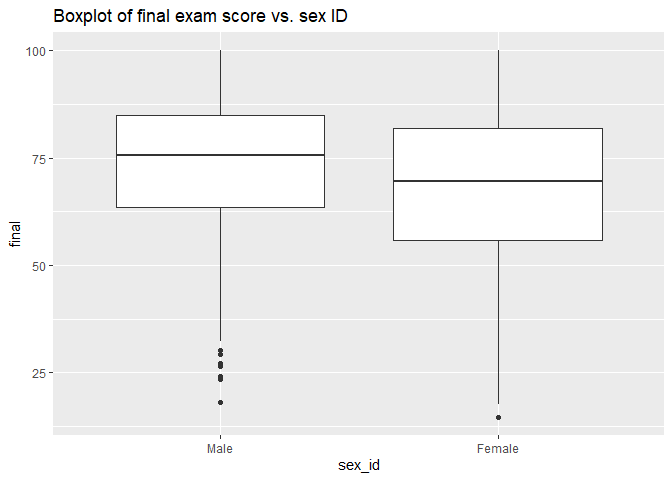<!-- -->

#### Final exam score vs. `urm_id`


```r
ggplot(data = master, mapping = aes(x = urm_id, y = final)) +
  geom_boxplot() +
  labs(title = "Boxplot of final exam score vs. URM ID")
```

```
## Warning: Removed 35 rows containing non-finite values (stat_boxplot).
```

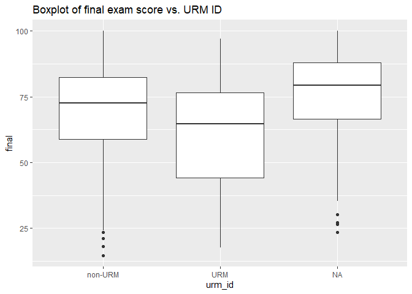<!-- -->

#### Final exam score vs. `eop_id`


```r
ggplot(data = master, mapping = aes(x = eop_id, y = final)) +
  geom_boxplot() +
  labs(title = "Boxplot of final exam score vs. EOP ID")
```

```
## Warning: Removed 35 rows containing non-finite values (stat_boxplot).
```

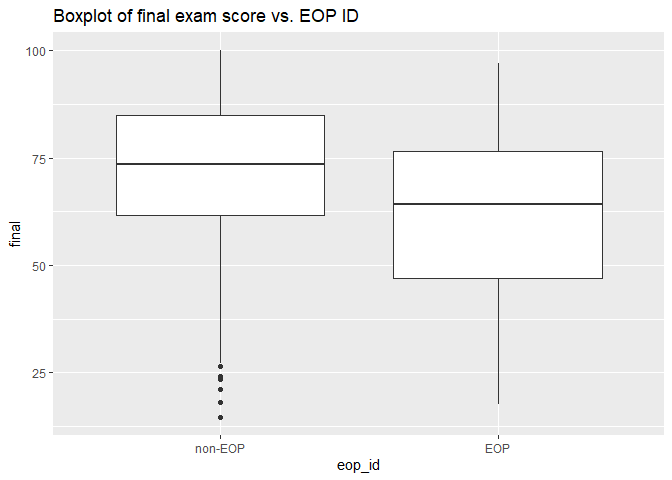<!-- -->

#### Final exam score vs. `fgn_id`


```r
ggplot(data = master, mapping = aes(x = fgn_id, y = final)) +
  geom_boxplot() +
  labs(title = "Boxplot of final exam score vs. FGN ID")
```

```
## Warning: Removed 35 rows containing non-finite values (stat_boxplot).
```

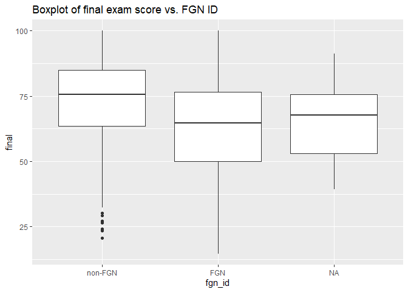<!-- -->

#### `satm` vs. `sex_id`


```r
ggplot(data = master, mapping = aes(x = sex_id, y = satm)) +
  geom_boxplot() +
  labs(title = "Boxplot of SAT math score vs. sex ID")
```

```
## Warning: Removed 62 rows containing non-finite values (stat_boxplot).
```

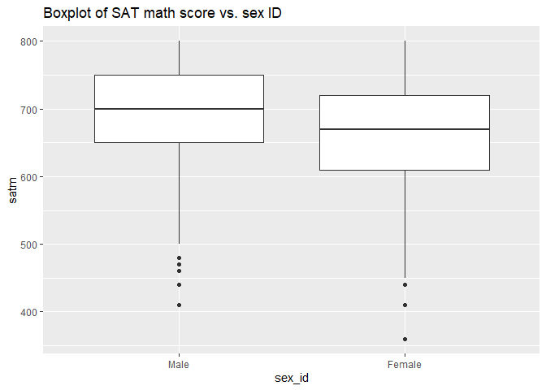<!-- -->

#### `satm` vs. `urm_id`


```r
ggplot(data = master, mapping = aes(x = urm_id, y = satm)) +
  geom_boxplot() +
  labs(title = "Boxplot of SAT math score vs. URM ID")
```

```
## Warning: Removed 62 rows containing non-finite values (stat_boxplot).
```

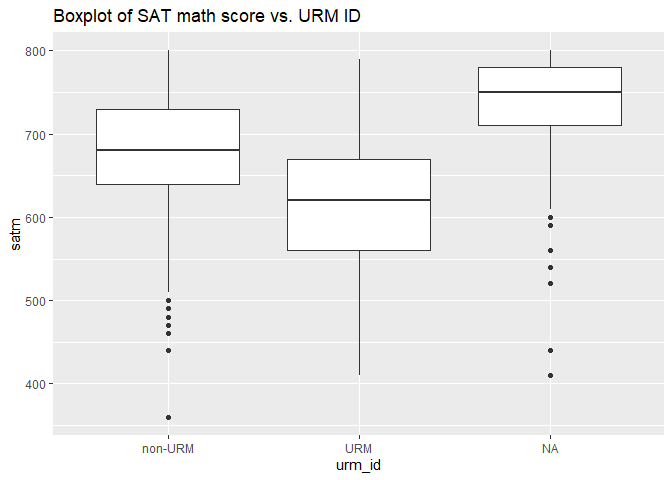<!-- -->

#### `satm` vs. `eop_id`


```r
ggplot(data = master, mapping = aes(x = eop_id, y = satm)) +
  geom_boxplot() +
  labs(title = "Boxplot of SAT math score vs. EOP ID")
```

```
## Warning: Removed 62 rows containing non-finite values (stat_boxplot).
```

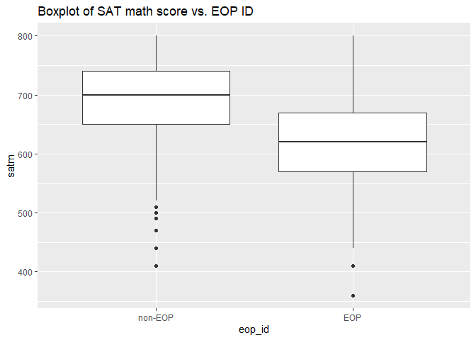<!-- -->

#### `satm` vs. `fgn_id`


```r
ggplot(data = master, mapping = aes(x = fgn_id, y = satm)) +
  geom_boxplot() +
  labs(title = "Boxplot of SAT math score vs. FGN ID")
```

```
## Warning: Removed 62 rows containing non-finite values (stat_boxplot).
```

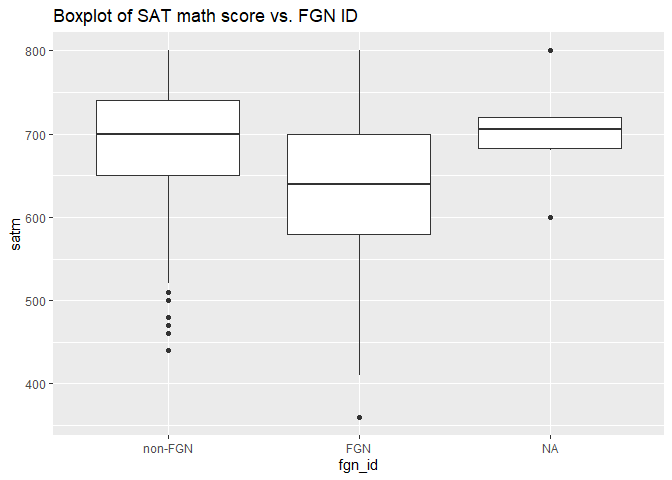<!-- -->

#### `aleksikc_score` vs. `sex_id`


```r
ggplot(data = master, mapping = aes(x = sex_id, y = aleksikc_score)) +
  geom_boxplot() +
  labs(title = "Boxplot of ALEKS Initial Knowledge Check score vs. sex ID")
```

```
## Warning: Removed 26 rows containing non-finite values (stat_boxplot).
```

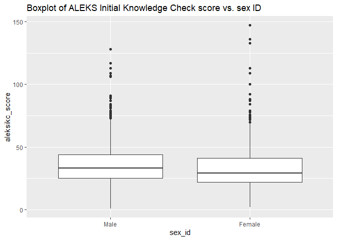<!-- -->

#### `aleksikc_score` vs. `urm_id`


```r
ggplot(data = master, mapping = aes(x = urm_id, y = aleksikc_score)) +
  geom_boxplot() +
  labs(title = "Boxplot of ALEKS Initial Knowledge Check score vs. URM ID")
```

```
## Warning: Removed 26 rows containing non-finite values (stat_boxplot).
```

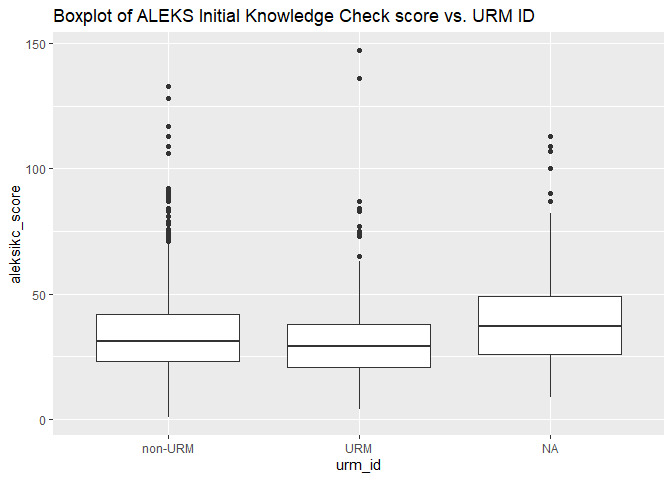<!-- -->

#### `aleksikc_score` vs. `eop_id`


```r
ggplot(data = master, mapping = aes(x = eop_id, y = aleksikc_score)) +
  geom_boxplot() +
  labs(title = "Boxplot of ALEKS Initial Knowledge Check score vs. EOP ID")
```

```
## Warning: Removed 26 rows containing non-finite values (stat_boxplot).
```

<!-- -->

#### `aleksikc_score` vs. `fgn_id`


```r
ggplot(data = master, mapping = aes(x = fgn_id, y = aleksikc_score)) +
  geom_boxplot() +
  labs(title = "Boxplot of ALEKS Initial Knowledge Check score vs. FGN ID")
```

```
## Warning: Removed 26 rows containing non-finite values (stat_boxplot).
```

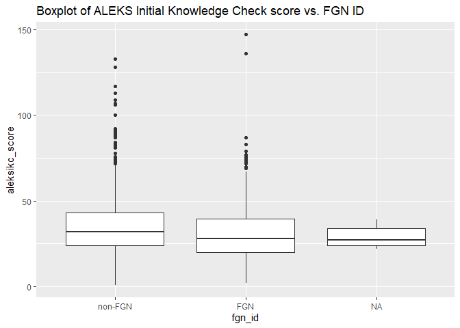<!-- -->

#### `hs_gpa` vs. `sex_id`


```r
ggplot(data = master, mapping = aes(x = sex_id, y = hs_gpa)) +
  geom_boxplot() +
  labs(title = "Boxplot of high school GPA vs. sex ID")
```

```
## Warning: Removed 56 rows containing non-finite values (stat_boxplot).
```

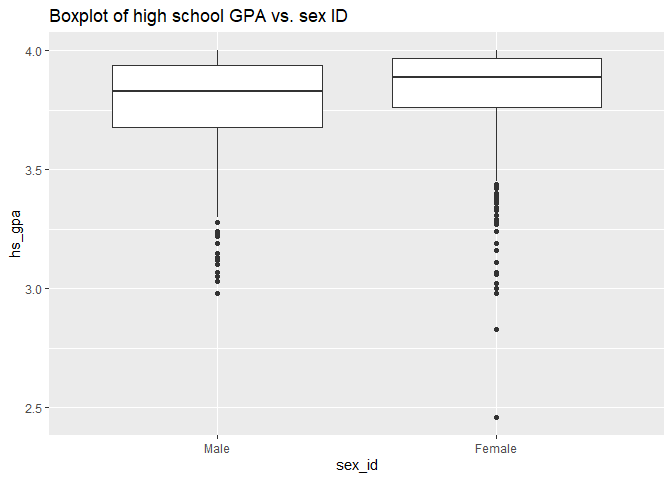<!-- -->

#### `hs_gpa` vs. `urm_id`


```r
ggplot(data = master, mapping = aes(x = urm_id, y = hs_gpa)) +
  geom_boxplot() +
  labs(title = "Boxplot of high school GPA vs. URM ID")
```

```
## Warning: Removed 56 rows containing non-finite values (stat_boxplot).
```

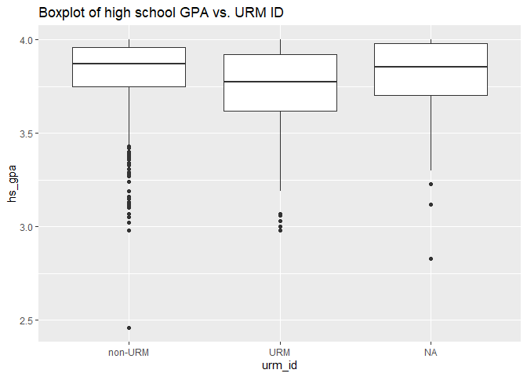<!-- -->

#### `hs_gpa` vs. `eop_id`


```r
ggplot(data = master, mapping = aes(x = eop_id, y = hs_gpa)) +
  geom_boxplot() +
  labs(title = "Boxplot of high school GPA vs. EOP ID")
```

```
## Warning: Removed 56 rows containing non-finite values (stat_boxplot).
```

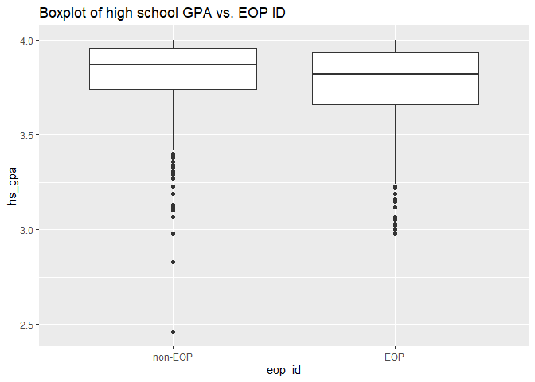<!-- -->

#### `hs_gpa` vs. `fgn_id`


```r
ggplot(data = master, mapping = aes(x = fgn_id, y = hs_gpa)) +
  geom_boxplot() +
  labs(title = "Boxplot of high school GPA vs. FGN ID")
```

```
## Warning: Removed 56 rows containing non-finite values (stat_boxplot).
```

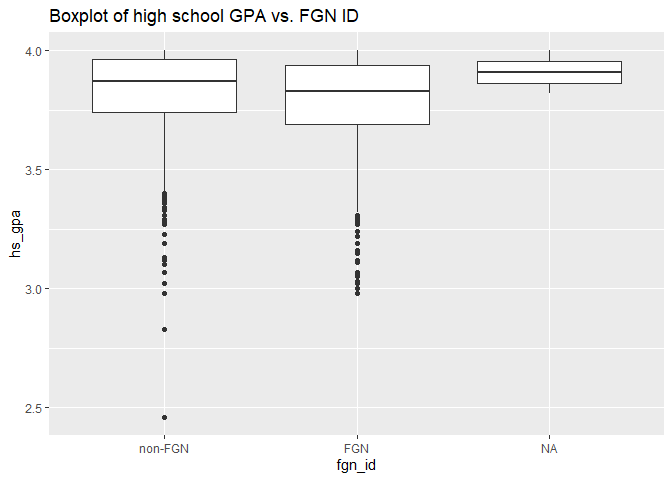<!-- -->

### Scatterplots

#### Final exam score vs. `satm` (grouped by `sex_id`)


```r
master %>% 
  ggplot(aes(x = satm, y = final, group = sex_id, color = sex_id)) +
  geom_point() +
  geom_smooth(method = 'lm', formula = y ~ x)
```

```
## Warning: Removed 96 rows containing non-finite values (stat_smooth).
```

```
## Warning: Removed 96 rows containing missing values (geom_point).
```

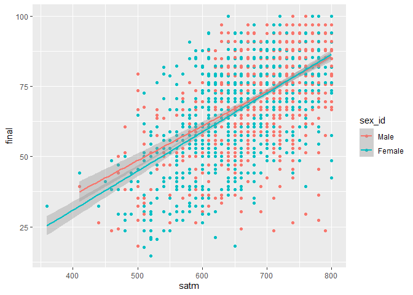<!-- -->

#### Final exam score vs. `aleksikc_score` (grouped by `sex_id`)


```r
master %>% 
  ggplot(aes(x = aleksikc_score, y = final, group = sex_id, color = sex_id)) +
  geom_point() +
  geom_smooth(method = 'lm', formula = y ~ x)
```

```
## Warning: Removed 61 rows containing non-finite values (stat_smooth).
```

```
## Warning: Removed 61 rows containing missing values (geom_point).
```

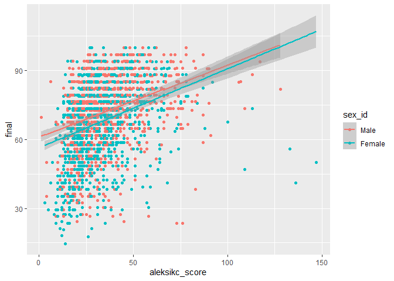<!-- -->

#### Final exam score vs. `hs_gpa` (grouped by `sex_id`)


```r
master %>% 
  ggplot(aes(x = hs_gpa, y = final, group = sex_id, color = sex_id)) +
  geom_point() +
  geom_smooth(method = 'lm', formula = y ~ x)
```

```
## Warning: Removed 91 rows containing non-finite values (stat_smooth).
```

```
## Warning: Removed 91 rows containing missing values (geom_point).
```

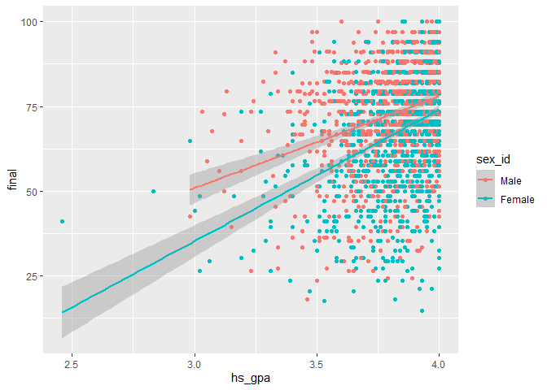<!-- -->

#### Final exam score vs. `satm` (grouped by `urm_id`)


```r
master %>% 
  ggplot(aes(x = satm, y = final, group = urm_id, color = urm_id)) +
  geom_point() +
  geom_smooth(method = 'lm', formula = y ~ x)
```

```
## Warning: Removed 96 rows containing non-finite values (stat_smooth).
```

```
## Warning: Removed 96 rows containing missing values (geom_point).
```

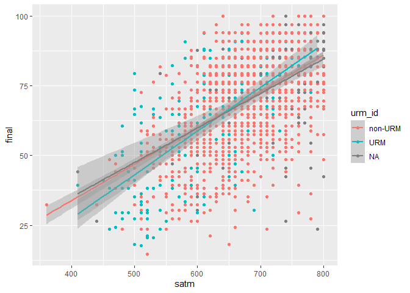<!-- -->

#### Final exam score vs. `aleksikc_score` (grouped by `urm_id`)


```r
master %>% 
  ggplot(aes(x = aleksikc_score, y = final, group = urm_id, color = urm_id)) +
  geom_point() +
  geom_smooth(method = 'lm', formula = y ~ x)
```

```
## Warning: Removed 61 rows containing non-finite values (stat_smooth).
```

```
## Warning: Removed 61 rows containing missing values (geom_point).
```

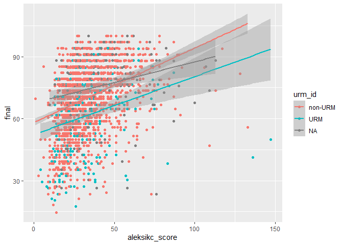<!-- -->

#### Final exam score vs. `hs_gpa` (grouped by `urm_id`)


```r
master %>% 
  ggplot(aes(x = hs_gpa, y = final, group = urm_id, color = urm_id)) +
  geom_point() +
  geom_smooth(method = 'lm', formula = y ~ x)
```

```
## Warning: Removed 91 rows containing non-finite values (stat_smooth).
```

```
## Warning: Removed 91 rows containing missing values (geom_point).
```

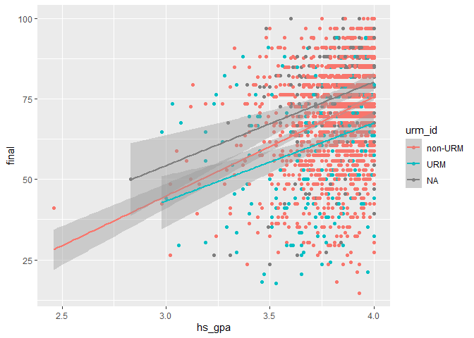<!-- -->

#### Final exam score vs. `satm` (grouped by `eop_id`)


```r
master %>% 
  ggplot(aes(x = satm, y = final, group = eop_id, color = eop_id)) +
  geom_point() +
  geom_smooth(method = 'lm', formula = y ~ x)
```

```
## Warning: Removed 96 rows containing non-finite values (stat_smooth).
```

```
## Warning: Removed 96 rows containing missing values (geom_point).
```

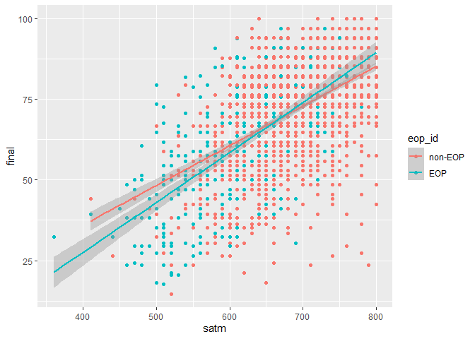<!-- -->

#### Final exam score vs. `aleksikc_score` (grouped by `eop_id`)


```r
master %>% 
  ggplot(aes(x = aleksikc_score, y = final, group = eop_id, color = eop_id)) +
  geom_point() +
  geom_smooth(method = 'lm', formula = y ~ x)
```

```
## Warning: Removed 61 rows containing non-finite values (stat_smooth).
```

```
## Warning: Removed 61 rows containing missing values (geom_point).
```

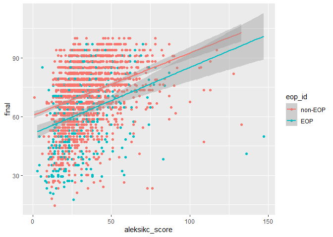<!-- -->

#### Final exam score vs. `hs_gpa` (grouped by `eop_id`)


```r
master %>% 
  ggplot(aes(x = hs_gpa, y = final, group = eop_id, color = eop_id)) +
  geom_point() +
  geom_smooth(method = 'lm', formula = y ~ x)
```

```
## Warning: Removed 91 rows containing non-finite values (stat_smooth).
```

```
## Warning: Removed 91 rows containing missing values (geom_point).
```

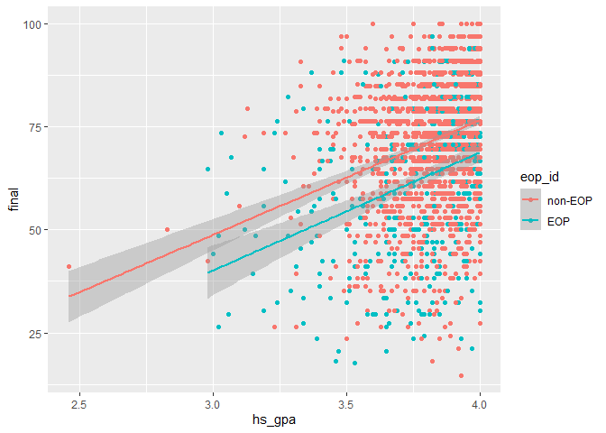<!-- -->

#### Final exam score vs. `satm` (grouped by `fgn_id`)


```r
master %>% 
  ggplot(aes(x = satm, y = final, group = fgn_id, color = fgn_id)) +
  geom_point() +
  geom_smooth(method = 'lm', formula = y ~ x)
```

```
## Warning: Removed 96 rows containing non-finite values (stat_smooth).
```

```
## Warning: Removed 96 rows containing missing values (geom_point).
```

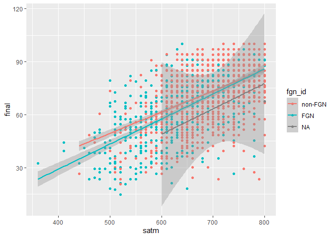<!-- -->

#### Final exam score vs. `aleksikc_score` (grouped by `fgn_id`)


```r
master %>% 
  ggplot(aes(x = aleksikc_score, y = final, group = fgn_id, color = fgn_id)) +
  geom_point() +
  geom_smooth(method = 'lm', formula = y ~ x)
```

```
## Warning: Removed 61 rows containing non-finite values (stat_smooth).
```

```
## Warning: Removed 61 rows containing missing values (geom_point).
```

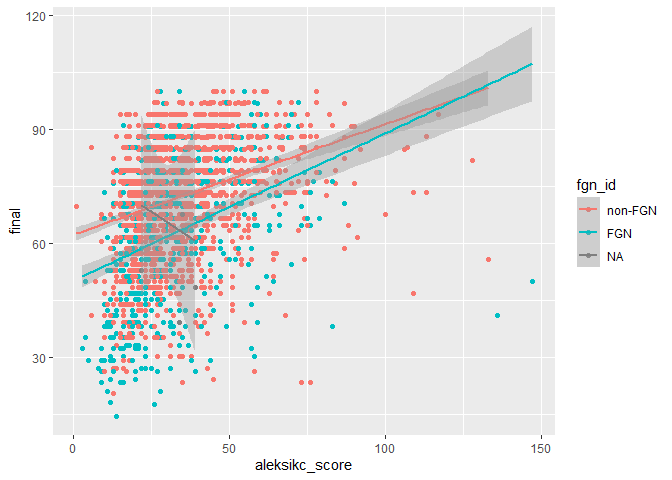<!-- -->

#### Final exam score vs. `hs_gpa` (grouped by `fgn_id`)


```r
master %>% 
  ggplot(aes(x = hs_gpa, y = final, group = fgn_id, color = fgn_id)) +
  geom_point() +
  geom_smooth(method = 'lm', formula = y ~ x)
```

```
## Warning: Removed 91 rows containing non-finite values (stat_smooth).
```

```
## Warning in qt((1 - level)/2, df): NaNs produced
```

```
## Warning: Removed 91 rows containing missing values (geom_point).
```

```
## Warning in max(ids, na.rm = TRUE): no non-missing arguments to max; returning -
## Inf
```

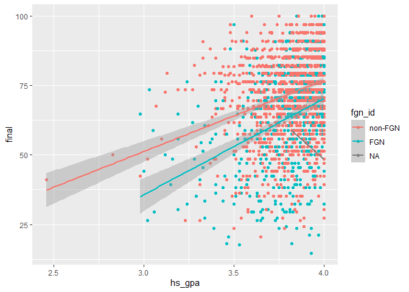<!-- -->

#### Final exam score vs. `satm` (grouped by `exp`)


```r
master %>% 
  ggplot(aes(x = satm, y = final, group = exp, color = exp)) +
  geom_point() +
  geom_smooth(method = 'lm', formula = y ~ x)
```

```
## Warning: Removed 96 rows containing non-finite values (stat_smooth).
```

```
## Warning: Removed 96 rows containing missing values (geom_point).
```

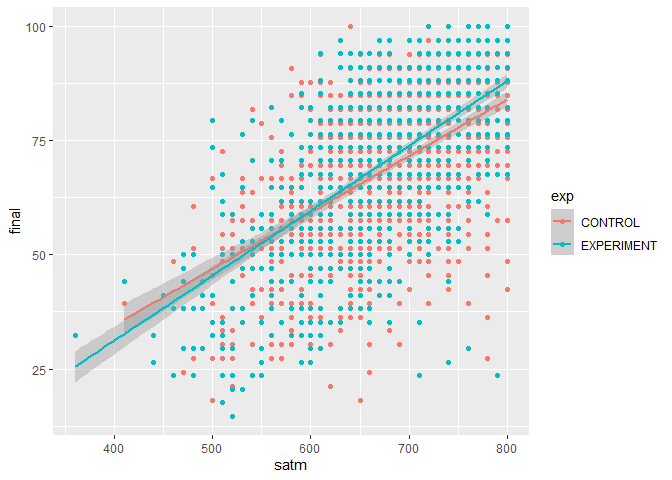<!-- -->

### Boxplots

#### `sex_id` distribution between control and experimental years


```r
ggplot(data = master, aes(x = sex_id)) +
  geom_bar() +
  facet_wrap(~ exp)
```

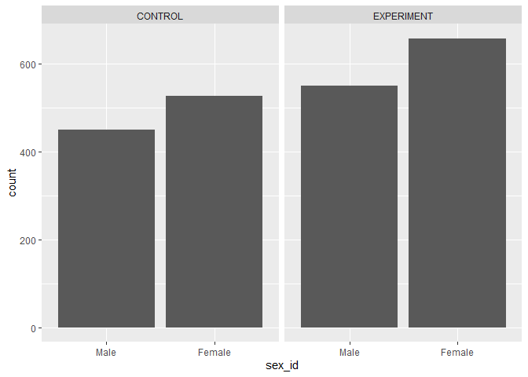<!-- -->

#### `urm_id` distribution between control and experimental years


```r
ggplot(data = master, aes(x = urm_id)) +
  geom_bar() +
  facet_wrap(~ exp)
```

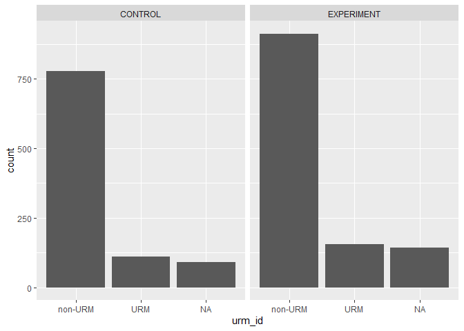<!-- -->

#### `eop_id` distribution between control and experimental years


```r
ggplot(data = master, aes(x = eop_id)) +
  geom_bar() +
  facet_wrap(~ exp)
```

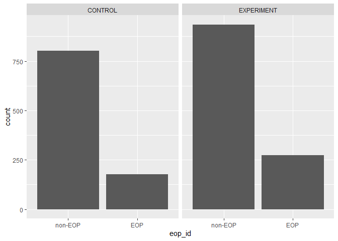<!-- -->

#### `fgn_id` distribution between control and experimental years


```r
ggplot(data = master, aes(x = fgn_id)) +
  geom_bar() +
  facet_wrap(~ exp)
```

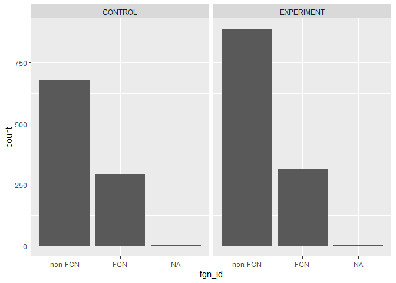<!-- -->
