```r
library(here)
```

```
## here() starts at G:/Shared drives/CEG Two-Stage Exams Analysis (4 REAL)/two-stage-2
```

```r
library(tidyverse)
```

```
## -- Attaching packages ------------------------------------------------------------------ tidyverse 1.3.0 --
```

```
## v ggplot2 3.3.2     v purrr   0.3.4
## v tibble  3.0.3     v dplyr   1.0.1
## v tidyr   1.1.1     v stringr 1.4.0
## v readr   1.3.1     v forcats 0.5.0
```

```
## Warning: package 'ggplot2' was built under R version 4.0.3
```

```
## -- Conflicts --------------------------------------------------------------------- tidyverse_conflicts() --
## x dplyr::filter() masks stats::filter()
## x dplyr::lag()    masks stats::lag()
```

```r
library(skimr)
```

```
## Warning: package 'skimr' was built under R version 4.0.3
```

```r
library(moderndive)
```

```
## Warning: package 'moderndive' was built under R version 4.0.3
```

```r
library(ggplot2)
library(dplyr)
library(readr)
```
Now I want to rename the data set as data_2s

```r
proj_dir <- here()
importable_data_dir <- here("processing-and-analysis", "importable-data", "/")
analysis_data_dir <- here("processing-and-analysis", "analysis-data", "/")
metadata_dir <- here("original-data", "metadata", "/")

`master_2s_small_deidentified (DO NOT TOUCH)` <- readRDS("G:/Shared drives/CEG R Coding Practice/Ganling/two-stage-2/processing-and-analysis/01-importable-data/dataset/master_2s_small_deidentified (DO NOT TOUCH).rds")

data_2s <- `master_2s_small_deidentified (DO NOT TOUCH)`

#select only the four variables I am trying to look at

Exam_scores <- data_2s %>% select(exam1, exam2, finalexam, course_fullid)
Exam_scores_true <- na.omit(Exam_scores)
Exam_mean <- Exam_scores_true %>% group_by(course_fullid) %>% summarize(mean_exam1= mean(exam1), mean_exam2= mean(exam2), mean_finalexam= mean(finalexam))
```

```
## `summarise()` ungrouping output (override with `.groups` argument)
```

```r
#Now, what I want to do is to make box plots and look at the values for each exam based on the section the students are in
 ggplot(data = Exam_mean, mapping = aes(x = course_fullid, y = mean_exam1)) +     geom_bar(stat='identity')
```

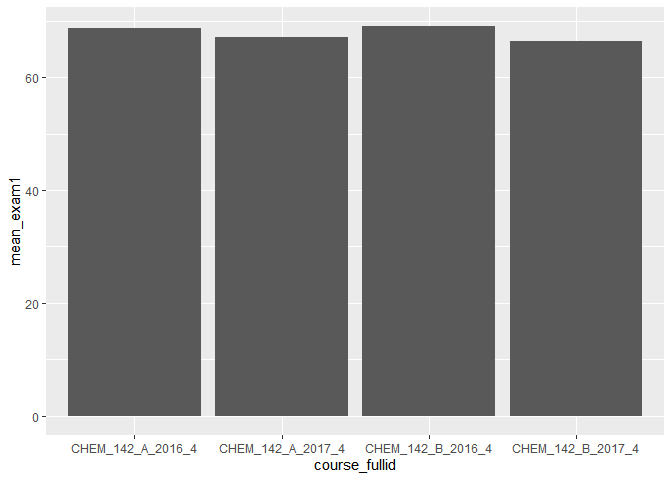<!-- -->

```r
 ggplot(data = Exam_mean, mapping = aes(x = course_fullid, y = mean_exam2)) + geom_bar(stat='identity')
```

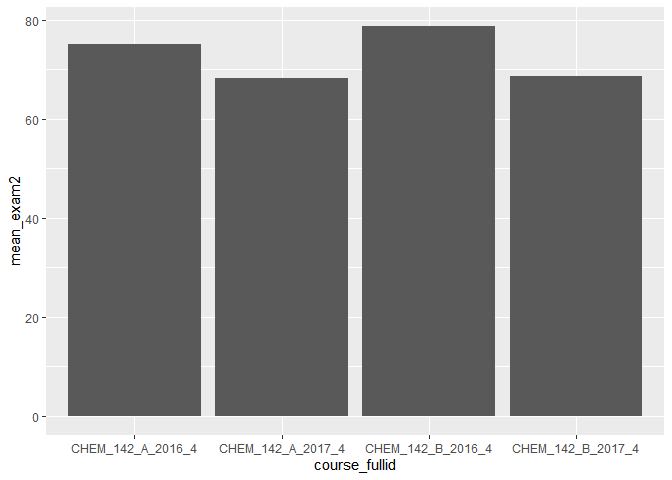<!-- -->

```r
 ggplot(data = Exam_mean, mapping = aes(x = course_fullid, y = mean_finalexam)) + geom_bar(stat='identity')
```

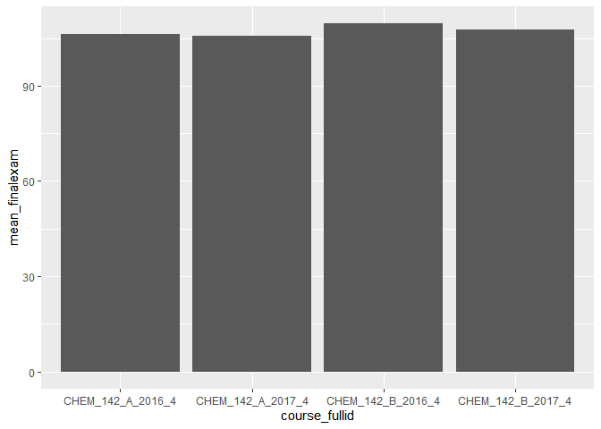<!-- -->
Now we want to filter course id and see if the version of the test had any effects

```r
Exam_scores_2016_A_version <- data_2s %>% filter(course_fullid %in% c("CHEM_142_A_2016_4")) %>% select(exam1, exam2, finalexam, ver)

Exam_scores_2016_A_version_true <-na.omit(Exam_scores_2016_A_version)

Exam_version_2016A_mean <- Exam_scores_2016_A_version_true %>% group_by(ver) %>% 
summarize(mean_exam1= mean(exam1), mean_exam2= mean(exam2), mean_finalexam= mean(finalexam))
```

```
## `summarise()` ungrouping output (override with `.groups` argument)
```

```r
#graph the results
ggplot(data = Exam_version_2016A_mean, mapping = aes(x = ver, y = mean_exam1)) + geom_bar(stat='identity')
```

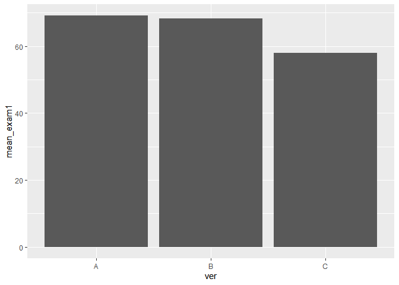<!-- -->

```r
ggplot(data = Exam_version_2016A_mean, mapping = aes(x = ver, y = mean_exam2)) + geom_bar(stat='identity')
```

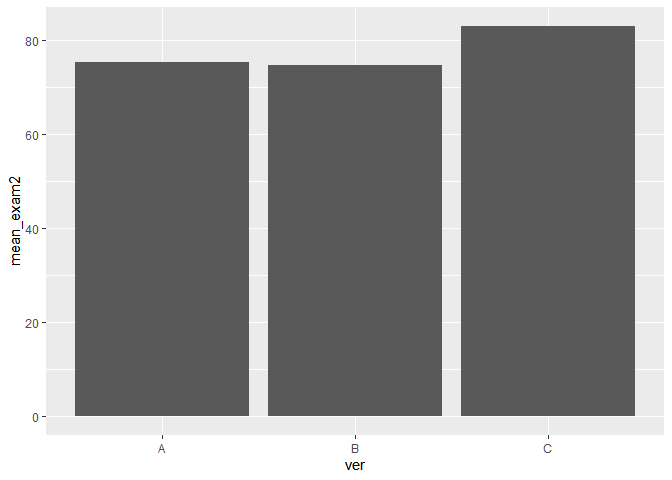<!-- -->

```r
ggplot(data = Exam_version_2016A_mean, mapping = aes(x = ver, y = mean_finalexam)) + geom_bar(stat='identity')
```

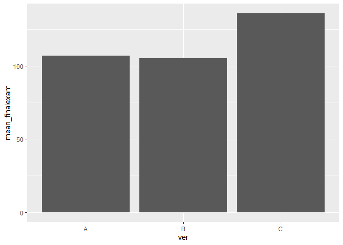<!-- -->

```r
#now lets figure out the relationship between other varibles, first lets generate data from section A with eop status

Exam_scores_2016_A_eop <- data_2s %>% filter(course_fullid %in% c("CHEM_142_A_2016_4")) %>% select(exam1, exam2, finalexam, eop_id)

Exam_scores_2016_A_eop_true <-na.omit(Exam_scores_2016_A_eop)

Exam_eop_2016A_mean <- Exam_scores_2016_A_eop_true %>% group_by(eop_id) %>% 
summarize(mean_exam1= mean(exam1), mean_exam2= mean(exam2), mean_finalexam= mean(finalexam))
```

```
## `summarise()` ungrouping output (override with `.groups` argument)
```

```r
#graph the results
ggplot(data = Exam_eop_2016A_mean, mapping = aes(x = eop_id, y = mean_exam1)) + geom_bar(stat='identity')
```

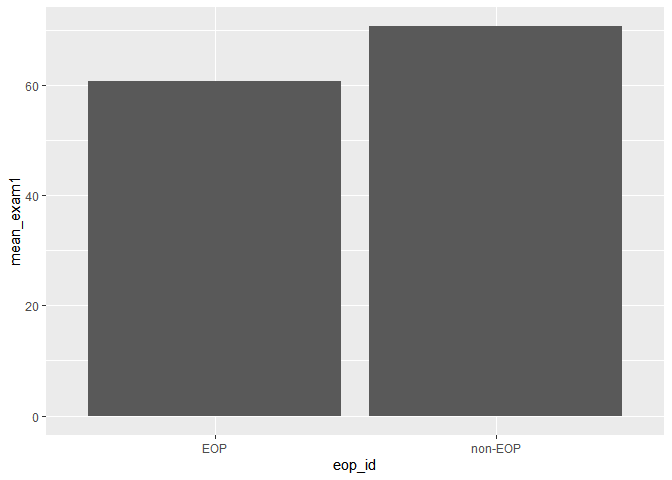<!-- -->

```r
ggplot(data = Exam_eop_2016A_mean, mapping = aes(x = eop_id, y = mean_exam2)) + geom_bar(stat='identity')
```

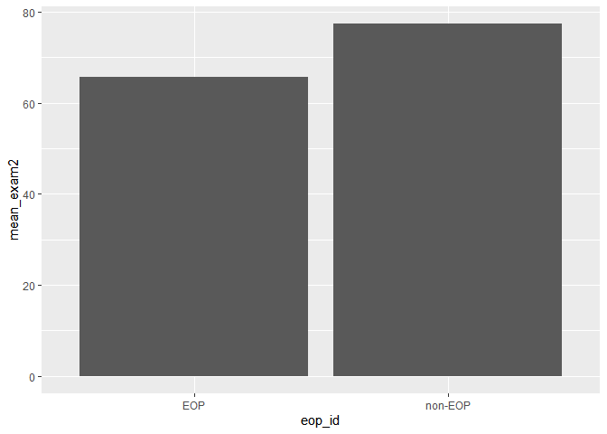<!-- -->

```r
ggplot(data = Exam_eop_2016A_mean, mapping = aes(x = eop_id, y = mean_finalexam)) + geom_bar(stat='identity')
```

<!-- -->
###As expected, it appears that EOP students on average score lower on the exams compare to non-EOP students in section 2016 A

```r
Exam_scores_2016_A_sex <- data_2s %>% filter(course_fullid %in% c("CHEM_142_A_2016_4")) %>% select(exam1, exam2, finalexam, sex_id)

Exam_scores_2016_A_sex_true <-na.omit(Exam_scores_2016_A_sex)

Exam_sex_2016A_mean <- Exam_scores_2016_A_sex_true %>% group_by(sex_id) %>% 
summarize(mean_exam1= mean(exam1), mean_exam2= mean(exam2), mean_finalexam= mean(finalexam))
```

```
## `summarise()` ungrouping output (override with `.groups` argument)
```

```r
#graph the results
ggplot(data = Exam_sex_2016A_mean, mapping = aes(x = sex_id, y = mean_exam1)) + geom_bar(stat='identity')
```

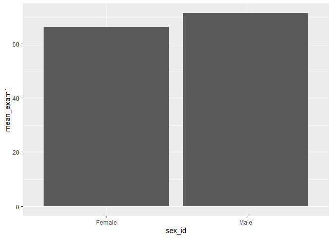<!-- -->

```r
ggplot(data = Exam_sex_2016A_mean, mapping = aes(x = sex_id, y = mean_exam2)) + geom_bar(stat='identity')
```

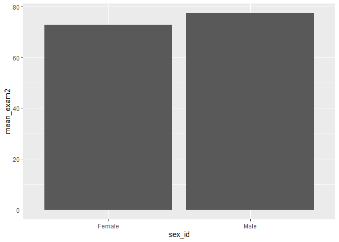<!-- -->

```r
ggplot(data = Exam_sex_2016A_mean, mapping = aes(x = sex_id, y = mean_finalexam)) + geom_bar(stat='identity')
```

<!-- -->
Also, males tend to do better on exams on average compare to females 
###Now lets look at FGN status

```r
Exam_scores_2016_A_fgn <- data_2s %>% filter(course_fullid %in% c("CHEM_142_A_2016_4")) %>% select(exam1, exam2, finalexam, fgn_id)

Exam_scores_2016_A_fgn_true <-na.omit(Exam_scores_2016_A_fgn)

Exam_fgn_2016A_mean <- Exam_scores_2016_A_fgn_true %>% group_by(fgn_id) %>% 
summarize(mean_exam1= mean(exam1), mean_exam2= mean(exam2), mean_finalexam= mean(finalexam))
```

```
## `summarise()` ungrouping output (override with `.groups` argument)
```

```r
#graph the results
ggplot(data = Exam_fgn_2016A_mean, mapping = aes(x = fgn_id, y = mean_exam1)) + geom_bar(stat='identity')
```

<!-- -->

```r
ggplot(data = Exam_fgn_2016A_mean, mapping = aes(x = fgn_id, y = mean_exam2)) + geom_bar(stat='identity')
```

<!-- -->

```r
ggplot(data = Exam_fgn_2016A_mean, mapping = aes(x = fgn_id, y = mean_finalexam)) + geom_bar(stat='identity')
```

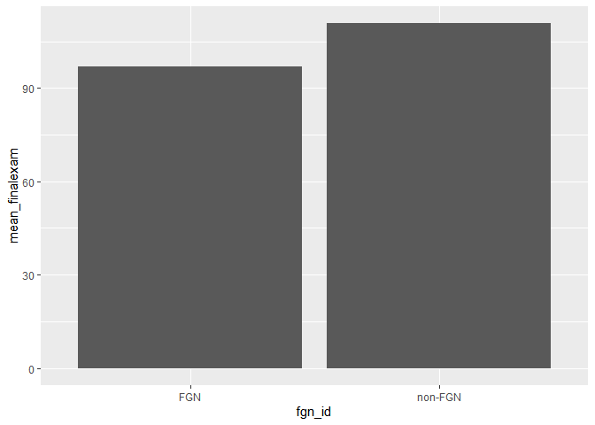<!-- -->

###Non-fgn students tend to do better on exams compare to fgn students
###Finally, we would like to look at under represented status

```r
Exam_scores_2016_A_urm <- data_2s %>% filter(course_fullid %in% c("CHEM_142_A_2016_4")) %>% select(exam1, exam2, finalexam, urm_id)

Exam_scores_2016_A_urm_true <-na.omit(Exam_scores_2016_A_urm)

Exam_urm_2016A_mean <- Exam_scores_2016_A_urm_true %>% group_by(urm_id) %>% 
summarize(mean_exam1= mean(exam1), mean_exam2= mean(exam2), mean_finalexam= mean(finalexam))
```

```
## `summarise()` ungrouping output (override with `.groups` argument)
```

```r
View(Exam_urm_2016A_mean)

#graph the results
ggplot(data = Exam_urm_2016A_mean, mapping = aes(x = urm_id, y = mean_exam1)) + geom_bar(stat='identity')
```

<!-- -->

```r
ggplot(data = Exam_urm_2016A_mean, mapping = aes(x = urm_id, y = mean_exam2)) + geom_bar(stat='identity')
```

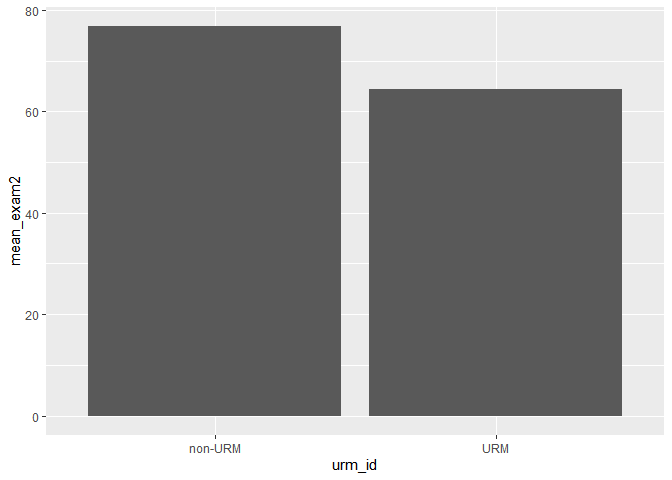<!-- -->

```r
ggplot(data = Exam_urm_2016A_mean, mapping = aes(x = urm_id, y = mean_finalexam)) + geom_bar(stat='identity')
```

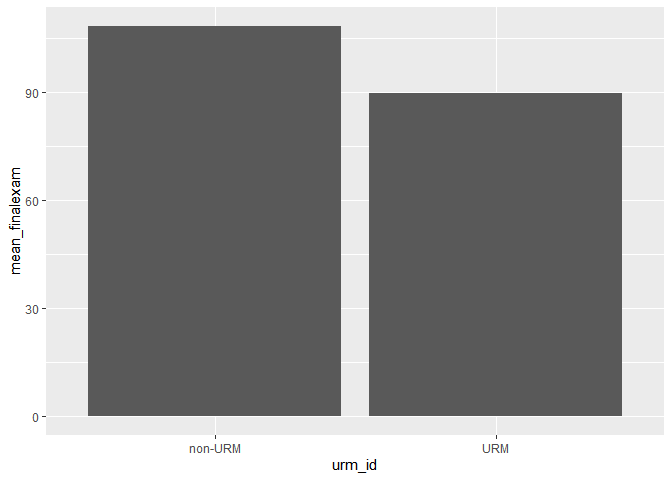<!-- -->
###on Average non-URM do a lot better on exams compared to URM

```r
quiz_ind_scores_version <- data_2s %>% filter(course_fullid %in% c("CHEM_142_A_2017_4")) %>% select(q1_ind, q1_ver)

quiz_ind_scores_version_true <-na.omit(quiz_ind_scores_version)

quiz_ind_version_mean <- quiz_ind_scores_version_true %>% group_by(q1_ver) %>% summarize(mean_q1_ind= mean(q1_ind))
```

```
## `summarise()` ungrouping output (override with `.groups` argument)
```

```r
#graph the results

ggplot(data = quiz_ind_version_mean, mapping = aes(x = q1_ver, y = mean_q1_ind)) + geom_bar(stat='identity')
```

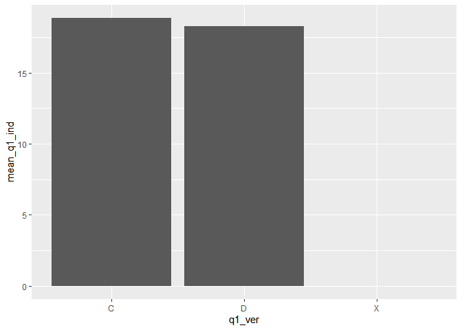<!-- -->

#what about eop status?

```r
quiz_ind_scores_eop <- data_2s %>% filter(course_fullid %in% c("CHEM_142_A_2017_4")) %>% select(q1_ind, eop_id)

quiz_ind_scores_eop_true <-na.omit(quiz_ind_scores_eop)

quiz_ind_eop_mean <- quiz_ind_scores_eop_true %>% group_by(eop_id) %>% summarize(mean_q1_ind= mean(q1_ind))
```

```
## `summarise()` ungrouping output (override with `.groups` argument)
```

```r
#graph the results

ggplot(data = quiz_ind_eop_mean, mapping = aes(x = eop_id, y = mean_q1_ind)) + geom_bar(stat='identity')
```

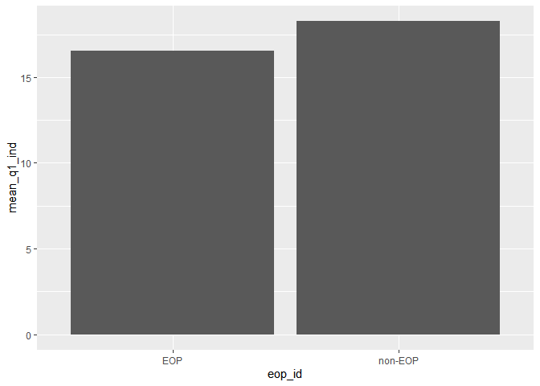<!-- -->
##Now lets think about sex status

```r
quiz_ind_scores_sex <- data_2s %>% filter(course_fullid %in% c("CHEM_142_A_2017_4")) %>% select(q1_ind, sex_id)

quiz_ind_scores_sex_true <-na.omit(quiz_ind_scores_sex)

quiz_ind_sex_mean <- quiz_ind_scores_sex_true %>% group_by(sex_id) %>% summarize(mean_q1_ind= mean(q1_ind))
```

```
## `summarise()` ungrouping output (override with `.groups` argument)
```

```r
#graph the results

ggplot(data = quiz_ind_sex_mean, mapping = aes(x = sex_id, y = mean_q1_ind)) + geom_bar(stat='identity')
```

<!-- -->
#First gen?

```r
quiz_ind_scores_fgn <- data_2s %>% filter(course_fullid %in% c("CHEM_142_A_2017_4")) %>% select(q1_ind, fgn_id)

quiz_ind_scores_fgn_true <-na.omit(quiz_ind_scores_fgn)

quiz_ind_fgn_mean <- quiz_ind_scores_fgn_true %>% group_by(fgn_id) %>% summarize(mean_q1_ind= mean(q1_ind))
```

```
## `summarise()` ungrouping output (override with `.groups` argument)
```

```r
#graph the results

ggplot(data = quiz_ind_fgn_mean, mapping = aes(x = fgn_id, y = mean_q1_ind)) + geom_bar(stat='identity')
```

<!-- -->
#urm and non-urm status

```r
quiz_ind_scores_urm <- data_2s %>% filter(course_fullid %in% c("CHEM_142_A_2017_4")) %>% select(q1_ind, urm_id)

quiz_ind_scores_urm_true <-na.omit(quiz_ind_scores_urm)

quiz_ind_urm_mean <- quiz_ind_scores_urm_true %>% group_by(urm_id) %>% summarize(mean_q1_ind= mean(q1_ind))
```

```
## `summarise()` ungrouping output (override with `.groups` argument)
```

```r
#graph the results

ggplot(data = quiz_ind_urm_mean, mapping = aes(x = urm_id, y = mean_q1_ind)) + geom_bar(stat='identity')
```

<!-- -->

```r
quiz_grp_scores_version <- data_2s %>% filter(course_fullid %in% c("CHEM_142_A_2017_4")) %>% select(q1_grp, q1_ver)

quiz_grp_scores_version_true <-na.omit(quiz_grp_scores_version)

quiz_grp_version_mean <- quiz_grp_scores_version_true %>% group_by(q1_ver) %>% summarize(mean_q1_grp= mean(q1_grp))
```

```
## `summarise()` ungrouping output (override with `.groups` argument)
```

```r
#graph the results

ggplot(data = quiz_grp_version_mean, mapping = aes(x = q1_ver, y = mean_q1_grp)) + geom_bar(stat='identity')
```

<!-- -->
#sex status

```r
quiz_grp_scores_sex <- data_2s %>% filter(course_fullid %in% c("CHEM_142_A_2017_4")) %>% select(q1_grp, sex_id)

quiz_grp_scores_sex_true <-na.omit(quiz_grp_scores_sex)

quiz_grp_sex_mean <- quiz_grp_scores_sex_true %>% group_by(sex_id) %>% summarize(mean_q1_grp= mean(q1_grp))
```

```
## `summarise()` ungrouping output (override with `.groups` argument)
```

```r
#graph the results

ggplot(data = quiz_grp_sex_mean, mapping = aes(x = sex_id, y = mean_q1_grp)) + geom_bar(stat='identity')
```

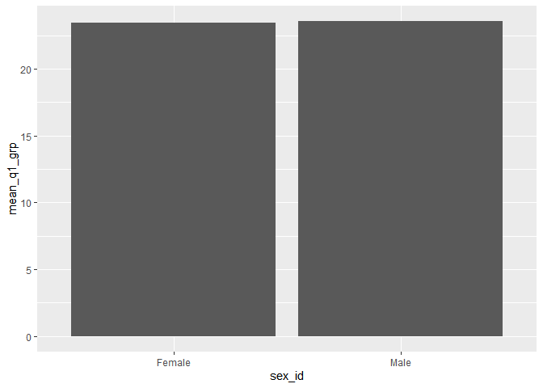<!-- -->
#eop status

```r
quiz_grp_scores_eop <- data_2s %>% filter(course_fullid %in% c("CHEM_142_A_2017_4")) %>% select(q1_grp, eop_id)

quiz_grp_scores_eop_true <-na.omit(quiz_grp_scores_eop)

quiz_grp_eop_mean <- quiz_grp_scores_eop_true %>% group_by(eop_id) %>% summarize(mean_q1_grp= mean(q1_grp))
```

```
## `summarise()` ungrouping output (override with `.groups` argument)
```

```r
#graph the results

ggplot(data = quiz_grp_eop_mean, mapping = aes(x = eop_id, y = mean_q1_grp)) + geom_bar(stat='identity')
```

<!-- -->

```r
quiz_grp_scores_fgn <- data_2s %>% filter(course_fullid %in% c("CHEM_142_A_2017_4")) %>% select(q1_grp, fgn_id)

quiz_grp_scores_fgn_true <-na.omit(quiz_grp_scores_fgn)

quiz_grp_fgn_mean <- quiz_grp_scores_fgn_true %>% group_by(fgn_id) %>% summarize(mean_q1_grp= mean(q1_grp))
```

```
## `summarise()` ungrouping output (override with `.groups` argument)
```

```r
#graph the results

ggplot(data = quiz_grp_fgn_mean, mapping = aes(x = fgn_id, y = mean_q1_grp)) + geom_bar(stat='identity')
```

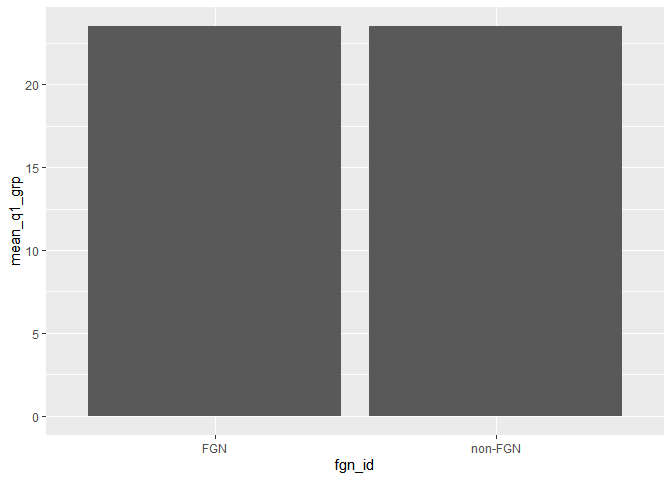<!-- -->
#urm and non-urm status

```r
quiz_grp_scores_urm <- data_2s %>% filter(course_fullid %in% c("CHEM_142_A_2017_4")) %>% select(q1_grp, urm_id)

quiz_grp_scores_urm_true <-na.omit(quiz_grp_scores_urm)

quiz_grp_urm_mean <- quiz_grp_scores_urm_true %>% group_by(urm_id) %>% summarize(mean_q1_grp= mean(q1_grp))
```

```
## `summarise()` ungrouping output (override with `.groups` argument)
```

```r
#graph the results

ggplot(data = quiz_grp_urm_mean, mapping = aes(x = urm_id, y = mean_q1_grp)) + geom_bar(stat='identity')
```

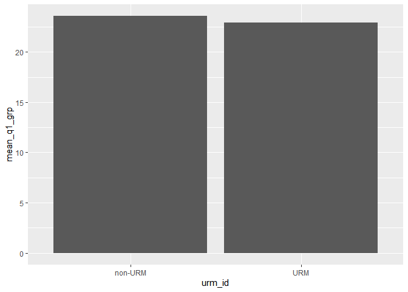<!-- -->
#Lastly, lets look at the total scores and see how they were related

```r
quiz_total_scores_version <- data_2s %>% filter(course_fullid %in% c("CHEM_142_A_2017_4")) %>% select(q1_total, q1_ver)

quiz_total_scores_version_true <-na.omit(quiz_total_scores_version)

quiz_total_version_mean <- quiz_total_scores_version_true %>% group_by(q1_ver) %>% summarize(mean_q1_total= mean(q1_total))
```

```
## `summarise()` ungrouping output (override with `.groups` argument)
```

```r
#graph the results

ggplot(data = quiz_total_version_mean, mapping = aes(x = q1_ver, y = mean_q1_total)) + geom_bar(stat='identity')
```

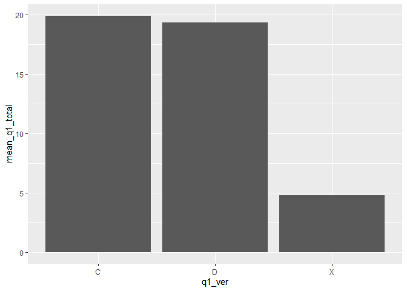<!-- -->

#sex status

```r
quiz_total_scores_sex <- data_2s %>% filter(course_fullid %in% c("CHEM_142_A_2017_4")) %>% select(q1_total, sex_id)

quiz_total_scores_sex_true <-na.omit(quiz_total_scores_sex)

quiz_total_sex_mean <- quiz_total_scores_sex_true %>% group_by(sex_id) %>% summarize(mean_q1_total= mean(q1_total))
```

```
## `summarise()` ungrouping output (override with `.groups` argument)
```

```r
#graph the results

ggplot(data = quiz_total_sex_mean, mapping = aes(x = sex_id, y = mean_q1_total)) + geom_bar(stat='identity')
```

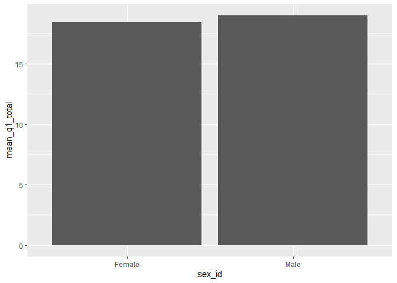<!-- -->
#eop status

```r
quiz_total_scores_eop <- data_2s %>% filter(course_fullid %in% c("CHEM_142_A_2017_4")) %>% select(q1_total, eop_id)

quiz_total_scores_eop_true <-na.omit(quiz_total_scores_eop)

quiz_total_eop_mean <- quiz_total_scores_eop_true %>% group_by(eop_id) %>% summarize(mean_q1_total= mean(q1_total))
```

```
## `summarise()` ungrouping output (override with `.groups` argument)
```

```r
#graph the results

ggplot(data = quiz_total_eop_mean, mapping = aes(x = eop_id, y = mean_q1_total)) + geom_bar(stat='identity')
```

<!-- -->
#First gen status

```r
quiz_total_scores_fgn <- data_2s %>% filter(course_fullid %in% c("CHEM_142_A_2017_4")) %>% select(q1_total, fgn_id)

quiz_total_scores_fgn_true <-na.omit(quiz_total_scores_fgn)

quiz_total_fgn_mean <- quiz_total_scores_fgn_true %>% group_by(fgn_id) %>% summarize(mean_q1_total= mean(q1_total))
```

```
## `summarise()` ungrouping output (override with `.groups` argument)
```

```r
#graph the results

ggplot(data = quiz_total_fgn_mean, mapping = aes(x = fgn_id, y = mean_q1_total)) + geom_bar(stat='identity')
```

<!-- -->
#urm and non-urm status

```r
quiz_total_scores_urm <- data_2s %>% filter(course_fullid %in% c("CHEM_142_A_2017_4")) %>% select(q1_total, urm_id)

quiz_total_scores_urm_true <-na.omit(quiz_total_scores_urm)

quiz_total_urm_mean <- quiz_total_scores_urm_true %>% group_by(urm_id) %>% summarize(mean_q1_total= mean(q1_total))
```

```
## `summarise()` ungrouping output (override with `.groups` argument)
```

```r
#graph the results

ggplot(data = quiz_total_urm_mean, mapping = aes(x = urm_id, y = mean_q1_total)) + geom_bar(stat='identity')
```

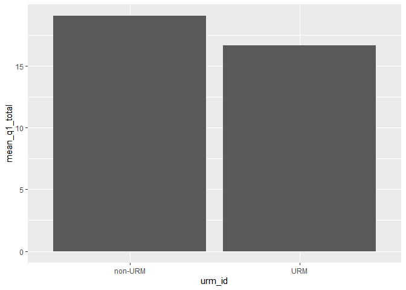<!-- -->

