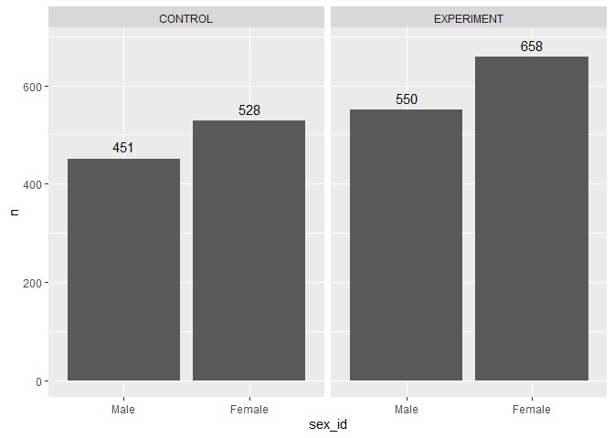
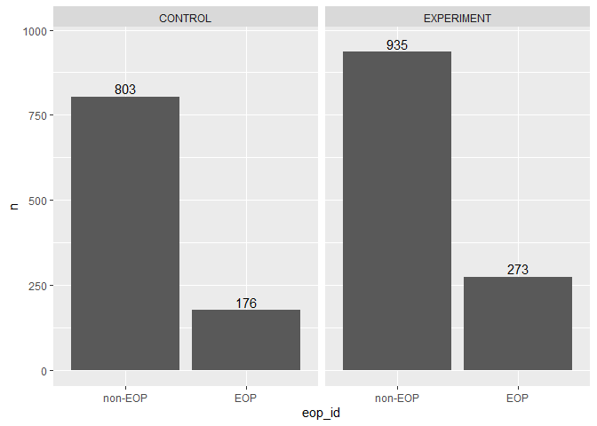
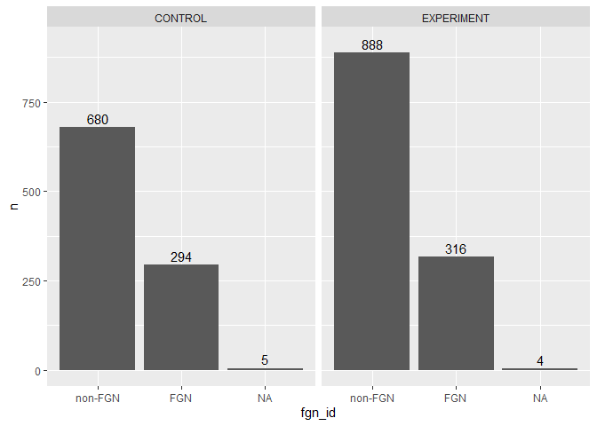
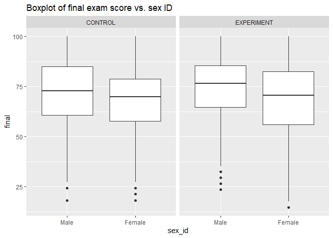
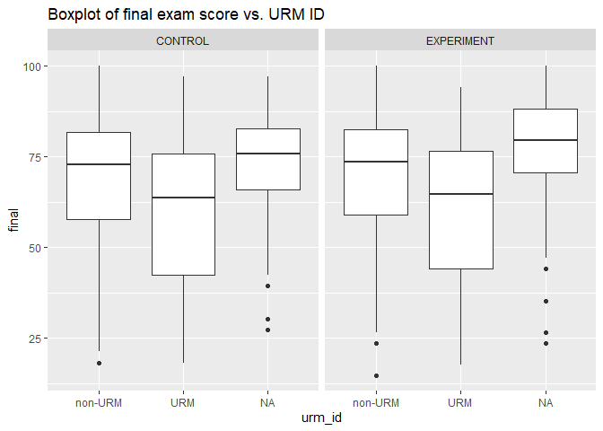
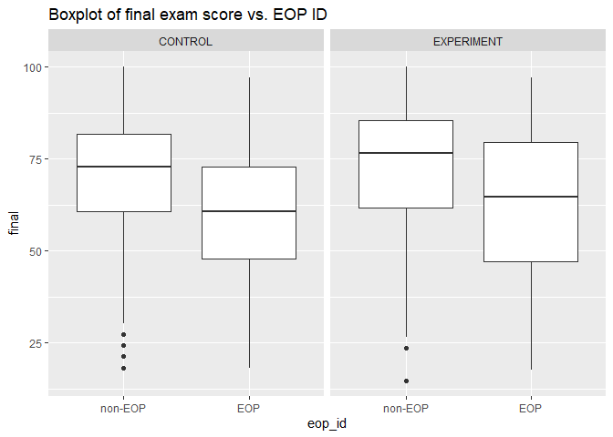
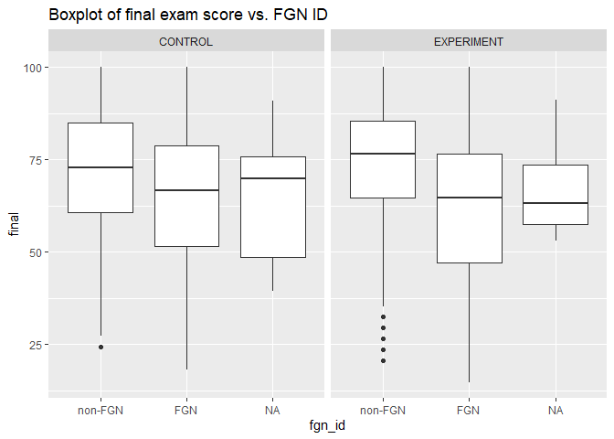

# Do two-stage exams help alleviate historic demographic-based achievement gaps in introductory chemistry courses at UW? A statistical analysis of final exam performance using R.


## Introduction

In undergraduate science courses, the implementation of collaborative testing has been an increasingly popular way to facilitate student learning. One version of collaborative testing involves "two-stage" exams, in which students first take an exam on their own, and then gather into groups to take the same, or a very similar exam. Students typically receive credit for a mixture of both the individual and group portions of the exam, with the individual portion often weighted more heavily. Student performance has been shown to generally increase on the group portion of the exam as compared to the individual portion [Gilley and Clarkston 2014], indicating evidence for immediate learning between the two stages of the exam <!--# 222: HOW IS THIS NOT JUST THE "SMART" KIDS PROVIDING THE CORRECT ANSWER DURING THE GROUP PORTION? I think G&C say somethign about this. -->. On the other hand, two-stage exams have recently been shown not to affect long-term retention of course information for students in a medical radiation technology class [Bentley et al. 2021]. In this crossover designed study, students were randomly assigned to a midterm to complete as a two-stage exam with other group members rather than as an individual exam. Long term retention of course information was measured by student performance on certain topics on a final exam that were previously assessed individually or collaboratively during a midterm. In a different study, students who participated in two-stage exams in an introductory computer science class presented short-term gains by outperforming individually assessed students on quizzes shortly after exams, but this effect was lost on a long-term scale due to no difference in performance during a final exam [Cao and Porter 2017].

Both the Bentley et al. paper and the Cao/Porter paper explored the effect of two-stage exams on short-term gains in student learning by administering two-stage exams to random groups of students during midterms and comparing performance to other students who tested individually. Both studies administered two-stage exams by first individually testing students and then allowing students to work together on a similar exam. In Bentley et al., student performance was compared using scores directly from the midterms, whereas for Cao and Porter, an individual post test was administered two weeks after the two-stage midterms and scores for the post test between collaboratively and individually tested students were compared. Finally, in both studies, student performance for certain topics on the long-term were compared between collaboratively and individually tested students on a traditional final exam. In both papers, two-stage exams appeared to facilitate immediate, short-term learning for students, but evidence from the similarity in final exam performance from individually and collaboratively tested students indicates that two-stage exams do not augment long-term student retention of course content. However, it has been investigated that improvement in student retention of course content from two-stage exams has varying effects across low-, mid-, and high-performing students, as well as depending on how long students were tested on course topics after initial exposure [Cooke et al. 2019]. <!--# JH: More thorough discussion of Cooke et al. paper is still needed here... --> None of these papers controlled for prior academic achievement measures, however the Cao and Porter paper did investigate the effect of two-stage exams on long-term retention for students of various demographic identifiers including sex, race, international student status, and first generation status, but found no significant subgroup effect for any demographic investigated. 

At the University of Washington, we implemented two-stage exams as quizzes in the first quarter of our three-quarter general chemistry sequence (CHEM 142) in Autumn 2017 to investigate if historical demographic-based achievement gaps in introductory chemistry can be alleviated by collaborative testing. <!--# 222: THIS REFERENCE TO ACHEIVEMENT GAPS JUMPS OUT OF NOWHERE. CAN YOU TIE THIS BACK TO THE OTHER LITERATURE SOMEHOW? DID THE OTHER PAPERS LOOK AT STUDENT IDENTITY CHARACTERISTICS? MAYBE THEY DIDN'T, WHICH MEANS OUR WORK HAS A UNIQUE TAKE. I THINK THERE ARE ALSO OTHER PAPERS ON ZOTERO (https://www.zotero.org/groups/4512143/r_learning_group/collections/TEAH4IFC/items/32XHGU5Y/item-list) THAT LOOKED AT STUDENT CHARACTERISTICS, AT LEAST IN TERMS OF COURSE PERFORMANCE (Giuliodori 2008 FOR INSTANCE). --> These two-stage quizzes were taken by students during weekly TA-led quiz sections. Then, the performance of students on a traditional, individually tested final exam were compared between the control and the experimental years. Unlike the Bentley et al. and the Cao and Porter studies, this study examines student data from two separate quarters rather than implementing a crossover design over the course of one class. Furthermore, this study only investigates how two-stage exams affect long-term student retention of class information rather than immediate student retention, as student performance was only compared across the final exam.

To explore the effect of two-stage quizzes on achievement gaps in introductory chemistry at UW, the following demographic identifiers were collected from the UW Registrar: binary sex, under-represented minority status, first generation college student status, and status under the Education Opportunity Program (EOP), which the University of Washington uses to promote the academic success of under-represented ethnic minorities, economically disadvantaged students, and first-generation students by offering financial, academic, and professional resources. Student performance on the final exam for this course was compared with a control CHEM 142 class from autumn 2016 in which two-stage exams were not implemented. Within R, linear models were generated to compare final exam scores between the experimental and control years for the four different demographic groups, further controlling for student performance indicators like high school GPA, SAT scores, and homework scores.

Here, we present the experimental design and data presentation for the investigation of the effect of two-stage quizzes on demographic-based achievement gaps in the first quarter of general chemistry at UW.

## Methods

All statistical analyses were conducted with R in the RStudio programming environment. We collected student performance and demographic data from a control group consisting of two sections (A and B) of Autumn 2016 CHEM 142 students who did not take two-stage quizzes, and from an experimental group of two sections (A and B) Autumn 2017 CHEM 142 students who participated in two-stage exams. All sections had lectures on Monday, Wednesday, and Friday; section A of both years had lecture at 8:30 and quiz section on Thursday, whereas section B of both years had lecture at 9:30 and quiz section on Tuesday. For Autumn 2016, section A had 461 students, and section B had 518; for Autumn 2017, section A had 603 students and section B had 609. Every section from both 2016 and 2017 were all taught by the same instructor. Data from both cohorts of students were merged to a master dataset where a categorical variable titled `exp` was assigned to each student as `CONTROL` or `EXPERIMENT`. Demographic data for binary sex, under-represented minority status, first-generation status, and Education Opportunity Program status were contained within categorical variables titled `sex_id`, `urm_id`, `fgn_id`, and `eop_id`, respectively. A variety of numerical student performance indicators were included in the dataset to be used as control variables: SAT math and SAT verbal scores as `satm` and `satv`, ALEKS initial knowledge check score as `aleks_ikc`, and unweighted high school GPA as `hs_gpa`.

The following plots display the number of students of each demographic group participating in the control and experimental years of the study:

<!-- -->

53.9% of students in the control year were female, as were 54.5% of students in the experimental year.

<!-- -->

11.2% of students in the control year were identified as URM by the research team, according to guidelines from the National Science Foundation, based on self-reported race and ethnicity. Another 9.2% of students did not disclose their URM status in the control year. In the experimental year, 12.7% of students self-identified as URM, and another 11.8% did not disclose their URM status. <!--# FYI: IT'S NOT ACTUALLY THAT STUDENTS SELF-IDENTIFIED AS URM, RATHER THAT WE INTERPRETED THEIR SELF-REPORTED RACE AND ETHNICITY THROUGH OUR "URM" LENS AND ASSIGNED THE URM DESIGNATION ACCORDINGLY. ANYONE WHO WAS NOT AMONG THE FOLLOWING GROUPS WERE PLACED IN THE URM CATEGORY (UNLESS THEY DECLINED TO REPORT RACE/ETHNICITY, THEN WE LEFT THEM AS NA): WHITE, ASIAN, INTERNATIONAL STUDENT -->

<!-- -->

17.9% of students in the control year were EOP, and 22.6% of students in the experimental year were EOP.

<!-- -->

30.0% of students in the control year were first-generation, as were 26.2% of students in the experimental year.

<!--# FYI: I've reworded parts of the following paragraph using my former post-doc's descriptions as a model. -->

We used linear regression to estimate the association between final exam scores and the two-stage quiz intervention by fitting a multilevel linear regression model to the data within the `lme4` packages in R (Bates et al., 2015) <!--# CFC: add to zotero and bib -->. We fit separate models for each demographic group of interest---women, under-represented minorities, first-generation students, and EOP students---and included a two-way interaction between the demographic group and year of the study. Furthermore, our models estimated a random intercept for each TA section to account for possible non-independence of observations within each TA section. The two-stage quizzes were administered within TA-led quiz sections, so it is possible that the degree to which this intervention influenced students' final exam performance could be impacted by variables such as the time of day of the quiz section, the different TAs leading the quiz sections, or the various settings in which quiz sections were held. <!--# FYI: Here through the end of the paragraph is WFW text from a paper I am writing based on my post-doc's work. It should be modified so we are not plaigiarizing, but this gives us some language to start with. --> We conducted model selection via stepwise backward elimination to identify the best-fitting model for the data [@zuur2009]. We used the Akaike Information Criterion (AIC) as an indicator of data-model fit because it is based on maximum likelihood estimation and the number of parameters ( <!--# CFC: Need to add these references to Zotero and the bib file --> Aho et al., 2014; Burnham et al., 2002). We compared the fit of the full model and the model with the random intercept removed, favoring the most parsimonious model within 2.0 units of the lowest AIC value <!--# FYI: I'm ignoring some details here for the time being because I am struggling with how to describe them. I will need to review the model selection guide I created for this project and Elli's 2018 paper. -->. We further eliminated terms---starting with the interaction term---via stepwise backwards elimination and comparison of AIC values for competing models. Model selection was terminated when removing a term no longer improved the model fit.

~~The fit of the fixed-effects linear regression models and that of the multilevel regression models associated with each demographic ID were compared using Akaike's Information Criterion (AIC) [@theobald2018], and we determined that the linear models that did not include random effects from TA sections fit the data more accurately. Next, we removed parameters from the linear models one by one, starting with the demographic ID interactions, and then moving on to the student performance indicator control variables, comparing the AIC value of each new model to the best-fitting one that came before it. If the fit of one model was better or the same than a more complex model that came before it based on its AIC value [REWORD], then we retained the less complex model as more representative of the data.~~ <!--# FYI: I'm just striking this text out for now rather than deleting it -->

Generally when comparing two models to each other, if the AIC for a new model increases by 2 or more units, then the old model is retained, and if the AIC decreases by more than 2 units, then the newer model is retained. If the AIC changes by less than 2 units, then the models are considered to have similar fits to the data, and the least complex model is retained.

All models generated in this study use centered final exam data.

### Example: Model selection for `sex_id`

Here we offer an annotated example of model selection for the models associated with `sex_id` by comparison of AIC values. The first step is to compare the two most complex models to each other: the fixed effects linear model and the model with a random intercept for the TA section.

#### 1. Fixed-effects only model (sex)


```r
sex_mod1 <- lm(final_c ~ exp * sex_id +
                         exp + sex_id +
                         satm_c + satv_c + aleksikc_c + hs_gpa_c,
                         data = master)
summary(sex_mod1)
```

```
## 
## Call:
## lm(formula = final_c ~ exp * sex_id + exp + sex_id + satm_c + 
##     satv_c + aleksikc_c + hs_gpa_c, data = master)
## 
## Residuals:
##     Min      1Q  Median      3Q     Max 
## -61.581  -7.775   1.386   8.823  36.733 
## 
## Coefficients:
##                             Estimate Std. Error t value Pr(>|t|)    
## (Intercept)                 1.786594   0.639191   2.795  0.00524 ** 
## expEXPERIMENT              -0.838761   0.848729  -0.988  0.32315    
## sex_idFemale               -2.889390   0.877542  -3.293  0.00101 ** 
## satm_c                      0.099012   0.004970  19.923  < 2e-16 ***
## satv_c                      0.021155   0.005106   4.143 3.56e-05 ***
## aleksikc_c                  0.194925   0.018152  10.739  < 2e-16 ***
## hs_gpa_c                   22.726225   1.661504  13.678  < 2e-16 ***
## expEXPERIMENT:sex_idFemale  0.869752   1.150669   0.756  0.44982    
## ---
## Signif. codes:  0 '***' 0.001 '**' 0.01 '*' 0.05 '.' 0.1 ' ' 1
## 
## Residual standard error: 12.83 on 2029 degrees of freedom
##   (150 observations deleted due to missingness)
## Multiple R-squared:  0.4277,	Adjusted R-squared:  0.4257 
## F-statistic: 216.6 on 7 and 2029 DF,  p-value: < 2.2e-16
```

#### 2. Random intercepts model with `ta_sect`; REML = TRUE (sex)


```r
sex_mod2 <- lmer(final_c ~ exp * sex_id +
                           exp + sex_id +
                           satm_c + satv_c + aleksikc_c + hs_gpa_c +
                         (1 | ta_sect),
                         data = master, REML = TRUE)
summary(sex_mod2)
```

```
## Linear mixed model fit by REML ['lmerMod']
## Formula: 
## final_c ~ exp * sex_id + exp + sex_id + satm_c + satv_c + aleksikc_c +  
##     hs_gpa_c + (1 | ta_sect)
##    Data: master
## 
## REML criterion at convergence: 16185.2
## 
## Scaled residuals: 
##     Min      1Q  Median      3Q     Max 
## -4.7506 -0.6042  0.1037  0.6946  2.8594 
## 
## Random effects:
##  Groups   Name        Variance Std.Dev.
##  ta_sect  (Intercept)   1.564   1.251  
##  Residual             163.051  12.769  
## Number of obs: 2037, groups:  ta_sect, 104
## 
## Fixed effects:
##                             Estimate Std. Error t value
## (Intercept)                 1.777626   0.663558   2.679
## expEXPERIMENT              -0.847830   0.883901  -0.959
## sex_idFemale               -2.883101   0.876921  -3.288
## satm_c                      0.098792   0.004968  19.885
## satv_c                      0.021152   0.005101   4.147
## aleksikc_c                  0.195079   0.018162  10.741
## hs_gpa_c                   22.637907   1.660729  13.631
## expEXPERIMENT:sex_idFemale  0.892834   1.150918   0.776
## 
## Correlation of Fixed Effects:
##              (Intr) exEXPERIMENT sx_dFm satm_c satv_c alksk_ hs_gp_
## exEXPERIMENT -0.736                                                
## sex_idFemal  -0.716  0.516                                         
## satm_c       -0.114 -0.010        0.159                            
## satv_c        0.073 -0.013       -0.103 -0.543                     
## aleksikc_c   -0.026 -0.001        0.035 -0.203 -0.005              
## hs_gpa_c      0.094 -0.031       -0.136 -0.101 -0.092 -0.016       
## eEXPERIMENT:  0.524 -0.709       -0.732  0.004  0.019  0.005  0.037
```

#### AIC comparison of `sex_mod1` and `sex_mod2`


```r
AIC(sex_mod1, sex_mod2)
```

```
##          df      AIC
## sex_mod1  9 16186.44
## sex_mod2 10 16205.22
```

The AIC *increases* by more than 2 for `sex_mod2`, so including a random intercept in the model does not improve model fit. The original model without random effects fits the data better. Therefore, the observations within a TA section can be assumed to be independent.

#### 3. Fixed-effects only model with *no* demographic interactions (sex)

The next step is to remove demographic interactions from the model and then compare it to the fixed effect model *with* the interaction term.


```r
sex_mod1.a <- lm(final_c ~ exp + sex_id +
                           satm_c + satv_c + aleksikc_c + hs_gpa_c,
                           data = master)
summary(sex_mod1.a)
```

```
## 
## Call:
## lm(formula = final_c ~ exp + sex_id + satm_c + satv_c + aleksikc_c + 
##     hs_gpa_c, data = master)
## 
## Residuals:
##     Min      1Q  Median      3Q     Max 
## -61.780  -7.861   1.322   8.856  36.499 
## 
## Coefficients:
##                Estimate Std. Error t value Pr(>|t|)    
## (Intercept)    1.523236   0.535825   2.843  0.00452 ** 
## expEXPERIMENT -0.365043   0.572268  -0.638  0.52362    
## sex_idFemale  -2.403368   0.597123  -4.025 5.91e-05 ***
## satm_c         0.098995   0.004969  19.922  < 2e-16 ***
## satv_c         0.021081   0.005105   4.130 3.78e-05 ***
## aleksikc_c     0.194861   0.018150  10.736  < 2e-16 ***
## hs_gpa_c      22.677976   1.660102  13.661  < 2e-16 ***
## ---
## Signif. codes:  0 '***' 0.001 '**' 0.01 '*' 0.05 '.' 0.1 ' ' 1
## 
## Residual standard error: 12.83 on 2030 degrees of freedom
##   (150 observations deleted due to missingness)
## Multiple R-squared:  0.4275,	Adjusted R-squared:  0.4258 
## F-statistic: 252.7 on 6 and 2030 DF,  p-value: < 2.2e-16
```

#### AIC comparison of `sex_mod1` and `sex_mod1.a`


```r
AIC(sex_mod1, sex_mod1.a)
```

```
##            df      AIC
## sex_mod1    9 16186.44
## sex_mod1.a  8 16185.02
```

The AIC *decreases* by *less than 2* for `sex_mod1.a`, which means the fit of `sex_mod1.a` is similar to `sex_mod1` . We will move forward with the simplest model, which is `sex_mod1.a`. Therefore, demographic interactions will not be retained in this model. This indicates that there is no disproportionate effect of the two-stage intervention on women.

#### 4. Removal of parameters one by one

The next step is to remove parameters one by one from `sex_mod1.a` and then compare each newer, simpler iteration of the model to the previously best-fitting model that came before it. We remove parameters from the model in order of which ones had the lowest t-values in the regression output of the previously best-fitting model.

We will start with removing `exp`, which has the lowest t-value.


```r
sex_mod1.b <- lm(final_c ~ sex_id +
                           satm_c + satv_c + aleksikc_c + hs_gpa_c,
                           data = master)
summary(sex_mod1.b)
```

```
## 
## Call:
## lm(formula = final_c ~ sex_id + satm_c + satv_c + aleksikc_c + 
##     hs_gpa_c, data = master)
## 
## Residuals:
##     Min      1Q  Median      3Q     Max 
## -61.943  -7.841   1.273   8.871  36.332 
## 
## Coefficients:
##               Estimate Std. Error t value Pr(>|t|)    
## (Intercept)   1.321101   0.432018   3.058  0.00226 ** 
## sex_idFemale -2.405558   0.597025  -4.029 5.80e-05 ***
## satm_c        0.098964   0.004968  19.919  < 2e-16 ***
## satv_c        0.021085   0.005104   4.131 3.75e-05 ***
## aleksikc_c    0.194892   0.018147  10.740  < 2e-16 ***
## hs_gpa_c     22.669520   1.659807  13.658  < 2e-16 ***
## ---
## Signif. codes:  0 '***' 0.001 '**' 0.01 '*' 0.05 '.' 0.1 ' ' 1
## 
## Residual standard error: 12.83 on 2031 degrees of freedom
##   (150 observations deleted due to missingness)
## Multiple R-squared:  0.4274,	Adjusted R-squared:  0.426 
## F-statistic: 303.2 on 5 and 2031 DF,  p-value: < 2.2e-16
```

#### AIC comparison of `sex_mod1.a` and `sex_mod1.b`


```r
AIC(sex_mod1.a, sex_mod1.b)
```

```
##            df      AIC
## sex_mod1.a  8 16185.02
## sex_mod1.b  7 16183.43
```

The AIC *decreases* by *less than 2* for `sex_mod1.b`, so we will move forward with this model since it is the simplest. Since `exp` was not retained in the model, this means that there is no difference in average final exam score for women in the two years of the study. Essentially, the two-stage intervention had no impact on final exam scores for this group. <!--# CFC: CHECK THAT THIS INTERPRETATION IS CORRECT!! -->

Next, we will try removing `sex_id` .


```r
sex_mod1.c <- lm(final_c ~ satm_c + satv_c + aleksikc_c + hs_gpa_c,
                           data = master)
summary(sex_mod1.c)
```

```
## 
## Call:
## lm(formula = final_c ~ satm_c + satv_c + aleksikc_c + hs_gpa_c, 
##     data = master)
## 
## Residuals:
##     Min      1Q  Median      3Q     Max 
## -60.680  -7.919   1.392   8.811  37.160 
## 
## Coefficients:
##              Estimate Std. Error t value Pr(>|t|)    
## (Intercept)  0.010370   0.285346   0.036 0.971015    
## satm_c       0.103736   0.004843  21.420  < 2e-16 ***
## satv_c       0.018388   0.005079   3.621 0.000301 ***
## aleksikc_c   0.199022   0.018186  10.944  < 2e-16 ***
## hs_gpa_c    21.592688   1.644279  13.132  < 2e-16 ***
## ---
## Signif. codes:  0 '***' 0.001 '**' 0.01 '*' 0.05 '.' 0.1 ' ' 1
## 
## Residual standard error: 12.87 on 2032 degrees of freedom
##   (150 observations deleted due to missingness)
## Multiple R-squared:  0.4228,	Adjusted R-squared:  0.4217 
## F-statistic: 372.1 on 4 and 2032 DF,  p-value: < 2.2e-16
```

#### AIC comparison of `sex_mod1.b` and `sex_mod1.c`


```r
AIC(sex_mod1.b, sex_mod1.c)
```

```
##            df      AIC
## sex_mod1.b  7 16183.43
## sex_mod1.c  6 16197.64
```

The AIC *increases* by *more than 2* for `sex_mod1.c`, so we will retain the `sex_id` variable in our model. This means that there is a statistically significant difference between the average final exam score for women compared to men in this data set.

If a parameter has a t-value with a very large magnitude (i.e., above 3 or 4), then it is assumed that the parameter is significant enough to remain in the model, so parameter removal and subsequent AIC comparison of the new model is not performed.

Our final model is `sex_mod1.b`, which is summarized above.

## Results

What is the impact of two-stage quizzes on historic demographic-based achievement gaps in introductory chemistry?

The best-fitting regression models for student performance on the final exams between the control and experimental years for each student demographic group are provided along with their interpretations. Boxplots displaying the final exam score distribution across the control and experimental years are provided as well.

#### Women


```r
# `sex_id`
sex_mod1.b <- lm(final_c ~ sex_id +
                           satm_c + satv_c + aleksikc_c + hs_gpa_c,
                           data = master)
summary(sex_mod1.b)
```

```
## 
## Call:
## lm(formula = final_c ~ sex_id + satm_c + satv_c + aleksikc_c + 
##     hs_gpa_c, data = master)
## 
## Residuals:
##     Min      1Q  Median      3Q     Max 
## -61.943  -7.841   1.273   8.871  36.332 
## 
## Coefficients:
##               Estimate Std. Error t value Pr(>|t|)    
## (Intercept)   1.321101   0.432018   3.058  0.00226 ** 
## sex_idFemale -2.405558   0.597025  -4.029 5.80e-05 ***
## satm_c        0.098964   0.004968  19.919  < 2e-16 ***
## satv_c        0.021085   0.005104   4.131 3.75e-05 ***
## aleksikc_c    0.194892   0.018147  10.740  < 2e-16 ***
## hs_gpa_c     22.669520   1.659807  13.658  < 2e-16 ***
## ---
## Signif. codes:  0 '***' 0.001 '**' 0.01 '*' 0.05 '.' 0.1 ' ' 1
## 
## Residual standard error: 12.83 on 2031 degrees of freedom
##   (150 observations deleted due to missingness)
## Multiple R-squared:  0.4274,	Adjusted R-squared:  0.426 
## F-statistic: 303.2 on 5 and 2031 DF,  p-value: < 2.2e-16
```

We did not retain `exp` as a parameter in the `sex_id` model, so there was no meaningful change in final exam score for females on average between the control and experimental years of the study. <!--# CFC: But look at that -2.4055 decrease for `sex_id`! Women earned a lower average final exam score than men over both years of the study, by (-2.405) + 1.321 = -1.084 units -->


```r
ggplot(data = master, mapping = aes(x = sex_id, y = final)) +
  geom_boxplot() +
  facet_grid(. ~ exp) +
  labs(title = "Boxplot of final exam score vs. sex ID")
```

```
## Warning: Removed 35 rows containing non-finite values (stat_boxplot).
```

<!-- -->

#### Under-represented Minorities


```r
# `urm_id`
urm_mod1.c <- lm(final_c ~ urm_id +
                           satm_c + satv_c + aleksikc_c + hs_gpa_c,
                           data = master)
summary(urm_mod1.c)
```

```
## 
## Call:
## lm(formula = final_c ~ urm_id + satm_c + satv_c + aleksikc_c + 
##     hs_gpa_c, data = master)
## 
## Residuals:
##     Min      1Q  Median      3Q     Max 
## -61.069  -8.144   1.290   8.940  37.558 
## 
## Coefficients:
##              Estimate Std. Error t value Pr(>|t|)    
## (Intercept) -0.117729   0.325565  -0.362 0.717681    
## urm_idURM    0.902257   0.938069   0.962 0.336264    
## satm_c       0.101933   0.005636  18.087  < 2e-16 ***
## satv_c       0.021861   0.005655   3.866 0.000115 ***
## aleksikc_c   0.205725   0.019639  10.475  < 2e-16 ***
## hs_gpa_c    21.808346   1.735268  12.568  < 2e-16 ***
## ---
## Signif. codes:  0 '***' 0.001 '**' 0.01 '*' 0.05 '.' 0.1 ' ' 1
## 
## Residual standard error: 12.86 on 1839 degrees of freedom
##   (342 observations deleted due to missingness)
## Multiple R-squared:  0.4209,	Adjusted R-squared:  0.4193 
## F-statistic: 267.3 on 5 and 1839 DF,  p-value: < 2.2e-16
```

Similarly, `exp` was not retained as a parameter in the `urm_id` model, so we did not find any meaningful change in final exam scores on average between the experimental and control years for URM students.

<!--# CFC: Maybe I am misinterpreting these mdoel estimates, but it sure looks to me like urm students scored 0.9022 + (-0.1177) = 0.7845 units higher on the final exam on average than non-URM students, taking the two years of data as a whole. Bu this doesn't match the box plot below. ??? -->


```r
ggplot(data = master, mapping = aes(x = urm_id, y = final)) +
  geom_boxplot() +
  facet_grid(. ~ exp) +
  labs(title = "Boxplot of final exam score vs. URM ID")
```

```
## Warning: Removed 35 rows containing non-finite values (stat_boxplot).
```

<!-- -->

#### Education Opportunity Program Students


```r
# `eop_id`
eop_mod1.a <- lm(final_c ~ exp + eop_id +
                           satm_c + satv_c + aleksikc_c + hs_gpa_c,
                           data = master)
summary(eop_mod1.a)
```

```
## 
## Call:
## lm(formula = final_c ~ exp + eop_id + satm_c + satv_c + aleksikc_c + 
##     hs_gpa_c, data = master)
## 
## Residuals:
##     Min      1Q  Median      3Q     Max 
## -60.444  -7.853   1.464   8.724  37.619 
## 
## Coefficients:
##                Estimate Std. Error t value Pr(>|t|)    
## (Intercept)    0.104784   0.451916   0.232 0.816665    
## expEXPERIMENT -0.406100   0.575458  -0.706 0.480456    
## eop_idEOP      0.630627   0.774358   0.814 0.415519    
## satm_c         0.104795   0.005007  20.930  < 2e-16 ***
## satv_c         0.018885   0.005117   3.691 0.000229 ***
## aleksikc_c     0.198709   0.018193  10.922  < 2e-16 ***
## hs_gpa_c      21.724850   1.651563  13.154  < 2e-16 ***
## ---
## Signif. codes:  0 '***' 0.001 '**' 0.01 '*' 0.05 '.' 0.1 ' ' 1
## 
## Residual standard error: 12.88 on 2030 degrees of freedom
##   (150 observations deleted due to missingness)
## Multiple R-squared:  0.4231,	Adjusted R-squared:  0.4214 
## F-statistic: 248.2 on 6 and 2030 DF,  p-value: < 2.2e-16
```

This time, we retained `exp` as a parameter in the `eop_id` model, and the coefficient associated with EOP ID has a value of 0.630627. The interpretation of this coefficient is as follows: on average, there was a final exam score increase of 0.630627 for EOP students between the control year and the experimental year compared to their non-EOP counterparts. <!--# CFC: Also the interaction term was not retained, so there was not differential impact on the scores for EOP students. I am struggling to remember how this is different from what we have in this model though, where there is a coefficient retainted for both eop_id and exp. We can tabulate the magnitude of the effect for eop students in the exp year by adding 0.1047 + (-0.4061) + 0.6306 = 0.3292, which I think means that the average final exam score for an eop student in the experimental year was 0.3292 units higher than non-eop students in the experimental year. However, this doesn't really match the box plot below. What's going on? --> Although the model predicts a small positive trend in final exam scores for EOP students, the t-value for this coefficient is very small, and there are no significance codes associated with it. Therefore, we cannot accept this trend as being statistically significant. <!--# 222: Actually, yes we can, because the parameter was retained during model selection.  -->


```r
ggplot(data = master, mapping = aes(x = eop_id, y = final)) +
  geom_boxplot() +
  facet_grid(. ~ exp) +
  labs(title = "Boxplot of final exam score vs. EOP ID")
```

```
## Warning: Removed 35 rows containing non-finite values (stat_boxplot).
```

<!-- -->

#### First-generation Student Status


```r
# `fgn_id`
fgn_mod1.a <- lm(final_c ~ exp + fgn_id +
                           satm_c + satv_c + aleksikc_c + hs_gpa_c,
                           data = master)
summary(fgn_mod1.a)
```

```
## 
## Call:
## lm(formula = final_c ~ exp + fgn_id + satm_c + satv_c + aleksikc_c + 
##     hs_gpa_c, data = master)
## 
## Residuals:
##     Min      1Q  Median      3Q     Max 
## -60.605  -8.063   1.393   8.877  37.985 
## 
## Coefficients:
##                Estimate Std. Error t value Pr(>|t|)    
## (Intercept)    0.654221   0.474702   1.378  0.16830    
## expEXPERIMENT -0.441877   0.574048  -0.770  0.44153    
## fgn_idFGN     -1.378524   0.706336  -1.952  0.05112 .  
## satm_c         0.102405   0.004891  20.936  < 2e-16 ***
## satv_c         0.015781   0.005246   3.008  0.00266 ** 
## aleksikc_c     0.199218   0.018160  10.970  < 2e-16 ***
## hs_gpa_c      21.579154   1.642972  13.134  < 2e-16 ***
## ---
## Signif. codes:  0 '***' 0.001 '**' 0.01 '*' 0.05 '.' 0.1 ' ' 1
## 
## Residual standard error: 12.85 on 2028 degrees of freedom
##   (152 observations deleted due to missingness)
## Multiple R-squared:  0.4252,	Adjusted R-squared:  0.4235 
## F-statistic:   250 on 6 and 2028 DF,  p-value: < 2.2e-16
```

Again, we retained `exp` as a parameter in the `fgn_id` model <!--# 222: but the itnereaction term was no retained, so no differential impacts... -->. The coefficient associated with FGN ID has a value of -1.378524. The interpretation of this coefficient is as follows: on average, there is a decrease in final exam scores by 1.378524 units for FGN students compared to non-FGN students. There was a further decrease of 0.4418 units in the experimental year versus the control year, so altogether the average final exam score for first-generation students in the experimental year is (-1.378) + (-0.4418) + 0.6542) = -1.1656 units lower than the average final exam score for continuing-generation students in the experimental year. The t-value for this coefficient is small, and the significance code associated with `fgn_id` performance coefficient is not statistically significant. Thus, it follows that there is no significant change in final exam scores for first-generation students between the control and experimental years of the study. <!--# 222: Not so! it's retained via model selection. Model selection allows us to consider the whole model rather than just one parameter as a time. Presumably, you found that the model fit worse when you removed exp and fgn_id, which means that they are important parameters to include if we want to accurately describe the dataset. -->


```r
ggplot(data = master, mapping = aes(x = fgn_id, y = final)) +
  geom_boxplot() +
  facet_grid(. ~ exp) +
  labs(title = "Boxplot of final exam score vs. FGN ID")
```

```
## Warning: Removed 35 rows containing non-finite values (stat_boxplot).
```

<!-- -->

## Discussion

There was no evidence for significant change in final exam scores for any of the four demographic groups between the control and experimental years, indicating that two-stage exams are not shown to help narrow historical demographic-based achievement gaps in our context and implementation. The context of this study was to investigate student learning on a long-term scale throughout the entire quarter rather than short-term, since student performance data was only analyzed for a final exam. These findings reflect those of the studies discussed earlier in the introduction: two-stage exams did not affect student learning and retention on a long-term scale. In recent literature, there is no consistent methodology to measuring course content retention as a result of collaborative testing, so making strong conclusions about the effect of two-stage exams on long-term student learning is difficult [Cooke et. al].

It is worth noting that the way in which teaching methods are "marketed" to students can play a role in the effectiveness of that implementation. During the experimental year of our study, CHEM 142 students were briefly introduced to the rationale behind why collaborative testing can help encourage metacognition during the learning process; as students take collaborative two-stage quizzes, they are essentially rehearsing the process of test taking, and group interactions encourage students to analyze their own thought processes. However, if students are not regularly reminded of the potential benefits of this testing method, then student affect (particularly the attitudes surrounding two-stage quizzes) may remain relatively low, and students will see collaborative testing as a box to check off rather than fully intellectually immersing themselves in the activity. Since two-stage exams were administered during TA-led quiz sections over the course of the experiment, it is not guaranteed that students were regularly reminded of the metacognitive goals behind implementing collaborative testing, and so student affect surrounding two-stage quizzes may have remained relatively low, which in turn may explain why there was no significant change in final exam score for any studied demographic group between the control and experimental year.

<!--# JH: A discussion of Aut 2017 end of term student responses was going to go here, but I found that there was a very high concentration of students saying that weekly quizzes stressed them out and took away from their learning. There were only one or two students saying that the two-stage format of the quizzes contributed positively to their learning. -->

## Conclusion

In our study, we found no link between two-stage quizzes and improvement in final exam test scores for students in any of the demographic groups we analyzed. A future study on two-stage exams would ideally account for student affect regarding collaborative testing by consistently encouraging students during the course of the class to view collaborative testing as a test-run for exams to bolster metacognition. Due to the lack of consistent methodologies in past literature, it is difficult to draw broad conclusions about the larger impact of two-stage exams on long-term retention of course content.
